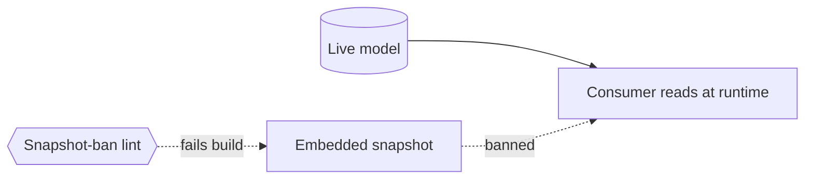

# Meta-model consumption discipline (read, don't hardcode) — GoF appendix rendering

> **Draft fill.** Worked Structure + Sample Code slots for the catalogue entry
> `models-bridge/system-models/meta-model-consumption.md`, rendered in the book's Gang-of-Four appendix
> layout. The follow-up pass injects the two filled slots at the placeholders keyed by the entry name
> `Meta-model consumption discipline (read, don't hardcode)`. Intent / Motivation / Applicability /
> Consequences / Known Uses / Related Patterns are projected from the catalogue `.md` — reproduced in
> brief so the entry reads as a complete GoF page.

## Meta-model consumption discipline (read, don't hardcode)

**Intent** — Consume the models by *querying them at runtime*, never by embedding a hardcoded snapshot —
so a lint, test, or brief always reasons from the live model, and a copied-out value can't drift behind
the model it was copied from.

### Motivation

The models are a bridge only if consumers read them. The moment a consumer hardcodes a snapshot — "our
packages are [A, B, C]" pasted into a lint — that copy drifts the instant the model changes, and the
consumer keeps passing while reasoning about a stale world. It is the most common substrate-drift vector,
recurring at every site that reaches for a quick literal.

### Applicability

Reach for this when a queryable model exists and consumers keep snapshotting its values. You need a read
path (a query surface or a direct import) and a forward-policing lint that recognizes a queryable value's
snapshot, or the copies creep back.

### Structure

A consumer reads the model at run or lint time. A ban-lint scans consumer code for an embedded snapshot of
a value the model already holds and fails the build, so the query path is the only surviving one.



*Accessible description: a consumer reads the live model at runtime. A dashed edge marks an embedded
snapshot of a model value; the snapshot-ban lint fails the build on it, leaving the runtime query as the
only path.*

### Sample Code

The consumer derives its answer from the model; a lint bans a literal snapshot of a queryable value. The
query keeps one authoritative answer every consumer derives, where a copy mints a private answer that
drifts the day the model moves.

```python
import ast, sys

def component_names() -> set[str]:
    """The authoritative answer: derived from the model, never a pasted literal."""
    return {c["name"] for c in load_model()}   # load_model reads the source-of-truth records

# The ban-lint: a hardcoded list of the queryable value is a finding.
KNOWN_SNAPSHOT = frozenset({"editor", "worker", "web"})  # what the model currently returns

def lint(path: str, source: str) -> list[str]:
    findings = []
    for node in ast.walk(ast.parse(source)):
        if isinstance(node, (ast.Set, ast.List)):
            literals = {e.value for e in node.elts if isinstance(e, ast.Constant)}
            if literals and literals <= KNOWN_SNAPSHOT and len(literals) > 1:
                findings.append(f"{path}:{node.lineno}: embedded model snapshot — query the model")
    return findings

if __name__ == "__main__":
    hits = [f for p in sys.argv[1:] for f in lint(p, open(p).read())]
    print("\n".join(hits))
    sys.exit(1 if hits else 0)
```

### Consequences

- **Slightly more ceremony per consumer** — a query call instead of a literal, the intended trade.
- **Runtime/lint-time coupling** — the consumer depends on the model being loadable when it runs.
- **The ban-lint's accuracy** — it must recognize a "queryable value" to flag its snapshot; verify it is
  built before relying on it.

### Known Uses

- The component registry and the model query tool, read at runtime by the lint fleet and dispatch.
- The snapshot-ban lint, the meta-file-preference rule, and the lint-scope-declares-against-the-model rule.

### Related Patterns

- **Bridge** — the *consumption* face: agent controls and product lints all read the models through this
  discipline rather than copying them.
- **Consumer** — dynamic context injection's forward slicer reads the component-zone model this way.
- **See also** — the query surface, the canonical read path this discipline uses.
