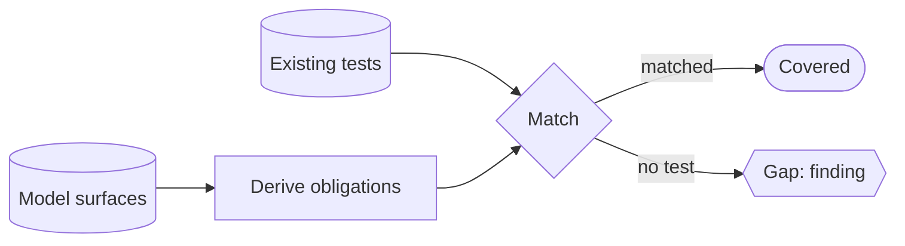

# Model-derived test-obligation census (derive what should be tested, lint the gap) — GoF appendix rendering

> **Draft fill.** Worked Structure + Sample Code slots for the catalogue entry
> `models-bridge/system-models/model-derived-test-obligation-census.md`, rendered in the book's
> Gang-of-Four appendix layout. The follow-up pass injects the two filled slots at the placeholders keyed
> by the entry name `Model-derived test-obligation census (derive what should be tested, lint the gap)`.
> Intent / Motivation / Applicability / Consequences / Known Uses / Related Patterns are projected from the
> catalogue `.md` — reproduced in brief so the entry reads as a complete GoF page.

## Model-derived test-obligation census (derive what should be tested, lint the gap)

**Intent** — Derive the set of things that *should* be tested from the structured models themselves — every
external seam that should be fuzzed, every failure edge that should have an injection test, every invariant
that should have a checker — and lint the **gap** between that derived obligation set and the tests that
exist. An untested obligation becomes a named, listable finding, not an absence nobody notices.

### Motivation

Line coverage measures the code you wrote *and* tested; it is blind to the code you should have written a
test for and didn't. The dangerous gaps are the ones nothing points at — an external seam never fuzzed, a
failure edge with no injection test, a cross-service invariant with no checker. A percentage climbs toward
a hundred while whole *categories* of obligation sit at zero, because coverage counts what exists and
cannot count what's missing.

### Applicability

Reach for this when models declare a testable surface (a seam registry, an enumerated failure-edge set, an
invariant list), the existing tests are joinable to obligations by naming convention, tag, or registry,
and a gate treats an unmet obligation as a build finding rather than a report nobody reads.

### Structure

Walk the models that declare a testable surface and compute the obligation set each implies. Join every
obligation against the test corpus. An obligation with no matching test is a named finding. Because the
denominator is *derived*, adding a seam or a failure edge grows the obligation set, so a new untested
surface reopens the gap until a test closes it.



*Accessible description: models that declare a testable surface — seam, error-path, invariant — feed a
derive step that computes the obligation set; each obligation is matched against the existing tests. A
match is covered; an obligation with no test is a named gap finding, and because the set is derived a new
surface reopens the gap until a test closes it.*

### Sample Code

The denominator is *derived from the models*, never enumerated by hand — that is what a static coverage
threshold can't do. The census walks each model that declares a testable surface, computes the obligations,
then reports the ones the test corpus does not match. Add a seam and the should-be-fuzzed set grows by one,
so the gap reopens until a test discharges it.

```python
def derive_obligations(models) -> set[str]:
    """The obligation set (the denominator) is DERIVED — it regrows when a model gains a surface."""
    obligations: set[str] = set()
    for seam in models.external_seams:   # each external seam should be fuzzed
        obligations.add(f"fuzz:{seam.name}")
    for edge in models.failure_edges:    # each failure edge should have an injection test
        obligations.add(f"inject:{edge.name}")
    for inv in models.invariants:        # each cross-service invariant should have a checker
        obligations.add(f"check:{inv.name}")
    return obligations

def gaps(models, tests) -> list[str]:
    """An obligation with no matching test is a named finding — not a blind spot a rising percentage hides."""
    covered = {t.obligation for t in tests}   # tests joinable to obligations by tag / naming / registry
    return sorted(o for o in derive_obligations(models) if o not in covered)
```

### Consequences

- **Untested categories become visible** — a whole class of obligation sitting at zero is a listable set
  of findings, not a blind spot a rising coverage percentage hides.
- **The join must be kept accurate** — a test the census fails to match reports a false gap; a stale match
  reports false safety. The matching rule must track how tests are named and tagged.
- **It measures obligation coverage, not test quality** — a matched obligation counts as covered even if
  its test is weak; the census closes the "no test at all" gap and leans on other mechanisms to judge
  strength.

### Known Uses

- A fuzz-target census that derives the should-be-fuzzed set from the external-seam model and flags the
  seams with no harness.
- An error-path census that derives the should-have-injection set from the failure-edge model and flags
  the edges with no failure-injection test.
- The same derive-and-lint shape reused for invariant checkers, so a cross-service invariant declared
  without a verifier is a finding rather than an untested predicate.

### Related Patterns

- **Generalization** — coverage-to-model mapping: that maps which *invariants* are tested; this census
  generalizes the idea across obligation kinds — seams to fuzz, edges to inject, invariants to check.
- **Consumer** — executable source-of-truth: the census reads the models as data to derive its
  obligations, so its denominator is exactly what those models declare.
- **Enabler** — fuzz campaigns: the census names *which* seams owe a fuzz harness; the campaigns are the
  harnesses that discharge those obligations.
- **Sibling** — journey-task-closure: both derive a test obligation from a declared model element rather
  than from lines of code — that one a journey's terminal post-condition, this one a seam or edge's owed
  test.
- **See also** — meta-model consumption: deriving the obligation set by reading the models, rather than
  hardcoding a target list, is that read-don't-duplicate discipline.
