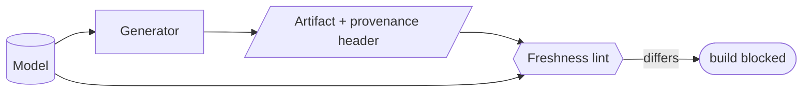

# Model-driven codegen — GoF appendix rendering

> **Draft fill.** Worked Structure + Sample Code slots for the catalogue entry
> `models-bridge/system-models/model-driven-codegen.md`, rendered in the book's Gang-of-Four appendix
> layout. The follow-up pass injects the two filled slots at the placeholders keyed by the entry name
> `Model-driven codegen`. Intent / Motivation / Applicability / Consequences / Known Uses / Related
> Patterns are projected from the catalogue `.md` — reproduced in brief so the entry reads as a complete
> GoF page.

## Model-driven codegen

**Intent** — Generate real artifacts *from* the models — access policy, service catalog, env wiring, API
docs, wire-contract types — each carrying a provenance header, so the model *drives the system* rather
than merely describing it, and hand-edits are caught.

### Motivation

A model nothing depends on is easy to ignore and quick to drift: nothing breaks if it's wrong, so nothing
keeps it right. And a generated artifact someone hand-edits loses the edit on the next regen, silently.

### Applicability

Reach for this when a fact would otherwise live in two places — the model and a hand-written config or doc
— and diverge. You need models rich enough to generate from, generators that re-emit a provenance marker
every run, and a provenance-plus-freshness lint.

### Structure

A generator reads the model and emits the artifact, stamping a provenance header. A freshness lint
re-runs generation and fails when the committed artifact differs, and the provenance lint fails on a
hand-edit that dropped the marker.



*Accessible description: a generator reads the model and emits an artifact carrying a provenance header. A
freshness lint regenerates from the model and blocks the build when the committed artifact differs, so a
hand-edit or a stale output is caught.*

### Sample Code

The generator emits the artifact with a provenance header re-stamped every run. A freshness lint
regenerates and fails when the committed file differs — so the model stays authoritative and a stray
hand-edit is caught before it is lost.

```python
import sys

HEADER = "# GENERATED from the model — edits are overwritten; change the model instead\n"

def generate(model: list[dict]) -> str:
    body = "\n".join(f"allow: {row['name']}" for row in model)
    return HEADER + body + "\n"          # provenance marker re-emitted every run

def freshness_lint(committed: str, model: list[dict]) -> list[str]:
    expected = generate(model)
    if committed != expected:
        return ["artifact is stale or hand-edited — regenerate from the model"]
    if not committed.startswith(HEADER):
        return ["provenance header missing — artifact was hand-authored"]
    return []

if __name__ == "__main__":
    # `load_model` reads the source-of-truth; `read_artifact` reads the committed output file.
    findings = freshness_lint(read_artifact(), load_model())
    for f in findings:
        print(f"STALE-ARTIFACT: {f}")
    sys.exit(1 if findings else 0)
```

### Consequences

- **A generator per artifact class** to author and keep current with the model schema.
- **Generated files must not be hand-edited** — a real constraint the provenance lint enforces.
- **Regen discipline** — the artifact must be regenerated when the model changes; the freshness lint
  catches misses.

### Known Uses

- Access-policy, service-catalog, API-entity, API-doc, wire-contract, and docker generators.
- A model-visualization generator that emits human diagrams from the models, so even the picture can't
  drift.
- The provenance-header requirement and its enforcing lint.

### Related Patterns

- **Enabler** — the models (service-flow, domain registries, deployment topology) are what it generates
  from.
- **Bridge** — the *product-facing* face of the models: they don't just inform agents, they build config
  and docs.
- **See also** — the product provenance-and-attribution family: provenance headers here, mutation stamps
  there.
