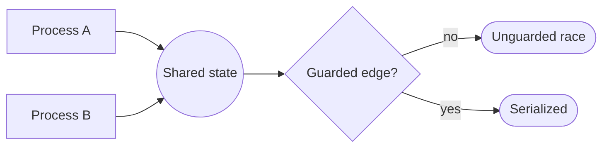

# Process view (concurrent processes, lanes, and racing edges) — GoF appendix rendering

> **Draft fill.** Worked Structure + Sample Code slots for the catalogue entry
> `models-bridge/system-models/process-view.md`, rendered in the book's Gang-of-Four appendix layout. The
> follow-up pass injects the two filled slots at the placeholders keyed by the entry name
> `Process view (concurrent processes, lanes, and racing edges)`. Intent / Motivation / Applicability /
> Consequences / Known Uses / Related Patterns are projected from the catalogue `.md` — reproduced in brief
> so the entry reads as a complete GoF page.

## Process view (concurrent processes, lanes, and racing edges)

**Intent** — Project a system's concurrency as an explicit *process view*: the concurrent processes that
run at once, the lanes they run in, and the *racing edges* where two of them touch shared state at the same
time — so a race is a named edge you can point at, review, and guard, not a surprise found in production.

### Motivation

Concurrency bugs are the ones a static read never shows. Every process looks correct alone; the defect
lives in the *simultaneity* — two workers popping one queue entry, a preemption requeue racing a terminal
write, a cache refreshed by one process while another reads it half-written. Nothing in the codebase
*names* the set of things that run concurrently, so nothing enumerates the pairs that can collide, so no one
can check that each collision is guarded.

### Applicability

Reach for this when there is a concurrency structure to project from (the underlying machines and the lock
registry), a registry of the real guards so the edge-to-guard join can be checked both ways, and an
enumerable set of processes so the racing edges can be closed.

### Structure

Name every process that can be live at once and assign each to a lane. For each pair that touches a shared
resource, declare a racing edge. Every edge names the lock, mediator, or atomic step that serializes it —
an edge with no guard is an unprotected race, a guard protecting no edge is a dead lock, and both are build
findings. The view is projected over the machine model and the lock registry, not re-authored.



*Accessible description: two concurrent processes both touch one shared-state node, naming a racing edge.
The edge is checked for a guard — unguarded, it is a race; guarded, it is serialized. The whole view is
projected over the composed machines and the lock registry, so it cannot drift.*

### Sample Code

The edge-to-guard join is checked *both ways*, so the view and the synchronization it depends on stay in
step: a declared race with no guard is an unprotected race, and a lock guarding no declared edge is a dead
lock. Either is a build finding, not a comment.

```python
def join_findings(racing_edges: set, guards: dict) -> list[str]:
    """Both directions: every race needs a guard, and every guard must serialize a declared race."""
    findings = []
    guarded_edges = {edge for edge, _lock in guards.items()}
    for edge in racing_edges:
        if edge not in guarded_edges:
            findings.append(f"UNGUARDED RACE: {edge[0]} vs {edge[1]} over {edge[2]}")
    for edge in guarded_edges:
        if edge not in racing_edges:
            findings.append(f"ORPHAN LOCK: guard for {edge} serializes no declared race")
    return findings
```

### Consequences

- **Races become reviewable objects** — a new concurrent process forces the author to ask which existing
  processes it can now collide with, and to declare and guard each new edge.
- **It is a projection, so it inherits its sources' fidelity** — if the underlying machine model or lock
  registry is wrong, the view is confidently wrong in the same place.
- **The edge set can grow faster than intuition** — N processes admit up to N-squared shared-resource
  pairs; the view surfaces the combinatorial surface the folklore was under-counting.

### Known Uses

- A Kruchten-style process view rendered from the concurrency structure: the concurrent worker,
  request-handler, cron, and orchestrator lanes, with the processes that occupy each.
- Racing edges named as first-class elements — the preemption requeue against the stale-sweep, two workers
  against one queue entry, a progress writer against a terminal archive — each joined to the lock or atomic
  step that serializes it.
- The edge-to-guard join checked both ways, so an unguarded race and an orphan lock are each a build finding
  rather than a comment.

### Related Patterns

- **Counterpart** — the composed state-machine model: the other question over the same concurrency. That
  model gives the machines and cross-machine invariants; this view gives the simultaneous processes and
  their races.
- **Layer** — this view is built atop the composed state-machine model: the machines are the substrate, the
  process view a projection over them.
- **Consumer** — the synchronization model: the lock registry this view reads to join each racing edge to
  its guard; the two are checked against each other.
- **See also** — concurrency contracts: the mediator and single-writer contracts that many racing edges
  resolve to, the enforcement a declared edge points at.
