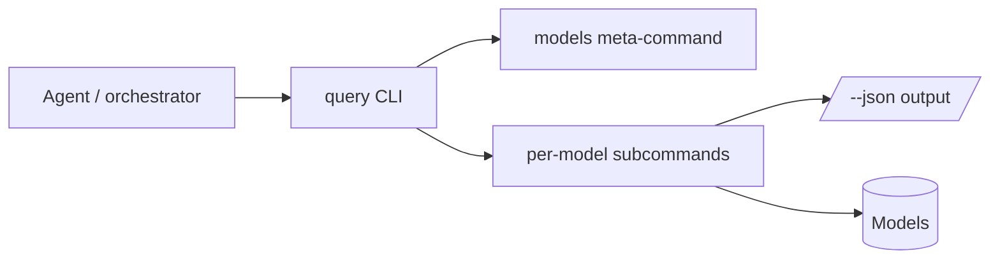

# Model query surface — GoF appendix rendering

> **Draft fill.** Worked Structure + Sample Code slots for the catalogue entry
> `models-bridge/system-models/query-surface.md`, rendered in the book's Gang-of-Four appendix layout. The
> follow-up pass injects the two filled slots at the placeholders keyed by the entry name
> `Model query surface (repo-query)`. Intent / Motivation / Applicability / Consequences / Known Uses /
> Related Patterns are projected from the catalogue `.md` — reproduced in brief so the entry reads as a
> complete GoF page.

## Model query surface (`repo-query`)

**Intent** — One canonical, self-describing query API over all the models — a CLI with deterministic JSON
subcommands — so an agent reads the system's compressed truth *through a tool* rather than parsing raw
files, and the tool itself documents how the models load.

### Motivation

The models are the agent's compressed map, but only if the agent can read them cheaply and correctly. Left
to `cat` and `grep` the model files, an agent re-implements loading and traversal, gets the dialect subtly
wrong, and produces brittle one-offs. Ad-hoc, error-prone model access defeats a queryable map's purpose.

### Applicability

Reach for this when agents and orchestration need the models, not just one Python tool. You need the
models to load cleanly, a stable subcommand and JSON contract agents can act on, and the loader pattern
documented — here, by co-locating the query tool with the models.

### Structure

One CLI sits over the model set. A `models` meta-command self-describes the surface; per-model subcommands
each emit JSON, so an agent consumes structure, not prose.



*Accessible description: an agent calls one query CLI that exposes a self-describing meta-command and
per-model subcommands. The subcommands read the models and emit JSON, giving the agent one structured
answer to act on.*

### Sample Code

The CLI dispatches a subcommand per model and emits JSON. A `models` meta-command lists the surface, so
the tool documents itself and an agent consumes structure instead of re-deriving the loader each time.

```python
import json, sys

# subcommand -> loader for its model (each returns plain records the CLI serializes).
SUBCOMMANDS = {
    "component":    lambda: load_components(),
    "service-flow": lambda: load_services(),
}

def dispatch(argv: list[str]) -> int:
    if not argv or argv[0] == "models":
        print(json.dumps({"subcommands": sorted(SUBCOMMANDS)}))   # self-describing
        return 0
    cmd = argv[0]
    if cmd not in SUBCOMMANDS:
        print(f"unknown subcommand: {cmd}", file=sys.stderr)
        return 2
    print(json.dumps(SUBCOMMANDS[cmd](), default=vars))           # deterministic --json contract
    return 0

if __name__ == "__main__":
    sys.exit(dispatch(sys.argv[1:]))
```

### Consequences

- **Not the sole path** — Python tools still import models directly; the CLI is the *canonical* read path
  for agents and orchestration, a soft convenience, not a lint-banned monopoly.
- **Subcommand surface to maintain** as models are added.

### Known Uses

- A `repo-query`-style CLI with a `models` meta-command plus per-model subcommands, all emitting JSON.
- The query tool exposed to the orchestrator as a skill.

### Related Patterns

- **Bridge** — the *agent-facing* face of the models: how a bounded agent reads the unbounded codebase's
  compressed truth.
- **Consumer** — reads every model here, e.g. component-zone and service-flow.
- **See also** — meta-model consumption: the discipline of reading the model, not a hardcoded copy; this
  CLI is the canonical way to do it.
