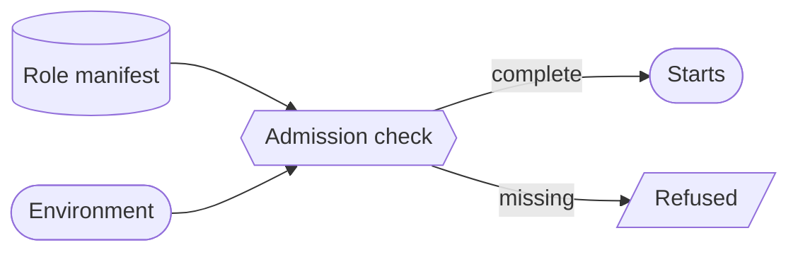

# Required-configuration-per-role manifest (admission policy on complete env) — GoF appendix rendering

> **Draft fill.** Worked Structure + Sample Code slots for the catalogue entry
> `models-bridge/system-models/required-config-per-role-manifest.md`, rendered in the book's Gang-of-Four
> appendix layout. The follow-up pass injects the two filled slots at the placeholders keyed by the entry
> name `Required-configuration-per-role manifest (admission policy on complete env)`. Intent / Motivation /
> Applicability / Consequences / Known Uses / Related Patterns are projected from the catalogue `.md` —
> reproduced in brief so the entry reads as a complete GoF page.

## Required-configuration-per-role manifest (admission policy on complete env)

**Intent** — Declare, per operating role and per plane it runs in, the *complete* set of configuration a
process must have to start, as a typed manifest an admission check reads — then refuse to launch a process
whose environment is missing any of its required set. A missing secret fails loudly at admission, before
the process does half its work and then fails quietly deep in a request.

### Motivation

A process needs a scatter of configuration — API keys, service tokens, admin secrets, endpoint URLs — and
*which* it needs depends on its role and plane. When the required set lives only as implicit knowledge, the
failure is the worst kind of quiet: the process starts fine, runs until it reaches the one code path that
reads the missing variable, and *then* fails — a 403 on an admin endpoint, an auth failure between
services. The environment was incomplete from the first second, but nothing checked completeness at the
boundary.

### Applicability

Reach for this when roles have genuinely different config needs, an admission point exists to check at (a
start-up hook, a dispatch gate) before work begins, and the required set is reconcilable against what each
role's code actually reads, so the manifest cannot drift into an aspirational list.

### Structure

For each role, in each plane, the manifest lists every configuration entry the process must have — the
complete set, not a sample. An admission check compares the process environment against its role-and-plane
required set before any work begins and refuses to start if any entry is missing, reporting the whole gap
at once. A drift gate reconciles the declared set against what each role's code reads.



*Accessible description: a manifest keyed by role and plane maps to the complete required configuration
set; at start-up an admission check compares the process environment against it. A complete environment
starts the process; a missing entry refuses it at the boundary and reports the whole gap at once, rather
than letting the process run until a request needs the value.*

### Sample Code

The check moves completeness to *admission*: the whole required set for this role-and-plane is known before
the process does any work, so an incomplete environment is refused once, at the boundary, with the full
missing list — never a scattered runtime `KeyError` per variable in whatever order the code paths fire.

```python
def admit(role: str, plane: str, env: dict, manifest: dict) -> None:
    """Refuse to start a process whose environment omits any entry in its role-and-plane required set."""
    required = manifest[(role, plane)]                 # the COMPLETE set for this role in this plane
    missing = [key for key in required if not env.get(key)]
    if missing:
        raise SystemExit(                              # fail loud + early, at the boundary — not late + quiet
            f"role={role} plane={plane}: environment incomplete, missing {sorted(missing)}")
```

### Consequences

- **Incomplete environments are refused at the door** — a missing secret fails start-up with the full list
  of what's absent, instead of a late, role-specific, request-specific error.
- **The manifest is another surface to keep true** — a newly-required variable must be added to the
  manifest as well as read in code; the reconciliation gate forces the two to agree.
- **It checks presence, not correctness** — the manifest proves the required set is *present*, not that each
  value is *valid*; a wrong-but-set key still passes admission.

### Known Uses

- A dispatch-role by plane manifest of required configuration: which tokens and secrets each operating role
  must have set, differing between the local plane and the production plane.
- An admission check that refuses to start a process whose environment omits any entry in its
  role-and-plane required set, reporting the whole missing set at once.
- The required set reconciled against what each role's code actually reads, so a newly-mandatory secret
  added in code without a manifest entry is a build finding rather than a late production auth failure.

### Related Patterns

- **Sibling** — the deployment-topology model: both model the physical runtime; that one places the
  processes across the fleet, this one states the configuration each placed process must have to start.
- **Enabler** — role-typed dispatch: the role a process is dispatched under is the key this manifest looks
  its required set up by; typed roles are what make a per-role required set expressible.
- **Consumer** — meta-model consumption: the admission check reads the required set from the manifest rather
  than duplicating it, the read-don't-hardcode discipline applied to configuration.
- **See also** — drift & parity gates: the reconciliation that keeps the declared required set equal to what
  each role's code actually consumes.
