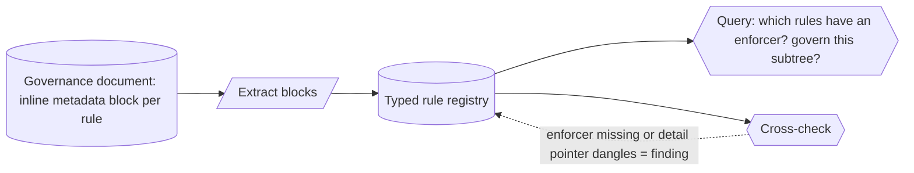

# Rule-metadata registry (machine-readable metadata on governance rules) — GoF appendix rendering

> **Draft fill.** Worked Structure + Sample Code slots for the catalogue entry
> `models-bridge/system-models/rule-metadata-registry.md`, rendered in the book's Gang-of-Four appendix
> layout. The follow-up pass injects the two filled slots at the placeholders keyed by the entry name
> `Rule-metadata registry (machine-readable metadata on governance rules)`. Intent / Motivation /
> Applicability / Consequences / Known Uses / Related Patterns are projected from the catalogue `.md` —
> reproduced in brief so the entry reads as a complete GoF page.

## Rule-metadata registry (machine-readable metadata on governance rules)

**Intent** — Attach machine-readable metadata to each rule in a governance document — its identifier,
scope, severity, the enforcing check, the canonical detail location — as a structured block inside the
rule, then extract those blocks into a typed registry the tooling can query. A body of governance prose
stops being an opaque wall a program can only grep and becomes a model.

### Motivation

A mature governance document accretes dozens of rules, and the interesting questions about them are
*aggregate*: which are backed by an automated check, which apply to a given subtree, which are advisory
versus blocking, which have a canonical detail doc. As long as the rules are only human paragraphs, every
such question is a manual read from memory, and nobody can mechanically tell that a rule *claims* an
enforcing lint that no longer exists.

### Applicability

Reach for this when the governance document has discrete, identifiable rules, each carries a stable
identifier the rest of the system can cite, and an extraction step actually parses the blocks into a
registry and reconciles them against the document and the enforcers.

### Structure

Inside or beside each human rule sits a structured metadata block — a stable identifier, scope, severity,
enforcing check, detail pointer. A build step extracts every block into a typed registry, so the document
projects into a queryable model. The tooling queries the registry instead of grepping the prose, and a
cross-check flags a block citing an enforcer that doesn't exist or a detail pointer that dangles.



*Accessible description: a governance document carries an inline machine-readable metadata block on each
rule — a stable identifier, the rule's scope, its severity, the check that enforces it, and where its full
detail lives. A build step extracts every block into a typed rule registry, turning the document into a
queryable model. Aggregate questions — which rules have an automated enforcer, which govern a subtree,
which are blocking — are answered by walking the registry rather than re-reading the prose. A cross-check
flags a rule whose block cites an enforcer that no longer exists, or whose detail pointer dangles, so the
document cannot claim enforcement the system doesn't have.*

### Sample Code

The block is *typed fields the prose cannot be reduced to by parsing* — "blocking, scoped to the PDF
subtree, enforced by check X" is a fact a grep over English cannot recover. Once extracted, the registry
supports a check prose never could: a rule citing an enforcer that doesn't exist is a build finding.

```python
from dataclasses import dataclass

@dataclass(frozen=True)
class RuleMeta:
    id: str
    scope: str
    severity: str        # e.g. "blocking" / "advisory"
    enforcer: str        # the check that enforces it — or "" for review-only
    detail: str          # canonical detail-doc pointer

def cross_check(registry: list[RuleMeta], enforcers_present: set, docs_present: set) -> list[str]:
    """A block claiming an enforcer that no longer exists is worse than no block — it asserts a gone guarantee."""
    findings = []
    for r in registry:
        if r.enforcer and r.enforcer not in enforcers_present:
            findings.append(f"rule {r.id}: cites enforcer {r.enforcer!r} that does not exist")
        if r.detail and r.detail not in docs_present:
            findings.append(f"rule {r.id}: detail pointer {r.detail!r} dangles")
    return findings

def with_automated_enforcement(registry: list[RuleMeta]) -> list[str]:
    """An aggregate query prose can't answer: which rules are backed by a real check."""
    return sorted(r.id for r in registry if r.enforcer)
```

### Consequences

- **Governance becomes queryable** — aggregate questions about the rules (enforcement coverage, scope,
  severity) are computed over the registry, so the document's consistency is checked, not remembered.
- **Every rule now owes a well-formed block** — adding a rule means authoring its metadata; the
  reconciliation gate makes the block mandatory, and an unstructured rule is a finding.
- **The metadata must not drift from the prose** — a block that says "enforced by X" after X was removed is
  worse than no block; the cross-check against real enforcers keeps the claim honest.

### Known Uses

- Inline metadata blocks on a set of numbered project rules, each carrying the rule's identifier, scope,
  severity, enforcing check, and canonical detail pointer.
- A build step that extracts the blocks into a typed rule registry, so tooling can ask which rules have an
  automated enforcer and which rely on review.
- A cross-check that flags a rule citing an enforcer that no longer exists or a detail pointer that dangles,
  so the governance document's claims stay reconciled with the system that enforces them.

### Related Patterns

- **Counterpart** — the CLAUDE.md rule index: that mechanism governs the governance *document* itself — its
  cap and index discipline on the human prose; this one extracts the machine-readable *metadata* out of the
  rules into a queryable model.
- **Sibling** — domain registries: both turn an enumerable set of facts into a typed registry the tooling
  reads; that one over domain values, this one over governance rules.
- **Consumer** — the query surface: the extracted rule registry is one more model the query surface exposes,
  so "which rules enforce X" joins the other model queries.
- **See also** — drift & parity gates: the reconciliation that keeps the extracted registry equal to the
  document's rules and their real enforcers.
