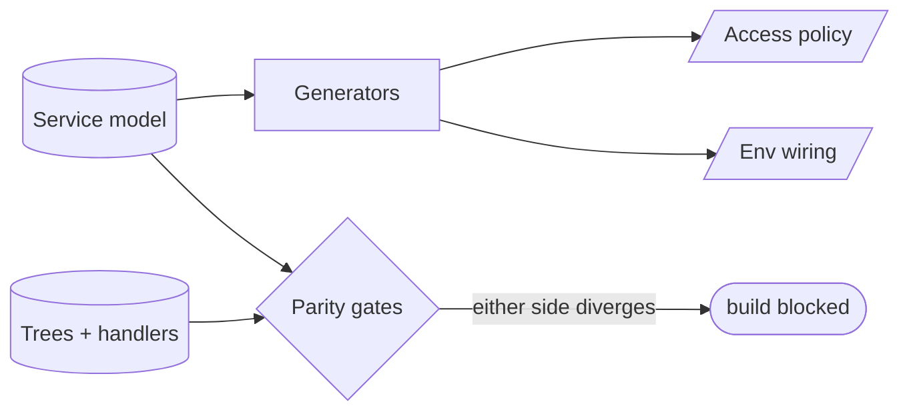

# Service-flow / API model — GoF appendix rendering

> **Draft fill.** Worked Structure + Sample Code slots for the catalogue entry
> `models-bridge/system-models/service-flow-model.md`, rendered in the book's Gang-of-Four appendix
> layout. The follow-up pass injects the two filled slots at the placeholders keyed by the entry name
> `Service-flow / API model`. Intent / Motivation / Applicability / Consequences / Known Uses / Related
> Patterns are projected from the catalogue `.md` — reproduced in brief so the entry reads as a complete
> GoF page.

## Service-flow / API model

**Intent** — A service-catalogue-dialect model of the service-oriented architecture — every service, its
APIs, inter-service auth, and URL wiring — that is the source of truth access policy and wiring are
*generated from* and validated against.

### Motivation

A service-oriented deployment has many parts that must agree: auth headers, URL env vars, access policy,
the deploy table, the public-API contract, the frontend trees. Kept in sync by hand across code, YAML, and
deploy scripts, they drift — a service gains an endpoint the policy doesn't allow, a handler diverges from
its spec. Each drift is a production-shaped bug, and there are many surfaces to drift.

### Applicability

Reach for this when the same service fact is restated in code, deploy YAML, and access policy, and those
restatements diverge. You need a service-architecture dialect expressive enough for the SOA fields,
generators that emit the real artifacts, and bidirectional parity gates.

### Structure

One dialect model is the source of truth. Generators emit access policy, the service catalog, and env
wiring from it; bidirectional parity gates hold every tree to an entity and every handler to its spec.



*Accessible description: one service model feeds generators that emit access policy and env wiring, and
also feeds bidirectional parity gates that compare it against the real trees and handlers. Divergence on
either side blocks the build.*

### Sample Code

The model is the source of truth generators emit from and parity gates check both ways: every declared
service maps to a real handler tree, and every tree maps back to a service — so no copy is hand-synced and
none can silently disagree.

```python
import sys

# The service model: the single source of truth for the SOA.
MODEL = {"web": ["/upload", "/status"], "worker": ["/handle"]}

def generate_policy() -> list[str]:
    return [f"allow {svc} -> {ep}" for svc, eps in MODEL.items() for ep in eps]

def parity(real_trees: dict[str, list[str]]) -> list[str]:
    """Bidirectional: every model service ↔ a real tree, every real endpoint ↔ the model."""
    findings = []
    for svc, eps in MODEL.items():
        real = set(real_trees.get(svc, []))
        findings += [f"{svc}{e}: declared, no handler" for e in set(eps) - real]
        findings += [f"{svc}{e}: handler with no model entry" for e in real - set(eps)]
    for svc in real_trees.keys() - MODEL.keys():
        findings.append(f"service '{svc}' exists but is unmodeled")
    return findings

if __name__ == "__main__":
    # `scan_handler_trees` enumerates the real service->endpoints map from the code.
    findings = parity(scan_handler_trees())
    for f in findings:
        print(f"SOA-DRIFT: {f}")
    sys.exit(1 if findings else 0)
```

### Consequences

- **A new service, endpoint, or tree ⇒ a model edit**, or a parity-gate failure.
- **Dialect lock-in** — adopting the catalogue schema inherits its conventions, a deliberate
  "adopt the canonical schema" trade.
- **Generator and gate maintenance** across several surfaces.

### Known Uses

- A service-catalogue-dialect YAML — source of truth for inter-service auth, URLs, access policy, and the
  deploy table.
- The web-API, wire-contract, and config schemas.
- Drift gates: the tree-vs-yaml parity lint and the handler-vs-spec public-API lint.

### Related Patterns

- **Bridge** — agents query it to reason about the SOA; it generates and governs the deployed system.
- **Enabler** — feeds model-driven codegen.
- **Counterpart** — drift & parity gates: the bidirectional parity lints.
