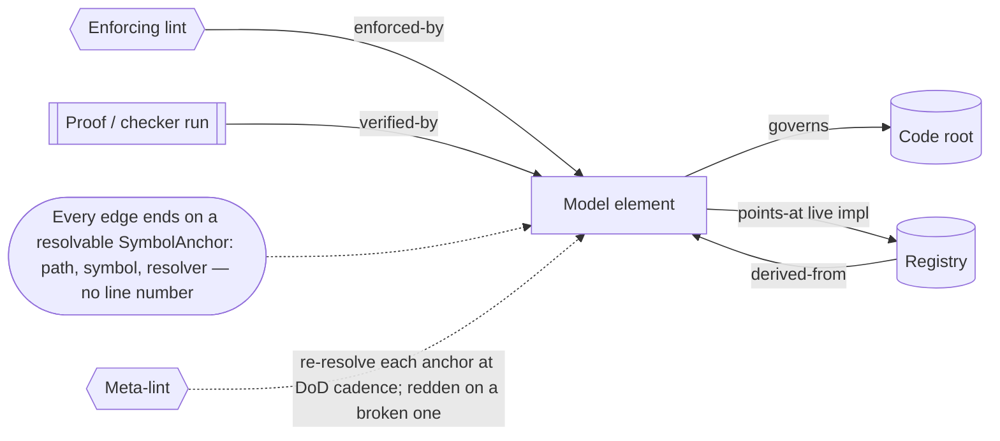

# Symbol-anchored traceability graph (derived edges) — GoF appendix rendering

> **Draft fill.** Worked Structure + Sample Code slots for the catalogue entry
> `models-bridge/system-models/symbol-anchored-traceability-graph.md`, rendered in the book's
> Gang-of-Four appendix layout. The follow-up pass injects the two filled slots at the placeholders keyed
> by the entry name `Symbol-anchored traceability graph (derived edges)`. Intent / Motivation /
> Applicability / Consequences / Known Uses / Related Patterns are projected from the catalogue `.md` —
> reproduced in brief so the entry reads as a complete GoF page.

## Symbol-anchored traceability graph (derived edges)

**Intent** — Link every model to its lint, its code entry-point, its proof, its related models, and its
registry as a typed graph whose every edge is a *derived* obligation a lint re-checks — each edge
terminating on a resolvable *symbol*, never a line number — so when the code moves and breaks an edge, the
model-to-code drift becomes mechanically visible at scan time. The governing principle: derived edges
defend; snapshotted ones drift.

### Motivation

The executable models that let a context-bounded agent operate a context-exceeding codebase are only
useful while the map equals the territory. A model names the lint that enforces it, the code root it
governs, the test that verifies it, the registry it reconciles against — and those cross-references rot the
moment the code moves without them. The failure is *silent traceability rot*: a reference to a symbol goes
stale when the symbol is renamed or deleted, and the model still looks authoritative while pointing at a
ghost.

### Applicability

Reach for this when static symbol resolvers already exist (a language-aware analyzer per language whose
cross-reference the graph *composes*), the models have addressable elements the edges can terminate on,
the anchor can live in-situ with the code or model site, and a cadence policy declares *when* the costly
re-derivation runs (audit / definition-of-done, not per-commit).

### Structure

Every edge terminates on a `SymbolAnchor` — a resolvable `(path, symbol, resolver)` reference, carrying no
line number — and joins two of five node genres (a model element, its lint, its code root, its proof, its
registry) under a closed edge vocabulary. Each edge carries a non-optional derivation. A meta-lint
re-resolves every anchor at check time and reddens on a broken one; the same anchors make the graph
bidirectionally traversable.



*Accessible description: a central model-element node is joined to four other node genres by typed,
closed-vocabulary edges — enforced-by its lint, governs its code root, verified-by its proof or checker
run, derived-from its registry, and points-at the live implementation. Every edge terminates on a
resolvable SymbolAnchor of (path, symbol, resolver) that carries no line number, so it survives a refactor
above it. A meta-lint re-resolves each anchor at definition-of-done or audit cadence and reddens a broken
one. The same resolving anchors let an agent traverse the graph both ways — code to model, or model to
code — on one index.*

### Sample Code

An edge is typed over a closed kind vocabulary and carries a *non-optional* derivation — the function that
re-proves the edge by reading live code, a registry, or a doc at check time. The meta-lint runs each
edge's derivation against its anchor; a vanished symbol reddens the edge. That is "derived defends":
nothing is stored as a snapshot that could silently go stale.

```python
from dataclasses import dataclass
from typing import Callable

EDGE_KINDS = {"governs", "enforced-by", "verified-by", "derived-from", "points-at", "related-to"}

@dataclass(frozen=True)
class SymbolAnchor:
    path: str
    symbol: str        # a function/class name — NEVER a line number (lines churn; a symbol survives)
    resolver: str      # chosen by extension: code analyzer / registry membership / doc heading

@dataclass(frozen=True)
class TraceEdge:
    src: SymbolAnchor
    dst: SymbolAnchor
    kind: str                                    # must be in EDGE_KINDS
    derivation: Callable[[SymbolAnchor], bool]   # NON-optional: how the edge re-proves itself at check time

def meta_lint(edges: list[TraceEdge]) -> list[str]:
    """Re-derive every edge at check time; a vanished symbol reddens the edge — derived defends."""
    findings = []
    for e in edges:
        if e.kind not in EDGE_KINDS:
            findings.append(f"{e.kind}: edge kind outside the closed vocabulary")
        if not e.derivation(e.dst):              # resolve the anchor against live code / registry / doc
            findings.append(f"{e.src.symbol} --{e.kind}--> {e.dst.symbol}: anchor no longer resolves")
    return findings
```

### Consequences

- **Resolution is expensive, so the check is not per-commit** — a cross-reference per symbol over a large
  tree is slow; the re-derivation lint is a scan-time / definition-of-done mechanism, and a fast keyword
  companion catches the cheap cases inline.
- **A weak-prover fallback is a standing warning** — a code anchor that resolves only by textual presence
  is a declared weak edge; left un-burned-down it re-admits the drift the strong prover exists to remove.
- **Resolution catches deletion, not demotion** — a symbol that still exists but no longer plays the role
  the edge claims resolves green; the present-tense keyword companion covers that gap.
- **The edge vocabulary must fit the domain** — a relationship the closed kind set can't express forces an
  enum change, the honest signal the join web grew a dimension.

### Known Uses

- A traceability graph over the system models whose typed edges join each model element to its enforcing
  lint, governed code root, verifying test or formal proof, related models, and registry entry — every edge
  symbol-anchored and re-derived by a meta-lint. A fan-out over twelve models classified roughly
  six-hundred anchors and caught about fourteen genuine model-to-code drifts, for most of which no existing
  lint fired — the graph was their first mechanical detection.
- The clean-versus-drifted split re-confirming the governing principle: the models carrying a standing
  anchor-resolution lint drifted zero times; the drift concentrated in registries with no such lint.
- The active-implementation registry plus its pointer-agreement lint — a `points-at` edge whose derivation
  is registry agreement — seeded by a deploy incident where a built-but-unwired replacement left every
  pointer surface aimed at a deleted driver.
- Proof-as-anchor: where an invariant carries a model-check, the proof is just another anchor kind, so the
  graph can trigger re-running the checker when anchored code changes.

### Related Patterns

- **Counterpart** — drift & parity gates: a per-model model-to-reality equality check. This generalizes
  that one edge kind into a typed graph spanning model-lint-code-proof-registry, and turns "does the edge
  still hold?" from a hand-maintained matrix into a re-derived walk.
- **Enabler** — executable source-of-truth: the structured models are the nodes this graph's edges
  terminate on; the graph is one more consumer of that substrate.
- **See also** — coverage-to-model-node mapping: a sibling join that maps *tests* onto model nodes; this
  maps *code, lints, and proofs* onto them and re-checks that the joins resolve.
- **See also** — control-to-substrate dependency: the neighbouring self-application that types each
  control's *substrate assumption*; this types each *trace edge* and re-derives it.
- **See also** — meta-model consumption: the read-don't-copy discipline the derived-over-snapshot invariant
  extends from a single value to a whole edge; and the query surface a bidirectional trace query rides on.
