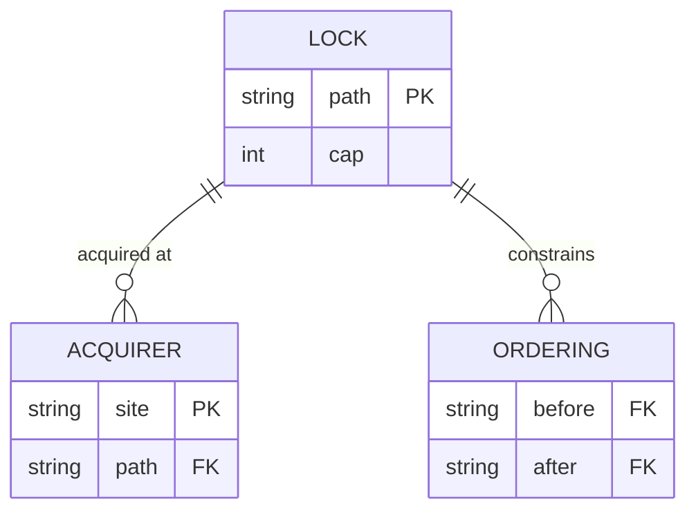

# Synchronization model (meta-sync) — GoF appendix rendering

> **Draft fill.** Worked Structure + Sample Code slots for the catalogue entry
> `models-bridge/system-models/synchronization-model.md`, rendered in the book's Gang-of-Four appendix
> layout. The follow-up pass injects the two filled slots at the placeholders keyed by the entry name
> `Synchronization model (meta-sync)`. Intent / Motivation / Applicability / Consequences / Known Uses /
> Related Patterns are projected from the catalogue `.md` — reproduced in brief so the entry reads as a
> complete GoF page.

## Synchronization model (meta-sync)

**Intent** — A typed registry that models the system's synchronization behaviour — every OS-level lock,
which shared resource it guards, and the required acquisition *ordering* — so concurrency contracts are
declared and checkable, not tribal.

### Motivation

A fleet of agents on one host contends over shared resources through OS locks. Left undocumented, two
failures lurk: an undeclared lock nobody knows guards what, and an inverted acquisition order between two
locks that deadlocks. Both are invisible in the code and catastrophic at runtime, and they recur as new
locks are added.

### Applicability

Reach for this when several tools take OS locks and "which locks exist, what do they guard, in what
order?" has no answer but a deadlock. You need a typed lock/acquirer/ordering schema, a coverage lint over
the real lock call sites, and an ordering-constraint graph.

### Structure

Three record kinds compose the registry — the lock, its acquisition site, and an ordering constraint. A
coverage lint flags an undeclared lock; an ordering lint walks the constraint graph and flags an inverted
acquisition.



*Accessible description: a lock record relates to many acquisition sites and many ordering constraints. A
coverage lint checks every real lock call site is a declared acquirer; an ordering lint checks acquisitions
respect the before/after constraints.*

### Sample Code

The registry declares each lock and the order pairs. An ordering lint walks a lock-acquisition sequence
against the declared graph and fails on an inversion — so a deadlock-inducing order is caught at author
time, not suffered in production.

```python
import sys

# Declared ordering: a lock in `before` must be acquired before its `after` lock.
ORDERINGS = [("db-lock", "cache-lock")]      # db before cache, always

def ordering_lint(acquire_sequence: list[str]) -> list[str]:
    """A held-lock acquiring one that must precede it is an inversion (deadlock risk)."""
    findings, held = [], []
    for lock in acquire_sequence:
        for before, after in ORDERINGS:
            if lock == before and after in held:
                findings.append(f"acquired '{before}' while holding '{after}' — order inverted")
        held.append(lock)
    return findings

if __name__ == "__main__":
    # `walk_acquisitions` reads a code path's lock-acquisition order from the declared sites.
    findings = ordering_lint(walk_acquisitions())
    for f in findings:
        print(f"LOCK-ORDER: {f}")
    sys.exit(1 if findings else 0)
```

### Consequences

- **Every new lock is a registry entry** — an undeclared lock fails the coverage lint.
- **The ordering graph must be maintained** — a missing edge lets a real inversion through.
- **Exempt sites need a rationale** — the closed-set carve-out is a small surface.

### Known Uses

- A synchronization registry of lock / acquirer / ordering records for the dev-time locks.
- The sync-coverage lint (undeclared-lock gate) and the ordering-constraint lint (deadlock-risk gate).

### Related Patterns

- **Bridge** — the fleet's mediators acquire these locks; the model governs the concurrency contracts the
  code must honor.
- **Counterpart** — drift & parity gates: the coverage and ordering lints that hold the model true.
- **See also** — mediator & single-writer contracts: the higher-level side of the same concurrency story.
