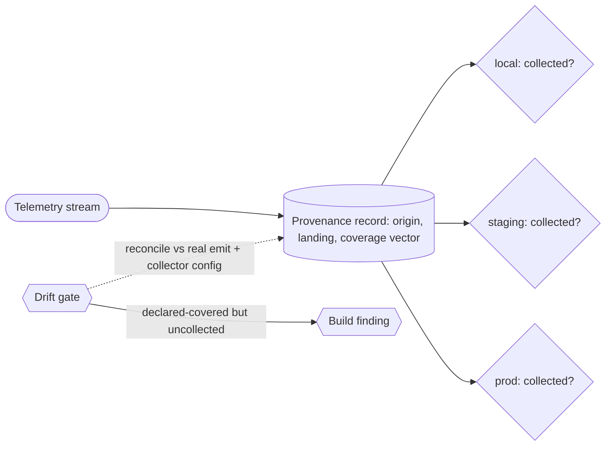

# Telemetry-collection provenance (per-stream origin, landing, per-env coverage) — GoF appendix rendering

> **Draft fill.** Worked Structure + Sample Code slots for the catalogue entry
> `models-bridge/system-models/telemetry-collection-provenance.md`, rendered in the book's Gang-of-Four
> appendix layout. The follow-up pass injects the two filled slots at the placeholders keyed by the entry
> name `Telemetry-collection provenance (per-stream origin, landing, per-env coverage)`. Intent /
> Motivation / Applicability / Consequences / Known Uses / Related Patterns are projected from the catalogue
> `.md` — reproduced in brief so the entry reads as a complete GoF page.

## Telemetry-collection provenance (per-stream origin, landing, per-env coverage)

**Intent** — Model each telemetry stream as a typed record of its *provenance* — where it originates, where
it lands, and in which environments it is actually collected — so the coverage of the observability surface
is a declared, checkable fact rather than an assumption. The failure it kills is the silent one: a metric
collected in production but quietly absent in the local plane, so a developer reasons over a signal that
isn't there.

### Motivation

Telemetry is trusted precisely when it is present, and its presence is uneven across environments in ways
nobody wrote down. A metric wired up in production may never be collected locally. The developer profiling
a slow path locally reads the dashboard, sees the metric flat, and concludes the path is cheap — when in
truth it was never emitted in that plane. The reasoning is corrupted not by a wrong number but by an
*absent* one that looks like a present zero.

### Applicability

Reach for this when coverage genuinely varies by plane, the emit points and collector configuration are
reconcilable against the declared record, and "collected here" is a fact a gate can evaluate against the
real collectors rather than a hopeful annotation.

### Structure

Each stream carries three typed things: its origin (what emits it), its landing (the sink it flows to), and
a per-environment coverage vector (whether each plane actually collects it). A drift gate reconciles the
record against the real emit and collector sites. Because coverage is declared per environment, a flat
metric is classified — a genuine zero where collected, or simply absent where it isn't.



*Accessible description: a telemetry stream is modeled as a provenance record naming its origin (what
emits it), its landing sink, and a per-environment coverage vector stating whether the local, staging, and
production planes each actually collect it. A drift gate reconciles the declared record against the real
emit points and the collector configuration; a stream declared collected in an environment where the
collector does not receive it is a build finding. The coverage vector also tells a genuine zero (collected,
value zero) from an absent stream (never collected here), the exact confusion that makes missing telemetry
dangerous.*

### Sample Code

The coverage vector is what a name list omits and what the failure turns on: it separates a true zero from
an absent stream, and it lets a gate assert "declared collected here, and the collector really receives
it." A mismatch is caught at build time, not mid-analysis over a misread dashboard.

```python
from dataclasses import dataclass

@dataclass(frozen=True)
class StreamProvenance:
    name: str
    origin: str                    # what emits the stream
    landing: str                   # the sink it flows to
    coverage: dict[str, bool]      # plane -> declared collected? e.g. {"local": False, "prod": True}

def coverage_findings(streams: list[StreamProvenance], collectors: dict[str, set]) -> list[str]:
    """A stream declared collected in a plane whose collector does not receive it reddens the gate."""
    findings = []
    for s in streams:
        for plane, declared in s.coverage.items():
            really = s.name in collectors.get(plane, set())
            if declared and not really:
                findings.append(f"{s.name}: declared collected in {plane}, collector does not receive it")
    return findings

def classify_flat(stream: StreamProvenance, plane: str) -> str:
    """Absent vs zero: a flat metric is 'genuine-zero' where collected, 'absent' where it is not."""
    return "genuine-zero" if stream.coverage.get(plane) else "absent-not-collected"
```

### Consequences

- **Missing telemetry stops being invisible** — a stream declared collected where the collector doesn't
  receive it reddens the gate, so the misread-dashboard failure is caught at build time.
- **The coverage vectors must track the collectors** — a record that says "collected locally" after the
  collector was reconfigured gives false confidence; the reconciliation gate keeps the vector honest.
- **It models presence, not usefulness** — the record proves a stream is collected where it claims, not
  that the stream is *worth* collecting.

### Known Uses

- A per-stream telemetry registry recording each stream's origin, its landing sink, and a per-environment
  coverage vector across the local, staging, and production planes.
- A check reconciling the declared coverage against the real emit points and collector configuration, so a
  metric emitted in production but silently uncollected locally is a build finding.
- Coverage vectors used to tell a genuine zero from an absent stream, so a developer profiling in one plane
  is not misled by a metric that plane never collected.

### Related Patterns

- **Sibling** — caused-by provenance: both are provenance models; that one records *what change caused* a
  code effect, this one records *where an observability stream comes from and lands*.
- **Consumer** — the typed event bus: the event streams this model tracks the coverage of are often the very
  topics an event bus carries; the provenance record says which of them land where.
- **Layer** — drift & parity gates: the reconciliation that keeps the declared origins, landings, and
  coverage equal to the real emit and collection sites.
- **See also** — deploy heartbeats: a concrete telemetry stream whose per-environment presence is exactly
  the kind of coverage fact this model would declare and check.
