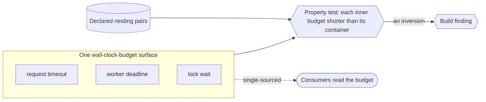

# Timeout-budget ordering model (nested wall-clock budgets, checked) — GoF appendix rendering

> **Draft fill.** Worked Structure + Sample Code slots for the catalogue entry
> `models-bridge/system-models/timeout-budget-ordering-model.md`, rendered in the book's Gang-of-Four
> appendix layout. The follow-up pass injects the two filled slots at the placeholders keyed by the entry
> name `Timeout-budget ordering model (nested wall-clock budgets, checked)`. Intent / Motivation /
> Applicability / Consequences / Known Uses / Related Patterns are projected from the catalogue `.md` —
> reproduced in brief so the entry reads as a complete GoF page.

## Timeout-budget ordering model (nested wall-clock budgets, checked)

**Intent** — Gather a system's scattered wall-clock budgets — request timeouts, worker deadlines, lock
waits, retry windows — into one typed surface, and state the ordering that must hold between them as a
machine-checkable invariant: an inner budget must expire before the outer budget that contains it. The
nesting stops being an accident of separately-edited constants and becomes a property a check can prove.

### Motivation

Wall-clock budgets get set independently, one constant at a time. Each looks reasonable alone; the bugs
live in the *relationships* between them. An inner operation whose timeout exceeds its caller's deadline is
abandoned mid-flight when the outer one gives up first; a lock wait longer than the request that holds it
dies still waiting; a retry window outlasts the total budget it was meant to fit inside. None is visible in
any single constant, and nothing in the codebase states inner-must-expire-before-outer, so nothing checks
it.

### Applicability

Reach for this when budgets have a real containment structure (a request containing a worker call
containing a lock wait), consumers actually read from one surface rather than mirroring it, and a
property-test harness quantifies over the declared pairs — without a check that quantifies, the ordering is
a comment.

### Structure

Every budget lives in one declared surface, each a named entry. For each pair where one operation runs
inside another, the model records that the inner budget must be strictly shorter than the outer — the
containment made explicit. A property test quantifies over the declared pairs and asserts the ordering, so
a raised budget that breaks nesting reddens the gate. Consumers source their timeout from the surface, so
the checked values are the used values.



*Accessible description: request timeouts, worker deadlines, and lock waits live together in one declared
budget surface rather than scattered across files. A set of declared nesting pairs — which operation runs
inside which — feeds a property test that asserts each inner budget is strictly shorter than its container,
across every declared pair and any future edit. An inversion (an inner budget raised past its outer one) is
a build finding. Consumers source their timeout from the single surface, so the budgets the check reasons
over are the budgets the running pipeline enforces.*

### Sample Code

The property test quantifies over the declared pairs, so the invariant holds for the whole surface and for
any future edit, not merely the current numbers — that is the difference between storing the budgets and
*modeling* them. Bumping an inner timeout past its outer one fails the check at the edit.

```python
BUDGETS = {                        # one surface; consumers READ from here, never mirror a copy
    "request": 300, "worker": 240, "lock_wait": 30, "retry_window": 60,
}
NESTING = [                        # (inner, outer): inner runs inside outer, so inner must be shorter
    ("worker", "request"),
    ("lock_wait", "worker"),
    ("retry_window", "worker"),
]

def ordering_findings(budgets: dict, nesting: list) -> list[str]:
    """For all nested pairs, inner < outer — a linear-ordering invariant proved over the whole surface."""
    return [f"{inner} ({budgets[inner]}s) not shorter than its container {outer} ({budgets[outer]}s)"
            for inner, outer in nesting if budgets[inner] >= budgets[outer]]
```

### Consequences

- **Timeout inversions become impossible to land quietly** — raising a budget past its container fails a
  check at the edit, exactly the class that used to surface only as an intermittent hang under load.
- **The nesting relation must be authored, not just the numbers** — someone has to say which budget contains
  which; that declaration is the model's substance, and an unstated nesting is unchecked.
- **Small surface, sharp payoff, narrow scope** — the model governs one property (ordering) and does not
  tell you whether any individual budget is *well chosen*, only that the budgets are consistently nested.

### Known Uses

- A single wall-clock-budget surface for a document pipeline: per-stage deadlines, lock waits, and retry
  windows gathered into one declared object.
- A property test asserting the nesting order — each inner budget strictly shorter than the deadline of the
  operation that contains it — across every declared pair, so an inversion fails at build time.
- Consumers sourcing their timeout from the surface, so the budgets a check reasons over are the budgets the
  running pipeline enforces.

### Related Patterns

- **Layer** — the composed state-machine model: timeout inversions cause the terminal-state and requeue
  races that model names as cross-machine invariants; the budget ordering is one concrete guard beneath
  those lifecycle predicates.
- **Consumer** — formal invariant verification: the nesting order is a linear-ordering predicate, exactly
  the shape that mechanism routes to a property test.
- **Sibling** — the synchronization model: both model an otherwise-implicit ordering constraint over shared
  resources — that one the lock-acquisition order, this one the timeout containment order.
- **See also** — meta-model consumption: consumers reading their budget from the one surface rather than
  hardcoding it is that read-side discipline applied to timeouts.
