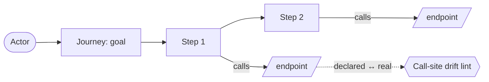

# User-journey model (product-goal → implementation bridge) — GoF appendix rendering

> **Draft fill.** Worked Structure + Sample Code slots for the catalogue entry
> `models-bridge/system-models/user-journey-model.md`, rendered in the book's Gang-of-Four appendix
> layout. The follow-up pass injects the two filled slots at the placeholders keyed by the entry name
> `User-journey model (product-goal → implementation bridge)`. Intent / Motivation / Applicability /
> Consequences / Known Uses / Related Patterns are projected from the catalogue `.md` — reproduced in
> brief so the entry reads as a complete GoF page.

## User-journey model (product-goal → implementation bridge)

**Intent** — Model the product's user journeys as first-class typed entities — each an *actor* pursuing a
*goal* through *ordered steps*, every boundary-crossing step joined to the endpoint it calls — so the path
from what the product is for to what the code must provide becomes a queryable, drift-checked model.

### Motivation

The path from a product goal to the code that serves it lives in people's heads. Nothing ties a journey to
the endpoints it hits, the tests that cover it, or the services it needs. So journeys go untested,
endpoints accrete that no journey needs, and a component's declared dependencies fall out of date with the
calls its code actually makes — because the journey is the one thing the code never names.

### Applicability

Reach for this when the actor/goal/ordered-steps intent is human knowledge a grep can't derive, endpoints
are already addressable, and reconciliation machinery can be pointed at the model. Graft the journey kind
into a service dialect you already lint rather than standing up a parallel model.

### Structure

Each journey is an actor pursuing a goal through ordered steps, each step naming the endpoint it crosses a
boundary to reach. A call-site drift lint holds the derived dependency list to the real calls in both
directions.



*Accessible description: an actor pursues a goal through ordered steps, each step calling an endpoint. A
call-site drift lint reconciles the journey's declared dependencies against the endpoints its code
actually calls, both directions.*

### Sample Code

A journey's dependency list is *derived* from its real call sites, so a drift lint checks it both ways:
every declared dep has a real call, and every call is declared. This makes the model a checked cache of
the call-site truth, not a hand-authoritative document that rots.

```python
import sys

def call_site_drift(declared: set[str], actual_calls: set[str]) -> list[str]:
    """Both directions: no stale declaration, no silent under-declaration."""
    findings  = [f"declared dep '{d}' has no call site (stale)" for d in sorted(declared - actual_calls)]
    findings += [f"call to '{c}' not in declared deps (under-declared)" for c in sorted(actual_calls - declared)]
    return findings

def dead_endpoint_audit(all_endpoints: set[str], reached: set[str]) -> list[str]:
    """Every exposed endpoint must be reached by some journey; the rest is dead surface."""
    return [f"endpoint '{e}' reached by no journey" for e in sorted(all_endpoints - reached)]

if __name__ == "__main__":
    # `declared_deps` reads the journey's model; `scan_calls` reads its code's service-client calls.
    findings = call_site_drift(declared_deps(), scan_calls())
    for f in findings:
        print(f"JOURNEY-DRIFT: {f}")
    sys.exit(1 if findings else 0)
```

### Consequences

- **A new journey, or a new call in a journey's code, ⇒ a model edit**, or the drift lint fails at that PR.
- **The controls land audit-only first**, then promote to blocking once the drift they surface is drained.
- **Journey granularity is a modeling choice** — too coarse and the audits are toothless, too fine and the
  model is noise.

### Known Uses

- Typed journey entities (actor, goal, ordered steps, per-step endpoint calls, and call-site anchors)
  carried as a new kind in an existing service dialect.
- The call-site drift lint plus two-way endpoint-coverage audits (undertested-journey and dead-endpoint).
- A journey-aware wake/scale capability keyed to the active journey's declared deps, gated on the drift
  lint being blocking.

### Related Patterns

- **Enabler** — the service-flow model, whose dialect, loader, query surface, and lint this journey kind
  reuses rather than a parallel model.
- **See also** — drift & parity gates: the call-site drift lint and the two coverage audits are that
  parity applied to this model.
- **See also** — executable source-of-truth: the pattern this instantiates — data-not-code, read every
  run, held equal to reality.
