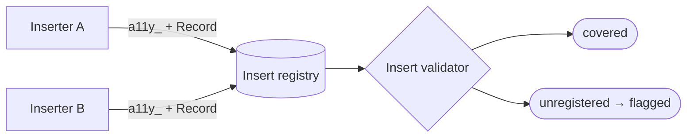

# `a11y_` prefix convention — GoF appendix rendering

> **Fill draft.** Structure + Sample Code slots for the catalogue entry
> `product/provenance-and-attribution/a11y-prefix.md`, in the book's Gang-of-Four appendix layout. The
> follow-up pass injects the two filled slots at the placeholders keyed by the entry name
> `` `a11y_` prefix convention ``. Intent / Motivation / Applicability / Consequences / Known Uses /
> Related Patterns are projected from the catalogue `.md` — reproduced in brief so the entry reads as a
> complete GoF page.

## `a11y_` prefix convention

**Intent** — A reserved naming prefix that marks tool-inserted, invisible-to-author artifacts, so
inserted content is distinguishable from authored content and a validator can cover it by prefix.

### Motivation

The tool inserts content: alt text, tags, off-canvas scaffolding. Mixing tool-inserted content with
author-written content risks two failures — presenting invisible scaffolding as if the user wrote it, or
an insert that isn't tracked and so isn't validated. The failure is untracked or mislabelled inserted
content, and it recurs per inserter and per insertion site.

### Applicability

Reach for this when a tool inserts artifacts into a document, some inserts are invisible to the author
and must be marked, and a validator needs to find every insert to cover it. Adopt a naming rule
(invisible inserts get the reserved prefix, user-visible inserts do not, spec-mandated names keep the
spec name) and have every inserter register itself, so coverage is mechanical rather than a promise.

### Structure

Each inserter names its artifact by the rule and records it in the registry. The validator reads the
registry — and can also recognize any invisible insert by its prefix — so every registered insert is
covered.



*Accessible description: two inserters each name their artifact with the reserved prefix and record it in
the insert registry. The validator reads the registry and covers every registered insert; an insert that
was never recorded is flagged.*

### Sample Code

Two parts make coverage automatic: a naming rule that marks an invisible insert by a reserved prefix, and
a registry every inserter records into. The validator then walks the registry, so a new inserter is
covered the moment it records — no hand-maintained list to drift.

```python
PREFIX = "a11y_"   # reserved marker for invisible-to-author inserts

def insert_name(base: str, *, visible: bool, spec_name: str | None = None) -> str:
    if spec_name is not None:
        return spec_name             # spec-mandated names win
    return base if visible else f"{PREFIX}{base}"

class InsertRegistry:
    def __init__(self): self._records: list[dict] = []
    def record(self, name: str, kind: str) -> None:
        self._records.append({"name": name, "kind": kind})
    def all(self) -> list[dict]: return self._records

def validate_inserts(reg: InsertRegistry) -> list[str]:
    # every invisible insert must carry the prefix; the registry is the coverage set
    return [f"insert '{r['name']}' is invisible but unprefixed"
            for r in reg.all() if r["kind"] == "invisible" and not r["name"].startswith(PREFIX)]
```

### Consequences

- **Adherence is partly discipline.** A mis-named or unregistered insert escapes coverage until caught.
- **Spec-mandated names are exceptions** to the prefix rule, a small carve-out to track.
- **Every inserter must record** — the automatic coverage only works if the registration habit holds.

### Known Uses

- The reserved-prefix naming convention (invisible → prefix, user-visible → not, spec-mandated → spec
  name) and its per-site corollaries.
- The insert registry plus a validator that reads it for automatic coverage.

### Related Patterns

- **Consumer** — the inserted-content validator reads the registered inserts; naming and registration
  are what it depends on.
- **See also (sibling)** — closed remediation-verb sets: both bound the remediator's move-space; this
  one bounds how inserted content is named and tracked.
