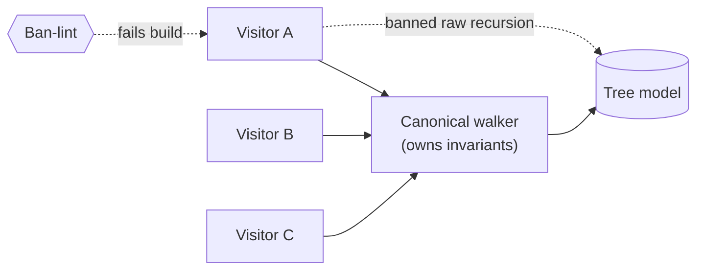

# Canonical walkers (one traversal per tree) — GoF appendix rendering

> **Fill draft.** Structure + Sample Code slots for the catalogue entry
> `product/canonical-models-and-seams/canonical-walkers.md`, in the book's Gang-of-Four appendix layout.
> The follow-up pass injects the two filled slots at the placeholders keyed by the entry name
> `Canonical walkers (one traversal per tree)`. Intent / Motivation / Applicability / Consequences /
> Known Uses / Related Patterns are projected from the catalogue `.md` — reproduced in brief so the entry
> reads as a complete GoF page.

## Canonical walkers (one traversal per tree)

**Intent** — Give each tree exactly one canonical walker that owns its traversal invariants, and route
all traversal through it instead of ad hoc recursion, so those invariants live in one place.

### Motivation

Ad hoc tree recursion re-implements traversal at every site, and each copy is subtly wrong in its own
way. One misses a node type, another visits in the wrong order, a third forgets the indirect references.
The same traversal bug recurs per site, and because each is hand-rolled, a fix to one never reaches the
others.

### Applicability

Reach for this when a tree is walked from many sites, each walk must honor the same invariants (visit
every node type, in order, resolve indirect references), and hand-rolled recursion keeps drifting from
those invariants. Pair it with the typed model the tree lives in: the walker is the one sanctioned
traversal over that model, and the same ban-lint that guards raw model access also bans raw recursion.

### Structure

Every call site that needs to walk the tree reaches it through the one canonical walker. The walker owns
the traversal invariants; a lint bans the direct edge — hand-rolled recursion or a regex reaching into
the tree fails the build.



*Accessible description: three visitors all reach the tree through one canonical walker that owns the
traversal invariants. A dashed edge marks a visitor recursing into the tree directly; the ban-lint fails
the build on that edge, so every surviving path to the tree runs through the walker.*

### Sample Code

A canonical walker holds the traversal invariants once — visit order, node-type coverage, reference
resolution — and hands each node to a visitor callback. Callers supply a visitor; they never write the
recursion. The value is that the "forgot to resolve the reference" bug now lives in exactly one place,
so fixing it once fixes every caller.

```python
from typing import Callable, Iterator

class TreeWalker:
    """The one sanctioned traversal over the tree. It owns the invariants every
    ad hoc recursion kept getting wrong: visit every node type, in document order,
    following indirect references to their target."""

    def __init__(self, resolve: Callable[[object], object]):
        self._resolve = resolve  # turns an indirect ref into the node it points at

    def walk(self, root) -> Iterator[object]:
        stack = [root]
        while stack:
            node = self._resolve(stack.pop())   # invariant: always resolve first
            yield node
            # invariant: children in document order, so pushed reversed
            stack.extend(reversed(getattr(node, "children", [])))


def collect_alt_text(root, walker: TreeWalker) -> list[str]:
    # a visitor: it never recurses itself — it just consumes the canonical order
    return [n.alt for n in walker.walk(root) if getattr(n, "alt", None)]
```

### Consequences

- **The walker must expose what callers need.** A missing traversal shape pushes a caller back to raw
  recursion, so coverage of the callers' needs matters as much as it does for the model.
- **Low novelty.** A well-understood DRY-plus-walker pattern; its value is invariant-centralization, not
  invention.
- **Coupled to the tree shape.** Restructuring the tree means updating the one walker in step.

### Known Uses

- One walker per tree: a structure-tree walker, a checking-pass walker, one walker per office-document
  part.
- The walker discipline that routes all traversal through them, with raw recursion and regex-into-tree
  banned alongside raw library access.

### Related Patterns

- **See also** — the typed models the trees belong to: a canonical walker is *how you traverse* those
  models, part of the same typed-seam discipline.
- **Enabler** — a canonical walker makes routing traversal through the typed models practical; without
  it, callers reach for raw recursion and re-open the ban-lint's door.
