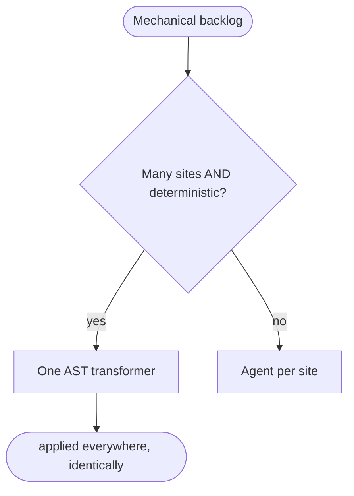

# Codemod-first threshold (N≳50 → AST transformer) — GoF appendix rendering

> **Fill draft.** Structure + Sample Code slots for the catalogue entry
> `product/repair-vocabulary/codemod-first.md`, in the book's Gang-of-Four appendix layout. The follow-up
> pass injects the two filled slots at the placeholders keyed by the entry name
> `Codemod-first threshold (N≳50 → AST transformer)`. Intent / Motivation / Applicability / Consequences /
> Known Uses / Related Patterns are projected from the catalogue `.md` — reproduced in brief so the entry
> reads as a complete GoF page.

## Codemod-first threshold (N≳50 → AST transformer)

**Intent** — For a large mechanical backlog (many sites with a deterministic fix shape), author *one
AST-level transformer* instead of dispatching one agent per site, bounding *how* large mechanical changes
are made.

### Motivation

A large mechanical lint backlog — say two hundred sites all needing the same deterministic edit — tempts
one of two bad responses: dispatch an agent per site (expensive, and each introduces per-site drift) or
hand-edit them (slow and inconsistent). The failure is N inconsistent fixes for a change that is actually
a single deterministic transform, and it recurs at every large mechanical backlog.

### Applicability

Reach for this when the backlog is large *and* the fix is deterministic — the same edit shape at every
site, no per-site judgment. Author one AST transformer, review it once, run it everywhere. Keep the
per-site-agent route for backlogs where each site genuinely needs a judgment call. The threshold picks
between them: many sites plus a deterministic shape means codemod.

### Structure

A branching decision: count the sites and ask whether the fix shape is deterministic. Many sites with a
deterministic shape route to one AST transformer; a shape needing per-site judgment routes to a per-site
agent.



*Accessible description: a decision node asks whether the backlog has many sites and a deterministic fix
shape. If so, it routes to one AST transformer applied identically everywhere; if the fix needs per-site
judgment, it routes to one agent per site.*

### Sample Code

A codemod parses each file to a syntax tree, rewrites the matching nodes with the exact same transform,
and writes the file back. Because it operates on structure rather than text, it cannot drift between sites
the way N separate edits do. This one hoists a deferred import out of a function body to module scope.

```python
import ast

class HoistImports(ast.NodeTransformer):
    """Deterministic transform: pull imports out of function bodies to module top.
    The same rewrite at every site, in one reviewable artifact — no per-site drift."""

    def __init__(self): self.hoisted: list[ast.stmt] = []

    def visit_FunctionDef(self, fn: ast.FunctionDef):
        kept = []
        for stmt in fn.body:
            if isinstance(stmt, (ast.Import, ast.ImportFrom)):
                self.hoisted.append(stmt)        # lift it to module scope
            else:
                kept.append(stmt)
        fn.body = kept or [ast.Pass()]
        return fn

def apply(source: str) -> str:
    tree = ast.parse(source)
    tf = HoistImports(); tree = tf.visit(tree)
    tree.body = tf.hoisted + tree.body           # imports now at the top
    return ast.unparse(ast.fix_missing_locations(tree))
```

### Consequences

- **Writing the transformer is upfront cost.** It pays off only at scale, which the threshold encodes.
- **Only for deterministic shapes.** A backlog needing per-site judgment still goes to a per-site agent.
- **A codemod wave may skip the lint stanza** — a scoped, marker-audited hole justified by the transform's
  mechanical nature.

### Known Uses

- The many-sites-plus-deterministic threshold that triggers a codemod, and AST transformers such as an
  inline-import hoist.
- A pre-commit-skip protocol for codemod-class commits; finished codemods retained as paste-ready
  exemplars.

### Related Patterns

- **See also (sibling)** — typed categories and closed remediation-verb sets: the other bounded-move
  controls; this one bounds *how a mechanical change is executed*.
- **See also (cross-target)** — the product-side face of the same codemod-first discipline the agent fleet
  uses for its own mechanical lint backlogs.
