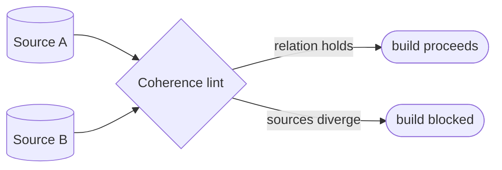

# Cross-source coherence lints — GoF appendix rendering

> **Fill draft.** Structure + Sample Code slots for the catalogue entry
> `product/validation-and-conformance/coherence-lints.md`, in the book's Gang-of-Four appendix layout. The
> follow-up pass injects the two filled slots at the placeholders keyed by the entry name
> `Cross-source coherence lints`. Intent / Motivation / Applicability / Consequences / Known Uses /
> Related Patterns are projected from the catalogue `.md` — reproduced in brief so the entry reads as a
> complete GoF page.

## Cross-source coherence lints

**Intent** — Lints that assert two or more independent sources *agree* (a config record and its sample, a
registry and its consumers, an enum and its uses), catching drift *between* sources that each look valid
on their own.

### Motivation

Some invariants live *between* files: a config record and its sample must list the same fields; a registry
and its consumers must share the same keys. Each file is individually valid, so the bug is invisible
per-file, but together they disagree. The canonical case: a new config field missing from the sample
defaults to a falsy value at deserialization and silently collapses a batch operation to single-call in
production. The failure is cross-source drift, recurring whenever paired sources evolve independently.

### Applicability

Reach for this when an invariant is *relational* — a consistency relation two machine-readable sources must
satisfy — and a per-file lint cannot see it because each file is valid alone. Declare the relation (a
subset, an equality, a one-to-one mapping), read both sources at lint time, and fail when they diverge.

### Structure

The lint reads both sources and checks the declared relation between them. Agreement passes; any
divergence fails the build.



*Accessible description: the coherence lint reads two independent sources and checks the declared relation
between them — for instance, A's fields are a subset of B's. When the relation holds the build proceeds;
when the sources diverge the build is blocked.*

### Sample Code

A coherence lint is a relation checked across two sources read at lint time. Here the relation is subset:
every field declared on a config record must appear in the shipped sample, or the missing field
deserializes to a default and silently changes behaviour. A single-source lint can never catch this — the
defect lives only in the *disagreement*.

```python
import sys

def coherence(record_fields: set[str], sample_fields: set[str]) -> list[str]:
    """Relational invariant: every field on the config record must appear in the
    sample. A field present in code but absent from the sample deserializes to a
    silent default — the bug lives between the files, not in either one."""
    return [f"config field '{f}' missing from sample — will default silently"
            for f in sorted(record_fields - sample_fields)]

if __name__ == "__main__":
    # `fields_of` reads a source into its declared field set (record, sample, ...)
    findings = coherence(fields_of("config_record"), fields_of("config_sample"))
    for f in findings:
        print(f"DRIFT: {f}")
    sys.exit(1 if findings else 0)
```

### Consequences

- **The relation must be specified correctly** — a wrong relation produces false failures or false
  confidence.
- **Lint-time coupling.** Reading several sources at once couples the lint to all of their shapes.
- **Pairs must be registered** — an unpaired source that should agree with another isn't checked until
  someone declares the relation.

### Known Uses

- Config-field-subset-of-sample lints and their companion deserialization tests.
- Registry-agreement lints (a registry and its consumers must list the same keys).
- The meta-file consistency discipline: read the meta-file, never embed a snapshot.

### Related Patterns

- **See also (sibling)** — the per-source semantic lints; this family is the relational complement.
- **See also (cross-target)** — the models-bridge "read the substrate, don't hardcode" discipline;
  coherence lints enforce that two substrates *stay* consistent.
- **Layer** — with the other validation-and-conformance checks over the artifact.
