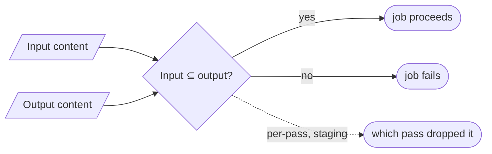

# ContentValidator (input ⊆ output fidelity) — GoF appendix rendering

> **Fill draft.** Structure + Sample Code slots for the catalogue entry
> `product/validation-and-conformance/content-validator.md`, in the book's Gang-of-Four appendix layout.
> The follow-up pass injects the two filled slots at the placeholders keyed by the entry name
> `ContentValidator (input ⊆ output fidelity)`. Intent / Motivation / Applicability / Consequences / Known
> Uses / Related Patterns are projected from the catalogue `.md` — reproduced in brief so the entry reads
> as a complete GoF page.

## ContentValidator (input ⊆ output fidelity)

**Intent** — A deterministic gate asserting that every piece of the user's original content survives
remediation (input content ⊆ output content), run in production, with a per-pass variant in staging that
pinpoints which pass dropped content.

### Motivation

Remediation mutates the document across many passes and four formats. A bug in any pass could silently drop
or alter user content: a deleted paragraph, a mangled table, a lost caption the author never sees go. For a
fidelity-critical tool that is the worst outcome — the output looks fine and quietly isn't what the author
wrote. The failure recurs on every remediation pass.

### Applicability

Reach for this when a transform must *preserve* something and a silent loss is the feared failure. Define
what "content" is, extract it from both input and output, and assert the input's content is a subset of the
output's, as a hard post-condition on every job. Add a per-pass variant that localizes a drop to the
offending pass in a pre-production environment.

### Structure

The gate extracts content from input and output and checks the subset relation. A subset passes and the job
proceeds; a violation fails the job. A staging per-pass variant localizes the drop to a specific pass.



*Accessible description: the fidelity gate extracts content from the input and the output and checks
whether the input's content is a subset of the output's. A subset lets the job proceed; a violation fails
the job. A staging-only per-pass variant reports which pass dropped the content.*

### Sample Code

The gate is a subset check over normalized content. Extract content from input and output, normalize away
legitimate reformatting (whitespace, order), and assert nothing in the input is missing from the output.
Everything rests on the extractor and the normalization — too loose and it cries wolf, too tight and it
misses a real drop.

```python
def normalize(items) -> set[str]:
    # collapse legitimate reformatting so reordering/whitespace don't trip the gate
    return {" ".join(s.split()).casefold() for s in items if s.strip()}

def fidelity_gate(input_content, output_content) -> list[str]:
    """Deterministic post-condition: every piece of input content must survive to
    the output. A missing item is a silent drop — the worst failure for a
    fidelity-critical tool, and invisible to a spot-check."""
    src, dst = normalize(input_content), normalize(output_content)
    return [f"content lost in remediation: {item!r}" for item in sorted(src - dst)]

# in production: any finding fails the job
def run_job(extract, produce_output, source):
    findings = fidelity_gate(extract(source), extract(produce_output(source)))
    if findings:
        raise FidelityError(findings)      # fail the job — don't ship lossy output
```

### Consequences

- **Everything rests on the extractor.** A lossy or over-eager extractor produces false positives (blocks
  good output) or false negatives (misses a real drop).
- **Subset semantics are subtle.** Reordering, whitespace, and reformatting must be normalized or the gate
  cries wolf.
- **It runs on every job** — a real but accepted cost for a fidelity guarantee.

### Known Uses

- The production input-⊆-output fidelity gate.
- A staging per-pass variant that signals the offending pass on a dedicated marker and a nonzero exit
  code.
- The accessibility-remediation policy it enforces: never drop content the user wrote.

### Related Patterns

- **Layer** — with the standards rule engine: both are product gates over the artifact — fidelity (nothing
  lost) and conformance (standards met).
- **Counterpart** — the per-pass staging variant localizes what the production gate only detects.
- **See also (sibling)** — the coherence lints: the other deterministic checks in this family.
