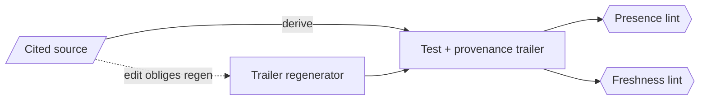

# DDT pin-trailers (doc-derived characterization) — GoF appendix rendering

> **Fill draft.** Structure + Sample Code slots for the catalogue entry
> `product/regression-tests/ddt-pin-trailers.md`, in the book's Gang-of-Four appendix layout. The
> follow-up pass injects the two filled slots at the placeholders keyed by the entry name
> `DDT pin-trailers (doc-derived characterization)`. Intent / Motivation / Applicability / Consequences /
> Known Uses / Related Patterns are projected from the catalogue `.md` — reproduced in brief so the entry
> reads as a complete GoF page.

## DDT pin-trailers (doc-derived characterization)

**Intent** — Doc-derived tests that characterize *current* behaviour before structural churn, each
carrying a provenance trailer (audited / source / pins) so it is regenerated when the source it cites is
edited.

### Motivation

Before a big refactor you want to pin current behaviour so the change is provably behaviour-preserving,
and doc-derived tests can silently drift from the doc or source they were derived from. The failure is
two-sided: unpinned behaviour lost in churn, or a doc-derived test that no longer matches its cited
source. It recurs before every structural change and whenever a cited source is edited.

### Applicability

Reach for this when you derive a test from a document or another source and must keep the two in step over
time. Attach a provenance trailer naming what the test was derived from and what it pins, and regenerate
the trailer in the same commit that edits a cited source. Note the success condition: these pin *correct*
behaviour before change, so near-zero defect yield is the goal, not a sign they aren't working.

### Structure

Each doc-derived test carries a provenance trailer citing its source. Editing a cited source obliges
regenerating the trailer in the same commit; a presence lint blocks a missing trailer, a freshness lint
warns on a stale one.



*Accessible description: a test is derived from a cited source and carries a provenance trailer. Editing
the source obliges regenerating the trailer in the same commit. A presence lint blocks a missing trailer;
a freshness lint warns when the trailer is stale.*

### Sample Code

The trailer is structured metadata parsed from the test file: what it was derived from, and the points it
pins. A presence check reads it and blocks a doc-derived test that lacks one; a freshness check compares
the recorded source hash against the source on disk and warns when they diverge — the signal an ordinary
test never carries.

```python
import ast, hashlib, re

def read_trailer(source: str) -> dict | None:
    # trailer lives right after the module docstring: DDT-source / DDT-pins lines
    m = re.search(r"DDT-source:\s*(?P<src>\S+).*?DDT-hash:\s*(?P<hash>[0-9a-f]+)", source, re.S)
    return m.groupdict() if m else None

def check(test_path: str, test_source: str, read_source) -> list[str]:
    trailer = read_trailer(test_source)
    if ast.get_docstring(ast.parse(test_source)) and trailer is None:
        return [f"{test_path}: doc-derived test missing provenance trailer"]   # blocking
    if trailer:
        live = hashlib.sha1(read_source(trailer["src"]).encode()).hexdigest()[:len(trailer["hash"])]
        if live != trailer["hash"]:
            return [f"{test_path}: trailer stale — cited source changed, regenerate"]  # warning
    return []
```

### Consequences

- **Trailer maintenance.** Editing a cited source obliges a regeneration, a real if small per-edit cost.
- **Low defect yield by design.** These are characterization pins; a near-zero find rate is the success
  condition.
- **Freshness is informational only** — the freshness lint never blocks, so a stale trailer can linger.

### Known Uses

- Doc-derived test files carrying an audited / source / pins provenance trailer.
- A trailer regenerator, a blocking presence lint, and a warning-level freshness lint.

### Related Patterns

- **See also (sibling)** — the tiered test suite and the property tests: the other behaviour-pinning
  bodies.
- **Counterpart** — the freshness lint detects drift of the test from its cited source, keeping the
  provenance honest.
