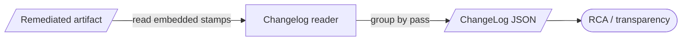

# `derive-changelog` (reconstruct mutations) — GoF appendix rendering

> **Fill draft.** Structure + Sample Code slots for the catalogue entry
> `product/provenance-and-attribution/derive-changelog.md`, in the book's Gang-of-Four appendix layout.
> The follow-up pass injects the two filled slots at the placeholders keyed by the entry name
> `` `derive-changelog` (reconstruct mutations) ``. Intent / Motivation / Applicability / Consequences /
> Known Uses / Related Patterns are projected from the catalogue `.md` — reproduced in brief so the entry
> reads as a complete GoF page.

## `derive-changelog` (reconstruct mutations)

**Intent** — A command that reconstructs the document's mutation history from the embedded attribution
stamps, turning inert provenance into a readable, attributed change log after the fact.

### Motivation

The stamps are embedded in the artifact, but embedded data isn't useful until it can be read back into a
coherent history. Without a reader, attribution is present but inert: you have the evidence and no way to
assemble it into "pass X made change Y." The failure is attribution that exists but can't be consumed,
which shows up exactly when someone needs the history for root-cause analysis or user transparency.

### Applicability

Reach for this when provenance is embedded in an artifact but scattered, and someone downstream needs the
ordered, attributed history: which step made which change, and whether it is visible to the user. Read the
embedded stamps, group by mutation, and emit a structured log. The reader is what makes the stamping
worthwhile — no consumer, no reason to stamp.

### Structure

The command reads the embedded stamps from the finished artifact, orders and groups them by pass, and
emits a structured change log a human or tool can read.



*Accessible description: the command reads the embedded attribution stamps out of the finished artifact,
groups them by the pass that made each change, and emits a structured change log consumed for root-cause
analysis and user transparency.*

### Sample Code

The reader is a projection over the embedded stamps: read them out of the artifact, sort by the order
they were applied, and emit one attributed entry per mutation, each carrying its visibility. What a raw
before/after diff cannot give you is the *who* and *why* — the stamp carries the pass and the visibility,
so the reconstruction is attributed, not just a delta.

```python
import json
from dataclasses import dataclass, asdict

@dataclass
class ChangeEntry:
    order: int
    pass_name: str          # who made the change
    target: str             # what was changed
    visibility: str         # "debug" (stripped before delivery) or "preserved"

def derive_changelog(read_stamps) -> str:
    """`read_stamps` yields the embedded provenance records out of the artifact.
    We turn them into an ordered, attributed change log — the who/why a diff omits."""
    stamps = sorted(read_stamps(), key=lambda s: s["order"])
    entries = [ChangeEntry(s["order"], s["pass"], s["target"], s.get("visibility", "debug"))
               for s in stamps]
    return json.dumps([asdict(e) for e in entries], indent=2)
```

### Consequences

- **Only as complete as the stamps.** An attribution gap — which the wiring lint exists to prevent —
  becomes a hole in the reconstructed history.
- **Schema-coupled.** It depends on the stamp schema staying stable across versions.

### Known Uses

- The change-log command: embedded stamps → structured change log, one entry per pass, each carrying its
  visibility.

### Related Patterns

- **Consumer** — reads the per-mutator attribution stamps; it is the read side of the attribution
  substrate.
- **Enabler** — of root-cause analysis and user-facing change transparency.
- **See also (counterpart)** — the wiring lint guarantees the stamps this reader depends on are complete.
