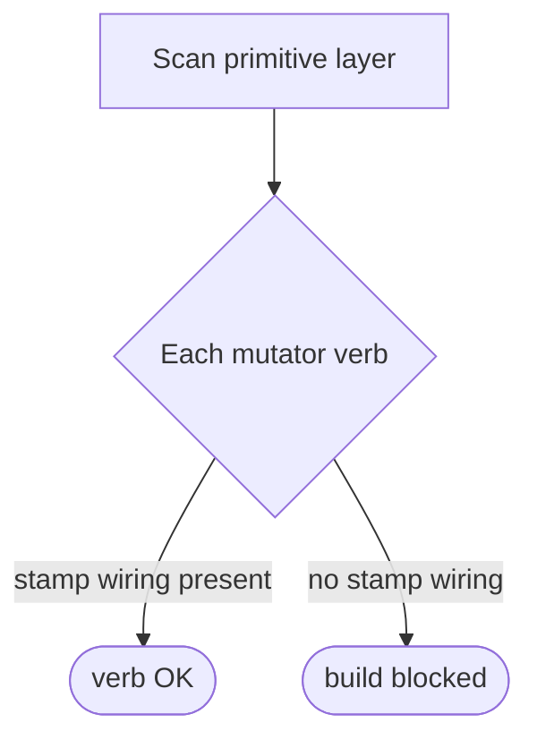

# F10 mutator-stamp-wiring lint — GoF appendix rendering

> **Fill draft.** Structure + Sample Code slots for the catalogue entry
> `product/provenance-and-attribution/f10-wiring-lint.md`, in the book's Gang-of-Four appendix layout. The
> follow-up pass injects the two filled slots at the placeholders keyed by the entry name
> `F10 mutator-stamp-wiring lint`. Intent / Motivation / Applicability / Consequences / Known Uses /
> Related Patterns are projected from the catalogue `.md` — reproduced in brief so the entry reads as a
> complete GoF page.

## F10 mutator-stamp-wiring lint

**Intent** — A lint that fails the build if any mutator verb in the model's primitive layer lacks stamp
wiring, so a new mutator cannot land producing unattributable mutations.

### Motivation

Attribution stamps only work if every mutator stamps. Add one new verb without wiring and it silently
produces unattributable mutations — a hole in the audit trail that no one sees until a root-cause
analysis hits it and finds no stamp. The failure is an unstamped mutator, and it recurs when a new verb is
added, usually under time pressure, when "remember to stamp" is most likely to be forgotten.

### Applicability

Reach for this when a discipline must hold across *every* member of a growing set, and the failure is an
*absence* a reviewer can't see in a diff. Make the completeness mechanically checkable: identify each
member (each mutator verb), assert each carries the required wiring, and fail the build on a gap. A
completeness check over all members sees the missing call a per-author reminder does not.

### Structure

The lint enumerates every mutator verb in the primitive layer and checks each for the stamp-wiring call.
A wired verb passes; an unwired one fails the build.



*Accessible description: the lint scans the primitive layer, enumerates every mutator verb, and checks
each for a stamp-wiring call. A verb with wiring passes; a verb missing it fails the build, so no unwired
mutator can land.*

### Sample Code

The lint is a completeness check: enumerate the members of a set, and assert each satisfies a required
predicate. Here the members are the mutating methods in the primitive layer, and the predicate is "calls
the stamp writer somewhere in its body." The value is that it catches an *absence* — the stamp that isn't
there — which review reliably misses.

```python
import ast, sys

STAMP_CALL = "write_stamp"          # the wiring every mutator must invoke

def _calls_stamp(fn: ast.FunctionDef) -> bool:
    return any(isinstance(n, ast.Call) and isinstance(n.func, ast.Attribute)
               and n.func.attr == STAMP_CALL for n in ast.walk(fn))

def _is_mutator(fn: ast.FunctionDef) -> bool:
    # a mutator verb: named for a document change and not a private helper
    return fn.name.startswith(("set_", "add_", "insert_", "remove_")) and not fn.name.startswith("_")

def lint(path: str, source: str) -> list[str]:
    return [f"{path}:{fn.lineno}: mutator '{fn.name}' has no stamp wiring"
            for fn in ast.walk(ast.parse(source))
            if isinstance(fn, ast.FunctionDef) and _is_mutator(fn) and not _calls_stamp(fn)]

if __name__ == "__main__":
    hits = [f for p in sys.argv[1:] for f in lint(p, open(p).read())]
    print("\n".join(hits)); sys.exit(1 if hits else 0)
```

### Consequences

- **The verb-detection heuristic is the weak point.** Miss a verb shape and a real gap passes; over-match
  and legitimate code fails.
- **Coupled to the primitive-layer structure.** A reorganization of the mutator layer needs the lint
  updated in step.

### Known Uses

- The mutator-stamp wiring lint, held at zero open gaps, blocking the build on any unwired verb.

### Related Patterns

- **Counterpart** — of the per-mutator attribution stamps: the stamps are the construction, this lint is
  the counted sensor that guarantees they're complete. The canonical construction-held-by-detection
  pairing on the product side.
- **See also (sibling)** — the blocking semantic-lint fleet: this lint is a member of that fleet doing a
  completeness-over-verbs job.
