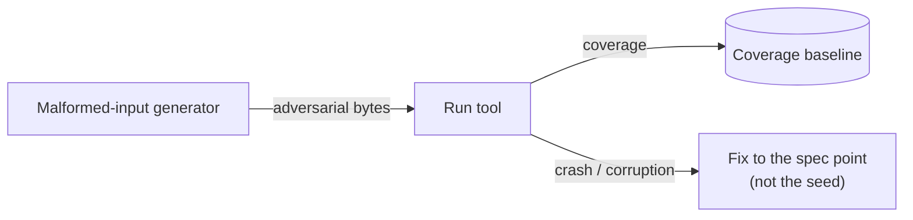

# Fuzz campaigns (+ auto-coverage) — GoF appendix rendering

> **Fill draft.** Structure + Sample Code slots for the catalogue entry
> `product/regression-tests/fuzz-campaigns.md`, in the book's Gang-of-Four appendix layout. The follow-up
> pass injects the two filled slots at the placeholders keyed by the entry name
> `Fuzz campaigns (+ auto-coverage)`. Intent / Motivation / Applicability / Consequences / Known Uses /
> Related Patterns are projected from the catalogue `.md` — reproduced in brief so the entry reads as a
> complete GoF page.

## Fuzz campaigns (+ auto-coverage)

**Intent** — Campaigns that feed malformed and adversarial inputs to the tool to find crashes and
corruption, with coverage collected automatically, plus a fix discipline that repairs to the *spec*, not
the failing seed.

### Motivation

Real-world documents are malformed in ways no hand-written test anticipates: a truncated stream, an odd
encoding, a structure right at the edge of what the spec allows. A fuzzer finds the crash or corruption on
inputs you would never think to write. The failure is crashes or corruption on adversarial or spec-edge
inputs, and it hides across an input space far too large to enumerate.

### Applicability

Reach for this when the input space is too large to enumerate, malformed inputs occur in the wild, and a
crash or corruption on a weird byte sequence is a real failure. Run adversarial campaigns, track coverage
against a baseline so reach is measurable, and — the load-bearing discipline — fix each finding to the
stable point in the format spec, so the fix closes every spec-allowed input, not just the failing seed.

### Structure

The campaign generates malformed inputs and runs the tool against them; coverage is collected
automatically and compared to a baseline. A finding routes to a fix aimed at the spec point, not the
individual seed.



*Accessible description: a generator feeds adversarial bytes to the tool; coverage is collected and
compared against a baseline so reach is measurable. A crash or corruption routes to a fix aimed at the
stable spec point rather than the individual failing seed.*

### Sample Code

The campaign loop is small; the discipline is what matters. Generate malformed inputs, run the tool,
record any crash. On a finding, the fix targets the *spec rule* the input violated — so the same fix
passes every input the spec allows, not just the one seed. Fixing the seed alone leaves the class open.

```python
import random

def campaign(run_tool, seed_corpus: list[bytes], iterations: int = 10_000) -> list[bytes]:
    """Feed mutated bytes to the tool; collect inputs that crash or corrupt.
    Each finding is a *class* representative — fix to the spec rule it broke,
    not to this exact byte string, or the class stays open."""
    findings = []
    rng = random.Random(0)
    for _ in range(iterations):
        base = rng.choice(seed_corpus)
        mutant = bytearray(base)
        i = rng.randrange(len(mutant))
        mutant[i] ^= 1 << rng.randrange(8)   # flip one bit — cheap adversarial mutation
        try:
            run_tool(bytes(mutant))
        except Exception:
            findings.append(bytes(mutant))   # a crash on spec-allowed input is a real bug
    return findings
```

### Consequences

- **Compute-heavy.** Campaigns cost real time; coverage is tracked to know when they've saturated.
- **Baseline maintenance.** The coverage baseline must be re-based only on intentional coverage-shape
  changes.
- **Seed-fixing is the anti-pattern** the fix discipline exists to prevent — repairing only the failing
  input leaves the spec-class open.

### Known Uses

- Fuzz and campaign harnesses with automatic coverage collection and aggregation against a baseline.
- The fix-to-the-stable-spec-point discipline for every finding.

### Related Patterns

- **See also (sibling)** — property tests (structured generation) and the tiered test suite (example
  tiers).
- **Counterpart** — the coverage baseline tracks what the campaign reached, keeping "we fuzzed it"
  honest.
