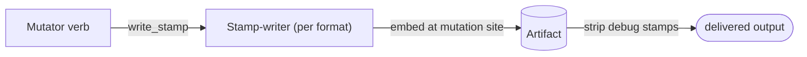

# Per-mutator attribution stamps — GoF appendix rendering

> **Fill draft.** Structure + Sample Code slots for the catalogue entry
> `product/provenance-and-attribution/mutator-stamps.md`, in the book's Gang-of-Four appendix layout. The
> follow-up pass injects the two filled slots at the placeholders keyed by the entry name
> `Per-mutator attribution stamps`. Intent / Motivation / Applicability / Consequences / Known Uses /
> Related Patterns are projected from the catalogue `.md` — reproduced in brief so the entry reads as a
> complete GoF page.

## Per-mutator attribution stamps

**Intent** — Every remediation verb that mutates a document emits an attribution stamp embedded in the
artifact, through one sanctioned stamp-writer per format, so every change is durably attributable and the
mutation history is reconstructable after the fact.

### Motivation

When a remediated document comes out wrong, you need to know which pass made which change; otherwise
root-cause analysis is guesswork across many passes and four formats. Without attribution a mutation is
anonymous: you can see the output is wrong but not who wrote it or why. The failure is unattributable
mutations, and it recurs on every mutation.

### Applicability

Reach for this when an artifact is mutated by many passes and you need after-the-fact attribution that
survives with the artifact itself, not in logs that scroll away. Give each format one stamp-writer, embed
the stamp at the mutation site, and carry a visibility flag so debug stamps can be stripped before
delivery while user-visible ones stay.

### Structure

Each mutator writes its stamp through the one sanctioned stamp-writer for its format; the stamp is
embedded in the artifact. Debug stamps are stripped before delivery; preserved stamps ship.



*Accessible description: a mutator verb writes its attribution stamp through the one stamp-writer for its
format, which embeds the stamp in the artifact. Before delivery a strip step removes debug-visibility
stamps, leaving preserved ones in the shipped output.*

### Sample Code

A stamp is a small record embedded at the mutation site: which pass, what it changed, and a visibility
flag. One writer per format is the sole surface, so stamps are uniform. Visibility keeps delivery honest —
debug stamps default on for reconstruction and are stripped before the document ships; a user-visible pass
opts its stamp into "preserved."

```python
from dataclasses import dataclass

@dataclass(frozen=True)
class Stamp:
    pass_name: str
    target: str
    visibility: str = "debug"    # "debug" is stripped before delivery; "preserved" ships

class StampWriter:
    """The sole stamp surface for one format. Embedding at the mutation site means
    the history travels with the artifact, not in logs that scroll away."""

    def __init__(self, artifact):
        self._artifact = artifact
        self._order = 0

    def write_stamp(self, stamp: Stamp) -> None:
        self._order += 1
        self._artifact.embed_metadata({"order": self._order, **stamp.__dict__})

def strip_for_delivery(artifact) -> None:
    # remove scaffolding before the document reaches the user
    artifact.drop_metadata(where=lambda m: m.get("visibility") == "debug")
```

### Consequences

- **Document overhead.** Stamps add content; debug stamps are stripped before delivery to avoid shipping
  scaffolding.
- **Helper-only discipline.** Bypassing the writer produces a non-uniform stamp; it is lint-guarded.
- **Every new verb must wire it** — the cost the wiring lint turns from "remember to" into "must."

### Known Uses

- One sanctioned stamp-writer per format (a PDF stamp helper, an append-only office attribution
  registry).
- The debug/preserved visibility model, with a strip step before delivery.

### Related Patterns

- **Counterpart** — the wiring lint guarantees every mutator verb stamps; it is the counted control that
  makes this audit trail complete.
- **Consumer** — the change-log reader reads these stamps to reconstruct the history.
- **Enabler** — the closed remediation-verb set makes "stamp every verb" a finite, achievable
  requirement.
