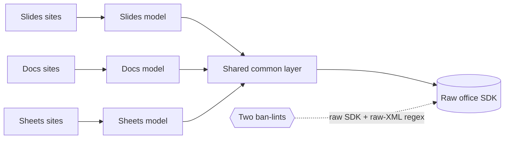

# Office Models ({Slides,Docs,Sheets}Model) — GoF appendix rendering

> **Fill draft.** Structure + Sample Code slots for the catalogue entry
> `product/canonical-models-and-seams/office-models.md`, in the book's Gang-of-Four appendix layout. The
> follow-up pass injects the two filled slots at the placeholders keyed by the entry name
> `Office Models ({Slides,Docs,Sheets}Model)`. Intent / Motivation / Applicability / Consequences /
> Known Uses / Related Patterns are projected from the catalogue `.md` — reproduced in brief so the entry
> reads as a complete GoF page.

## Office Models ({Slides,Docs,Sheets}Model)

**Intent** — Route all remediation of a format family through one typed model per format, with raw
library access *and* raw string-matching into the serialized form banned by lint. The same
construction-plus-ban-lint pattern as the PDF model, on a second object model.

### Motivation

Raw office-SDK access, and the sneakier path of regexing into the serialized XML, are the office
equivalent of the raw-format-library minefield: brittle, corruption-prone, with no single point to
enforce structural invariants. Left ad hoc, the same raw-library corruption class recurs across three
separate document formats.

### Applicability

Reach for this when the same defect class the sole-seam pattern already killed for one format applies to
a *different* object model that the first seam cannot cover. One typed model per format, plus a shared
common layer, consolidates the corruption class across all of them: a fix to the pattern benefits every
format at once. Add a second ban-lint on raw string-matching when the serialized form is text a regex
could reach into behind the SDK's back.

### Structure

Three formats, one pattern. Each format's call sites route through its typed model; the models share a
common layer. Two ban-lints guard the raw edges — one on the raw SDK, one on regexing the serialized
XML.



*Accessible description: three format-specific call sites route through three typed models into a shared
common layer, which is the only path to the raw office SDK. Two ban-lints guard the raw edges — one bans
the raw SDK, one bans regexing the serialized XML — so no site skips the models.*

### Sample Code

The pattern is the same sole-seam-plus-ban-lint as any typed model, applied once per format over a shared
base. What is worth showing is the *second* lint: the raw-SDK ban alone leaves a hole, because the
serialized document is text and a caller can regex into it behind the model's back. The string-match ban
closes that path.

```python
import ast, sys

RAW_SDK_ROOT = "office_sdk"          # the raw library the models wrap
SEAM_MODULES = {"slides_model", "docs_model", "sheets_model", "office_common"}

def lint(path: str, mod: str, source: str) -> list[str]:
    if mod in SEAM_MODULES:
        return []                    # the models + common layer may touch the raw SDK
    findings = []
    for node in ast.walk(ast.parse(source)):
        # ban 1: importing the raw SDK anywhere but the seam
        if isinstance(node, ast.ImportFrom) and (node.module or "").startswith(RAW_SDK_ROOT):
            findings.append(f"{path}:{node.lineno}: raw office SDK import — route through a typed model")
        # ban 2: the sneaky path — a regex reaching into the serialized XML
        if isinstance(node, ast.Attribute) and node.attr in {"search", "match", "findall"}:
            findings.append(f"{path}:{node.lineno}: regex over serialized XML — walk the typed model instead")
    return findings

if __name__ == "__main__":
    hits = [f for p in sys.argv[1:] for f in lint(p, p.rsplit("/", 1)[-1][:-3], open(p).read())]
    print("\n".join(hits)); sys.exit(1 if hits else 0)
```

### Consequences

- **Three models plus a shared layer to maintain** — more surface than a single-format seam.
- **Coverage gaps per format** force a scoped escape or a model extension, the same friction the
  single-format seam has.
- **The string-match ban can false-positive** on a legitimate string operation over document text,
  needing a scoped escape.

### Known Uses

- One typed model per office format (slides, docs, sheets) plus a shared common layer; the checking path
  routes through the canonical rule walkers.
- Two ban-lints: one on raw SDK access, one on raw-XML string-matching.

### Related Patterns

- **See also (sibling)** — the PDF half of the unified typed-model-plus-ban-lint pattern; together they
  consolidate raw-library corruption across every document format into one defect class.
- **Counterpart** — the two ban-lints hold these construction seams in place.
- **See also** — canonical walkers: traversal over the office models' trees.
