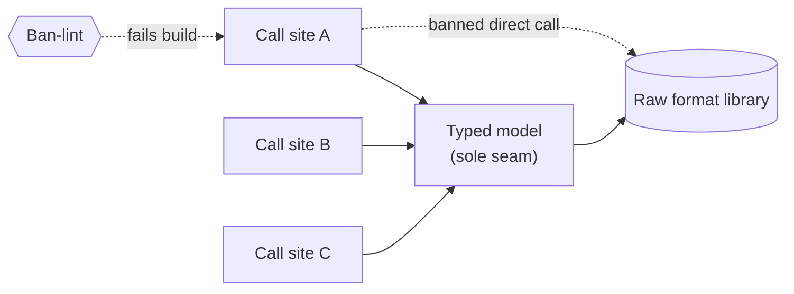

# PdfModel (sole PDF mutation surface) — GoF appendix rendering

> **Exemplar draft.** Worked Structure + Sample Code slots for the catalogue entry
> `product/canonical-models-and-seams/pdf-model.md`, rendered in the book's Gang-of-Four appendix
> layout. This is the reference bar for the sole-seam / ban-lint archetype. The follow-up pass injects
> the two filled slots (Structure, Sample Code) at the placeholders keyed by the entry name
> `PdfModel (sole PDF mutation surface)`. Intent / Motivation / Applicability / Consequences / Known
> Uses / Related Patterns are projected from the catalogue `.md` unchanged — reproduced here in brief so
> the entry reads as a complete GoF page.

## PdfModel (sole PDF mutation surface)

**Intent** — Route *all* reads and writes of a complex file format through one typed model, with raw
access to the underlying library banned by a lint, so the structure is compiler-checked and every
mutation passes through a surface that encodes the format's invariants.

### Motivation

The raw format library is a minefield of silent, invisible-at-the-call-site failures. Forget a
"mark-dirty" call on an indirect object and the write is dropped on save. Call a raw tag or dictionary
mutator and you can corrupt the document's structure tree. There is no one place to enforce these
invariants, so scattered raw calls make the *same* bug class recur at every call site.

### Applicability

Reach for this when a powerful, sharp-edged resource (a format library, a query language, a subprocess)
is called from many sites, each call able to fail silently, and no single place enforces the resource's
invariants. You need a typed surface that *covers* every operation callers need, a lint that bans the
raw alternative, and a one-time migration of every existing call site onto the seam.

### Structure

The diagram shows the shape of the seam: every call site reaches the resource through the one typed
model, and the ban-lint guards the direct edge — it fails the build on any call that tries to skip the
model and touch the raw library.



*Accessible description: three call sites all route through one typed model to reach the raw format
library. A dashed red edge marks a call site attempting a direct call to the library; the ban-lint node
fails the build on that edge, so the only surviving path to the library runs through the typed model.*

### Sample Code

Two parts make the seam: a **typed facade** that encodes the invariant callers keep forgetting, and a
**ban-lint** that fails the build on any raw call so no site can slip past the facade. The facade is
tiny — its value is that the dropped-write bug is now *unrepresentable*, because the only public verb
marks the object dirty for you.

```python
# --- the typed facade: the one sanctioned mutation surface ---
class DocModel:
    """Sole seam for mutating the format. Every verb encodes an invariant the raw
    library makes it easy to forget — here, 'mark dirty or the write is dropped'."""

    def __init__(self, raw):
        self._raw = raw  # the raw library handle stays private — callers never see it

    def set_title(self, obj, title: str) -> None:
        obj.title = title
        obj.mark_dirty()  # the invariant the raw API lets you forget, wired in once


# --- the ban-lint: fails the build if any site calls the raw API directly ---
import ast, sys

RAW_CALLS = {"mark_dirty", "add_tag", "put"}   # raw verbs only the facade may call
SEAM_MODULE = "docmodel"                        # the file that *is* the facade

def lint(path: str, source: str) -> list[str]:
    if path.endswith(f"{SEAM_MODULE}.py"):
        return []                               # the facade is allowed to touch the raw API
    findings = []
    for node in ast.walk(ast.parse(source)):
        if isinstance(node, ast.Attribute) and node.attr in RAW_CALLS:
            findings.append(f"{path}:{node.lineno}: raw '.{node.attr}(...)' — route through {SEAM_MODULE}")
    return findings

if __name__ == "__main__":
    hits = [f for p in sys.argv[1:] for f in lint(p, open(p).read())]
    print("\n".join(hits))
    sys.exit(1 if hits else 0)
```

### Consequences

- **The model must cover everything.** A missing operation forces either a lint-escape (a hole) or a
  model extension (the right fix, but friction). An incomplete seam weakens the ban.
- **Version lock-in.** Pinning the library for structural stability means upgrades become deliberate,
  gated work.
- **Maintenance surface.** The typed verbs plus the ban-lint are code to keep current as needs grow.

### Known Uses

- A typed read/write model over the canonical PDF library, each verb wiring the mark-dirty and
  attribution disciplines so a new verb cannot land un-wired.
- The ban-lints on the raw library (one on the raw constructors and calls, one on helper leakage).

### Related Patterns

- **Sibling** — the same typed-model-plus-ban-lint pattern applied to the office document formats; the
  pair consolidates raw-library corruption across every document format into one defect class.
- **See also** — canonical walkers, which define the one sanctioned traversal *over* this typed model.
