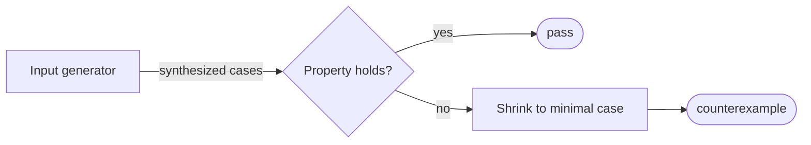

# FsCheck property tests — GoF appendix rendering

> **Fill draft.** Structure + Sample Code slots for the catalogue entry
> `product/regression-tests/property-tests.md`, in the book's Gang-of-Four appendix layout. The follow-up
> pass injects the two filled slots at the placeholders keyed by the entry name `FsCheck property tests`.
> Intent / Motivation / Applicability / Consequences / Known Uses / Related Patterns are projected from
> the catalogue `.md` — reproduced in brief so the entry reads as a complete GoF page.

## FsCheck property tests

**Intent** — Property-based tests that assert *invariants* (round-trip, combinatorial) over
machine-*generated* inputs, catching bugs in the input space that example-based tests never reach.

### Motivation

Example-based tests only check the cases you thought of. Invariants — read-then-write equals identity, a
combinatorial property that must hold for all inputs — fail on inputs you never imagined and never wrote a
test for. The failure is a bug living in the untested input space, and it recurs for any invariant-shaped
contract that hand-picked examples under-cover.

### Applicability

Reach for this when a class's contract is expressible as a property that must hold for *all* inputs, not
just a handful — round-trip identity, idempotence, a combinatorial law — and the input space is too large
to enumerate. Write a generator for the domain type, state the invariant, and let the framework synthesize
inputs and shrink any failure to a minimal counterexample.

### Structure

A generator synthesizes inputs; the property runs on each and asserts the invariant. On a failure the
framework shrinks the input to the smallest case that still breaks the invariant.



*Accessible description: a generator synthesizes inputs and a property checks the invariant on each. When
the property holds the test passes; when it fails the framework shrinks the input to the smallest case
that still breaks it and reports that counterexample.*

### Sample Code

A property test states a law and lets the framework hunt for a violation. The round-trip law — parse then
serialize returns the original model — is the canonical shape for a typed document model. The generator
supplies structured inputs; the framework shrinks a failure to the smallest model that still breaks the
law, so the counterexample is debuggable.

```python
from hypothesis import given, strategies as st

# a generator for the domain type — here a small structured document model
docs = st.builds(dict,
                 title=st.text(max_size=20),
                 nodes=st.lists(st.text(max_size=10), max_size=8))

@given(docs)
def test_parse_serialize_round_trips(doc):
    """Round-trip invariant: serialize then parse yields the same model, for
    *every* generated document — not just the examples someone thought to write.
    A failure shrinks to the smallest document that still breaks identity."""
    assert parse(serialize(doc)) == doc     # `parse`/`serialize` are the model's read/write
```

### Consequences

- **Generators are real work** to write for rich domain types.
- **The property must be stated correctly** — a wrong invariant yields false failures or, worse, false
  confidence.
- **Nondeterministic properties flake** — the invariant must be a true function of the input.

### Known Uses

- Property tests across the test projects, asserting round-trip and combinatorial invariants.
- Added per class when a property-shaped invariant exists, guided by a pilot-and-triage discipline.

### Related Patterns

- **See also (sibling)** — the tiered test suite and fuzz campaigns: examples-in-tiers and
  adversarial-fuzzing complement invariant-checking.
- **Consumer** — properties are asserted over the typed models; round-trip properties over a model are how
  you pin its read/write invariants.
