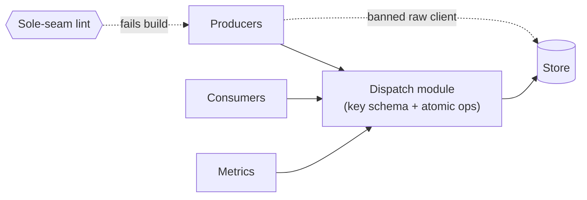

# Sole raw-Redis seam (the dispatch module) — GoF appendix rendering

> **Fill draft.** Structure + Sample Code slots for the catalogue entry
> `product/canonical-models-and-seams/raw-redis-seam.md`, in the book's Gang-of-Four appendix layout. The
> follow-up pass injects the two filled slots at the placeholders keyed by the entry name
> `Sole raw-Redis seam (the dispatch module)`. Intent / Motivation / Applicability / Consequences / Known
> Uses / Related Patterns are projected from the catalogue `.md` — reproduced in brief so the entry reads
> as a complete GoF page.

## Sole raw-Redis seam (the dispatch module)

**Intent** — Confine all raw-store access to one module, with every queue key declared there, so the
queue's atomicity and schema invariants live in exactly one lint-enforced place.

### Motivation

Raw store calls scattered across the codebase break two invariants at once. **Atomicity**: a
pop-and-move done as two separate commands silently loses a job if the worker crashes between them.
**Schema**: key names drift from the declared set, so a metric that reads queue depth misses a structure.
Both recur wherever someone reaches for the raw client.

### Applicability

Reach for this when a shared store is accessed from many sites, some operations must be atomic to be
crash-safe, and key names must stay in step with a declared schema. Give one module the store, declare
every key in it, encode the atomic operations once (a server-side script or an atomic move command), and
ban the raw client everywhere else.

### Structure

Every caller reaches the store through the one dispatch module. That module declares the key schema and
encodes atomic pop-and-move. A sole-seam lint bans the raw client anywhere else.



*Accessible description: producers, consumers, and metrics all reach the store through the one dispatch
module, which declares the key schema and encodes atomic pop-and-move. A dashed edge marks a caller using
the raw client directly; the sole-seam lint fails the build on it.*

### Sample Code

The seam's job is to make the non-atomic pop-and-move unwritable. A two-command sequence (pop from one
structure, push to another) loses work on a crash between them; the seam runs the move as one atomic
server-side script, so no caller can express the racy version. Every key the seam touches comes from one
declared table.

```python
KEYS = {"ready": "q:ready", "processing": "q:processing"}  # the one key schema

# atomic pop-and-move: pops the lowest-priority member and records it as processing
# in a single server-side step, so a crash can never lose the job between two commands.
_MOVE = """
local job = redis.call('ZPOPMIN', KEYS[1])
if job[1] then redis.call('HSET', KEYS[2], job[1], ARGV[1]) end
return job[1]
"""

class DispatchSeam:
    """The only module that speaks to the raw store. Callers get crash-safe verbs;
    they never hold the raw client, so they cannot write a two-command pop-and-move."""

    def __init__(self, client):
        self._client = client            # private — never exposed to callers
        self._move = client.register_script(_MOVE)

    def claim_next(self, worker_id: str) -> str | None:
        return self._move(keys=[KEYS["ready"], KEYS["processing"]], args=[worker_id])
```

### Consequences

- **All store traffic funnels through one seam** — a coupling point that must cover every queue
  operation callers need.
- **The seam must keep pace** with new queue structures, or callers are tempted back to raw access.
- **A depth metric must query every declared structure** — the schema being in one place is what makes
  that enforceable.

### Known Uses

- The dispatch module as the sole raw-store seam, with the queue-key schema declared in it.
- Atomic pop-and-move via a server-side script (or an atomic move command), never two separate commands.
- The sole-seam lint banning the raw client elsewhere.

### Related Patterns

- **See also (sibling)** — the typed cross-service client: the same bounded-service pattern for the
  cross-service-HTTP boundary, one lint-enforced seam owning a class of dangerous raw calls.
- **Counterpart** — the sole-seam lint that bans the raw store client outside the module.
