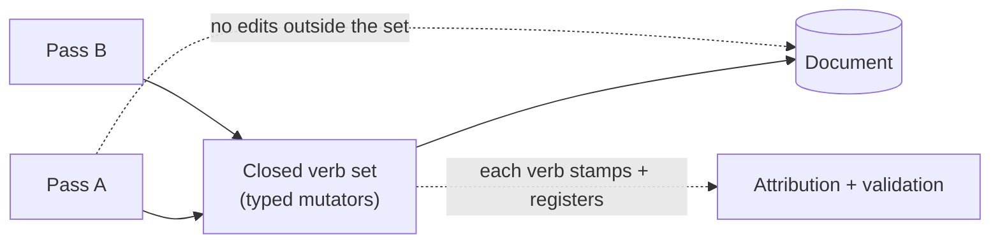

# Closed remediation-verb sets — GoF appendix rendering

> **Fill draft.** Structure + Sample Code slots for the catalogue entry
> `product/repair-vocabulary/remediation-verbs.md`, in the book's Gang-of-Four appendix layout. The
> follow-up pass injects the two filled slots at the placeholders keyed by the entry name
> `Closed remediation-verb sets`. Intent / Motivation / Applicability / Consequences / Known Uses /
> Related Patterns are projected from the catalogue `.md` — reproduced in brief so the entry reads as a
> complete GoF page.

## Closed remediation-verb sets

**Intent** — Route the remediator's mutations through a *bounded, named set* of typed verbs rather than
free-form edits, so the move-space is enumerable and every move can be stamped, validated, and
policy-checked.

### Motivation

Free-form document editing is unbounded: any pass could do anything, and an unbounded edit cannot be
stamped, validated, or checked against policy as a set. The failure is an unbounded mutation that is
un-attributed, un-validated, or off-policy, and it recurs per pass unless the move-space itself is
constrained.

### Applicability

Reach for this when you need to answer governance questions about *every* mutation — is it stamped, is it
validated, is it on-policy — and free-form edits leave those questions unanswerable. Define a closed set
of typed mutator verbs, route all changes through them, and make each verb carry its stamp and register
its inserts. A bounded action-space is what makes attribution and validation tractable at all.

### Structure

Every pass mutates only through the closed verb set; nothing edits the document outside it. Each verb
wires its stamp and, if it inserts, registers the insert — so the outcome is attributed and validated.



*Accessible description: every remediation pass mutates the document only through a closed set of typed
verbs; no pass edits the document outside the set. Each verb wires its stamp and registers its inserts, so
attribution and validation cover every move.*

### Sample Code

A closed verb set makes the move-space a finite enumeration. Each verb is a typed method on a mutator
class; nothing else touches the document. Because the set is closed, "is every move stamped?" and "is
every insert validated?" become answerable — a free-form edit API leaves both open.

```python
from enum import Enum

class Verb(Enum):                 # the whole move-space, enumerable
    SET_ALT_TEXT = "set_alt_text"
    ADD_TAG = "add_tag"
    INSERT_SCAFFOLD = "insert_scaffold"

class Remediator:
    """Passes mutate only through these verbs. Each verb stamps; an inserting verb
    also registers. Nothing edits the document outside this closed set, so every
    move is attributable and coverable."""

    def __init__(self, doc, stamp, register):
        self._doc, self._stamp, self._register = doc, stamp, register

    def set_alt_text(self, node, text: str) -> None:
        node.alt = text
        self._stamp(Verb.SET_ALT_TEXT, target=node.id)

    def insert_scaffold(self, node) -> None:
        name = self._doc.insert_offcanvas(node)
        self._stamp(Verb.INSERT_SCAFFOLD, target=name)
        self._register(name, kind="invisible")     # inserts are validated by the registry
```

### Consequences

- **A needed action absent from the set forces adding a verb** — friction, but the intended kind: it keeps
  the space closed and every move governed.
- **The verb set is a maintenance surface** that grows with remediation capability.

### Known Uses

- The typed mutator verb sets across the document models, with all changes routed through them.
- Each verb's stamp wiring and inserted-content registration.

### Related Patterns

- **Enabler** — of the attribution stamps and the content validator: a bounded move-space makes "stamp
  every move, validate every outcome" finite and achievable.
- **See also (sibling)** — typed categories and the codemod-first threshold.
