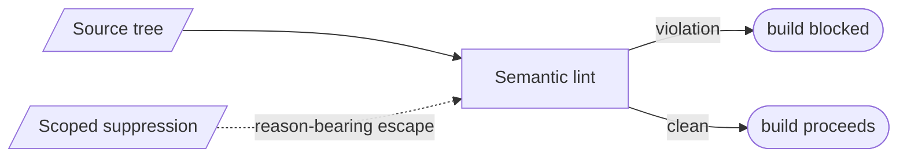

# Blocking semantic lints — GoF appendix rendering

> **Fill draft.** Structure + Sample Code slots for the catalogue entry
> `product/validation-and-conformance/semantic-lints.md`, in the book's Gang-of-Four appendix layout. The
> follow-up pass injects the two filled slots at the placeholders keyed by the entry name
> `Blocking semantic lints`. Intent / Motivation / Applicability / Consequences / Known Uses / Related
> Patterns are projected from the catalogue `.md` — reproduced in brief so the entry reads as a complete
> GoF page.

## Blocking semantic lints

**Intent** — A fleet of blocking semantic lints over the tool's *own source* (banned APIs, silent-catch
bans, diagnostic-print bans, typed-seam violations) that fail the build on domain-invariant violations the
compiler and review can't catch.

### Motivation

The codebase carries hundreds of structural invariants: no silent catch, no banned API in production,
every cross-boundary call through its seam. Code review cannot hold hundreds of invariants in a reviewer's
head, and the compiler enforces none of them — a silent catch, a banned API, a raw diagnostic print all
compile fine. The failure is structural drift that quietly reintroduces a defect class, and it recurs
continuously as code is written.

### Applicability

Reach for this when a domain rule is mechanically detectable but the compiler doesn't express it and review
keeps missing it. Encode the rule as a lint that scans the source and fails the build, declare its scope
and severity in a self-describing header, and give it a scoped, reason-bearing escape for legitimate
exceptions. Build the fleet atop a maxed-out commodity analysis floor, not in place of it.

### Structure

Each lint scans the source for its invariant and reports findings. A blocking lint fails the build; a
scoped, reason-bearing suppression comment escapes a legitimate exception.



*Accessible description: a semantic lint scans the source tree for its invariant. A violation blocks the
build; a clean scan lets it proceed. A scoped, reason-bearing suppression comment escapes a legitimate
exception on a single line.*

### Sample Code

A semantic lint encodes a domain rule the compiler can't and scans for it. This one bans a silent
`except` — a `catch` that neither logs, re-raises, nor carries a justifying comment — because a silently
swallowed error turns a fail-loud bug into a fail-quiet one. A reason-bearing suppression comment escapes a
deliberate swallow.

```python
import ast, sys

def lint(path: str, source: str, lines: list[str]) -> list[str]:
    """Ban the silent swallow: an `except` body that only passes, with no logging,
    re-raise, or justifying comment. A swallowed error hides a real failure."""
    findings = []
    for node in ast.walk(ast.parse(source)):
        if isinstance(node, ast.ExceptHandler):
            body_is_pass = all(isinstance(s, ast.Pass) for s in node.body)
            line = lines[node.lineno - 1]
            if body_is_pass and "noqa: silent-catch" not in line:   # scoped escape
                findings.append(f"{path}:{node.lineno}: silent except — log, re-raise, or justify")
    return findings

if __name__ == "__main__":
    hits = []
    for p in sys.argv[1:]:
        text = open(p).read()
        hits += lint(p, text, text.splitlines())
    print("\n".join(hits)); sys.exit(1 if hits else 0)
```

### Consequences

- **A large maintenance surface.** Hundreds of lints are hundreds of things to keep current.
- **False positives need escapes.** A too-strict lint blocks legitimate code until a scoped suppression is
  added — a small, audited hole.
- **Floor versus fleet.** The custom fleet only earns its keep atop the commodity analysis floor; without
  that floor the grade rests on the wrong thing.

### Known Uses

- Banned-API, silent-catch, diagnostic-print, and typed-seam ban-lints.
- The lint-declaration discipline: each lint declares its scope, severity, and a verb-of-checking
  docstring, with a scoped suppression escape.

### Related Patterns

- **See also (sibling)** — the coherence lints (relational lints across sources) and the artifact
  validators (fidelity, conformance).
- **Counterpart** — the typed-seam ban-lints are members of this fleet doing the "hold a construction seam
  in place" job.
