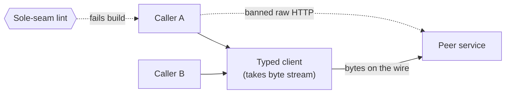

# ServiceClient (typed cross-service seam) — GoF appendix rendering

> **Fill draft.** Structure + Sample Code slots for the catalogue entry
> `product/canonical-models-and-seams/service-client.md`, in the book's Gang-of-Four appendix layout. The
> follow-up pass injects the two filled slots at the placeholders keyed by the entry name
> `ServiceClient (typed cross-service seam)`. Intent / Motivation / Applicability / Consequences / Known
> Uses / Related Patterns are projected from the catalogue `.md` — reproduced in brief so the entry reads
> as a complete GoF page.

## ServiceClient (typed cross-service seam)

**Intent** — Route all cross-service HTTP through one typed client whose signature takes an open file
handle, so passing a file *path* over the wire is a type error rather than a runtime bug; the raw HTTP
call to another service is banned.

### Motivation

Cross-service calls that pass a file *path* over the wire, instead of the file's bytes, are a recurring
bug. The receiving service runs in a different container and cannot open a path from the sender's
filesystem. Ad hoc raw HTTP calls at each site let this exact type-confusion recur wherever someone
reaches for the raw HTTP library.

### Applicability

Reach for this when a bug class can be encoded in a *type* — here, "bytes, not a path" — and the call is
made from many sites. Give the one client a signature that refuses the wrong shape, make it the sole
cross-service surface, and ban the raw HTTP call. The signature does the enforcing; the lint only keeps
callers on the signature.

### Structure

Every cross-service call goes through the one typed client, whose file argument is a byte stream, not a
path. The client posts bytes to the peer service. A lint bans the raw HTTP call; the type refuses the
path at compile time.



*Accessible description: two callers reach a peer service only through one typed client, which posts
bytes over the wire. A dashed edge marks a caller making a raw HTTP call directly; the sole-seam lint
fails the build on it, and the client's byte-stream signature makes passing a path a type error.*

### Sample Code

The pattern makes the bug unrepresentable by *typing it away*. The client's `post_file` takes a byte
stream — an open file handle — not a string path. A caller who passes a path gets a type error at the
call site, before any request is made. The lint is secondary: it only stops callers from bypassing the
client and hand-rolling the raw request.

```python
from typing import BinaryIO

class ServiceClient:
    """The sole cross-service HTTP surface. `post_file` takes an open byte stream,
    so a caller physically cannot pass a filesystem path — the type refuses it, and
    the receiver in another container never gets a path it can't open."""

    def __init__(self, base_url: str, http):
        self._base_url = base_url
        self._http = http

    def post_file(self, endpoint: str, body: BinaryIO) -> dict:
        # body is bytes on the wire, never a path string
        resp = self._http.post(f"{self._base_url}/{endpoint}", data=body.read())
        resp.raise_for_status()
        return resp.json()

# caller: passes a handle, not a path — passing `str` here fails type-checking
with open("/tmp/chunk.pdf", "rb") as fh:
    client.post_file("remediate", fh)
```

### Consequences

- **All cross-service calls funnel through one client** — a coupling point that must cover every HTTP
  shape callers need.
- **Slightly more ceremony.** Callers open a file handle rather than pass a path string — the point, but
  friction.
- **The seam bottlenecks evolution.** New call patterns require extending the one client.

### Known Uses

- A typed cross-service client whose file argument is a byte stream, making file-path-over-wire a type
  error.
- The sole-seam lint that bans the raw HTTP call to other services.

### Related Patterns

- **See also (sibling)** — the sole raw-store seam: the same bounded-service pattern for the store
  boundary, one lint-enforced seam owning a class of dangerous raw calls.
- **Counterpart** — the sole-seam lint that bans the raw HTTP alternative.
