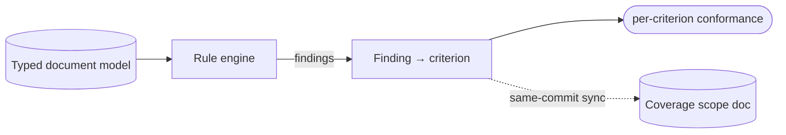

# Standards / WCAG rule engine — GoF appendix rendering

> **Fill draft.** Structure + Sample Code slots for the catalogue entry
> `product/validation-and-conformance/standards-rule-engine.md`, in the book's Gang-of-Four appendix
> layout. The follow-up pass injects the two filled slots at the placeholders keyed by the entry name
> `Standards / WCAG rule engine`. Intent / Motivation / Applicability / Consequences / Known Uses /
> Related Patterns are projected from the catalogue `.md` — reproduced in brief so the entry reads as a
> complete GoF page.

## Standards / WCAG rule engine

**Intent** — A rule engine that maps each finding to the exact external-standard clause it closes, turning
"does this conform?" into a deterministic, standards-grounded predicate rather than a judgement call.

### Motivation

"Is this document accessible?" needs a precise, standards-grounded answer, not a fuzzy score. Without one,
the tool either ships a document that claims conformance while missing success criteria, or runs checks
that aren't tied to any standard — so "we check X" doesn't map to "we close criterion Y." The failure is an
unfounded conformance claim, and it recurs per document and per new check.

### Applicability

Reach for this when conformance to an external standard must be *auditable clause by clause*, not summarized
as one opaque score. Have the engine emit findings, map each finding to the specific standard criterion it
closes, and keep a scope document in sync in the same commit so coverage claims (covered / gap /
aspirational) don't drift from the engine.

### Structure

The engine walks the typed model, produces findings, and maps each finding to the standard criterion it
closes. The scope document, kept in sync, records which criteria are covered, gaps, or aspirational.



*Accessible description: the rule engine walks the typed document model and produces findings, then maps
each finding to the exact standard criterion it closes, yielding a per-criterion conformance claim. A
coverage scope document is kept in sync in the same commit, recording which criteria are covered, gaps, or
aspirational.*

### Sample Code

The engine turns a pile of findings into a clause-by-clause conformance claim by mapping each finding to
the criterion it closes. A fuzzy score can't say *which* criterion a check satisfies; this mapping can, so
the claim is auditable. The same-commit rule keeps the coverage doc from drifting away from the engine.

```python
from dataclasses import dataclass

@dataclass(frozen=True)
class Finding:
    check_id: str
    criterion: str        # the exact standard clause this finding closes, e.g. "1.1.1"

def conformance(findings: list[Finding], in_scope: set[str]) -> dict[str, str]:
    """Map findings to the criteria they close, so conformance is auditable per
    clause rather than a single opaque score. A criterion with no finding and no
    check is a coverage gap, not a silent pass."""
    closed = {f.criterion for f in findings}
    return {c: ("covered" if c in closed else "gap") for c in sorted(in_scope)}

# the coverage scope set is the source of truth for what's in scope; it must be
# updated in the SAME change that adds a check closing a new criterion, or the
# claim drifts from the engine.
```

### Consequences

- **Coverage is only as complete as the mapped checks.** Unmapped criteria are gaps or aspirational;
  honesty about that is the scope doc's job.
- **The mapping must track the standard.** Revisions and new criteria require engine and doc updates.
- **Per-pass conformance checking is staging-only** — the production gate is coarser.

### Known Uses

- The finding-to-criterion mapping step.
- A staging per-pass rule-engine check that surfaces new findings on a dedicated marker.
- The coverage scope document (covered / gap / aspirational status).

### Related Patterns

- **Layer** — with the content validator: fidelity (nothing lost) and conformance (standards met) are the
  two product gates over the artifact.
- **Counterpart** — the coverage scope document keeps the coverage *claims* honest.
- **Consumer** — reads the canonical walkers that traverse the typed models to produce findings.
