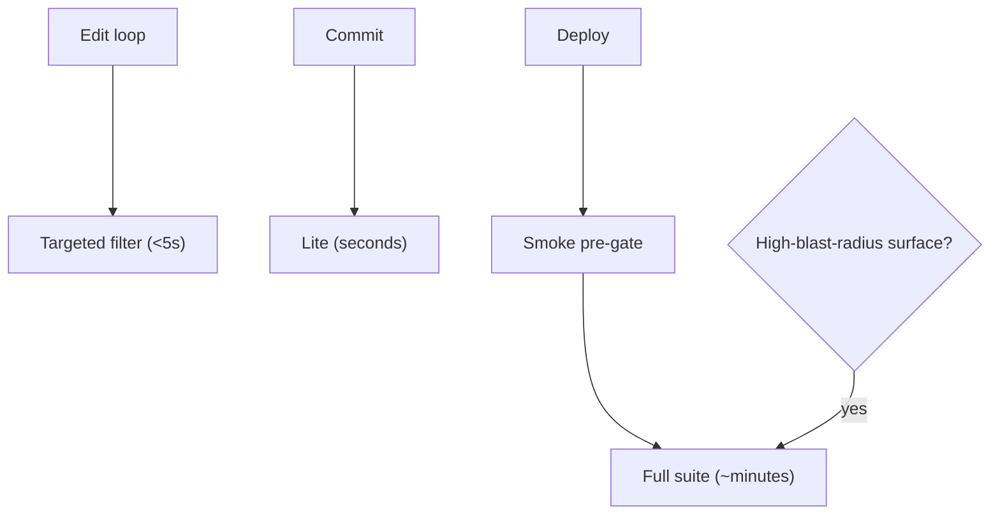

# Test-onion tiers (Smoke / Lite / targeted / full) — GoF appendix rendering

> **Fill draft.** Structure + Sample Code slots for the catalogue entry
> `product/regression-tests/test-onion-tiers.md`, in the book's Gang-of-Four appendix layout. The
> follow-up pass injects the two filled slots at the placeholders keyed by the entry name
> `Test-onion tiers (Smoke / Lite / targeted / full)`. Intent / Motivation / Applicability / Consequences
> / Known Uses / Related Patterns are projected from the catalogue `.md` — reproduced in brief so the
> entry reads as a complete GoF page.

## Test-onion tiers (Smoke / Lite / targeted / full)

**Intent** — A tiered test suite that stratifies thousands of tests by cost and coverage (Smoke, Lite,
targeted, full) so cheap tiers gate fast iterations and the full tier gates deploy, pinning behaviour at
the right price per decision.

### Motivation

Thousands of tests are too slow to run on every change, but skipping them lets regressions land.
Unstratified, you get one of two failures: unusably slow iteration (run everything, always) or missed
regressions (run nothing, hope). It recurs on every change and every deploy; the tension is constant.

### Applicability

Reach for this when the suite is large enough that running all of it on every edit is unusable, but a
fixed subset misses regressions. Tag tests into tiers by cost, and match each tier to a decision — a
sub-second targeted filter for the edit loop, a fast Lite tier, a tiny Smoke pre-gate, the full tier at
deploy. Add escalation rules so touching a high-blast-radius surface forces the full tier before "done."

### Structure

Each decision runs the cheapest tier that covers it: a targeted filter during editing, Lite and Smoke as
fast gates, the full suite at deploy. Touching a high-blast-radius surface escalates to the full tier.



*Accessible description: the edit loop runs a sub-five-second targeted filter, a commit runs the Lite
tier, and deploy runs a Smoke pre-gate then the full suite. A decision node routes any change touching a
high-blast-radius surface straight to the full tier.*

### Sample Code

Tiers are a selection over tagged tests, matched to the decision at hand. A trait on each test names its
tier; the runner picks the cheapest tier that covers the decision. The escalation rule overrides the
default: if the change touches a named high-blast-radius surface, force the full tier regardless.

```python
TIERS = {"smoke": 0, "lite": 1, "targeted": 2, "full": 3}   # cheap → expensive

def select_tier(decision: str, touched: set[str], hot_surfaces: set[str]) -> str:
    """Pick the cheapest tier that gates this decision — unless the change touches a
    high-blast-radius surface, which forces the full tier no matter the decision."""
    if touched & hot_surfaces:
        return "full"                                       # escalation overrides
    return {"edit": "targeted", "commit": "lite", "deploy": "full"}[decision]

def run(tests: list[dict], tier: str) -> list[dict]:
    ceiling = TIERS[tier]
    # a test runs if its own tier is at or below the selected ceiling
    return [t for t in tests if TIERS[t["tier"]] <= ceiling]
```

### Consequences

- **Tier assignment is judgment.** A mis-tiered slow test in Lite erodes the whole tier's speed promise.
- **Escalation depends on discipline.** The rules only help if the full tier actually runs when a named
  surface is touched.
- **The full tier is still minutes** — the deliberate price of the deploy gate.

### Known Uses

- Trait-selected Smoke / Lite / targeted / full tiers.
- A one-second rule for new pre-deploy tests, plus the escalation surfaces that force the full tier.

### Related Patterns

- **See also (sibling)** — property tests, fuzz campaigns, and DDT pin-trailers: the other
  behaviour-pinning bodies in this family.
- **Layer** — the full tier gates the staged-deploy stair; the deploy gates run this suite.
