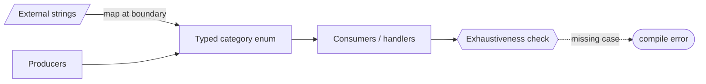

# Typed `ViolationCategory` / `FailureCategory` enums — GoF appendix rendering

> **Fill draft.** Structure + Sample Code slots for the catalogue entry
> `product/repair-vocabulary/typed-categories.md`, in the book's Gang-of-Four appendix layout. The
> follow-up pass injects the two filled slots at the placeholders keyed by the entry name
> `` Typed `ViolationCategory` / `FailureCategory` enums ``. Intent / Motivation / Applicability /
> Consequences / Known Uses / Related Patterns are projected from the catalogue `.md` — reproduced in
> brief so the entry reads as a complete GoF page.

## Typed `ViolationCategory` / `FailureCategory` enums

**Intent** — Replace free-form failure strings with typed enums, so the categorical move-space is a
closed, enumerable set the compiler and lints can check for exhaustive handling.

### Motivation

Bare failure strings are typo-prone, un-enumerable, and let a branch silently miss a case. A typo compiles
and mis-routes; a new category isn't forced into every handler; and you can't even ask "are all categories
handled?" The failure is an unhandled or mistyped category leading to silent misbehaviour, recurring at
every place a category is produced or consumed.

### Applicability

Reach for this when a set of categories is passed around as strings, the set is genuinely closed, and
missing a case must be a compile error rather than a runtime surprise. Define an enum, switch callers from
strings to enum values, and map external strings into the enum at the boundary. Exhaustive-match checking
then forces every handler to cover every case.

### Structure

Producers and consumers speak the enum, not strings. External strings are mapped into the enum at one
boundary. An exhaustiveness check lights up when a handler misses a case.



*Accessible description: external strings are mapped into a typed category enum at one boundary; producers
and consumers speak the enum. An exhaustiveness check over the handlers produces a compile error when a
case is unhandled.*

### Sample Code

An enum turns an open string vocabulary into a closed, checkable set. Callers compare against enum members,
not raw strings, so a typo is a name error at author time. External strings arrive at one boundary and map
in; an unmapped string fails loudly there rather than silently mis-routing downstream.

```python
from enum import Enum

class FailureCategory(Enum):
    TIMEOUT = "timeout"
    CORRUPT = "corrupt"
    RATE_LIMIT = "rate_limit"

_FROM_WIRE = {c.value: c for c in FailureCategory}

def parse_category(raw: str) -> FailureCategory:
    """The one boundary where external strings become the typed category.
    An unknown string fails here, loudly — not three layers down as a silent miss."""
    try:
        return _FROM_WIRE[raw]
    except KeyError:
        raise ValueError(f"unknown failure category {raw!r}")

def handle(cat: FailureCategory) -> str:
    # exhaustive match: adding a new enum member makes this branch incomplete,
    # which a type-checker flags — the missing case can't stay silent
    match cat:
        case FailureCategory.TIMEOUT:    return "retry"
        case FailureCategory.CORRUPT:    return "fail"
        case FailureCategory.RATE_LIMIT: return "backoff"
```

### Consequences

- **Adding a category touches every handler** — the point (it forces handling), but real work.
- **Boundary translation.** External strings still arrive as strings and must be mapped in at a controlled
  seam.

### Known Uses

- Violation- and failure-category enums in place of bare failure strings.
- Enum-value comparison instead of matching against raw strings.

### Related Patterns

- **See also (sibling)** — closed remediation-verb sets and the codemod-first threshold: the other
  bounded-move controls.
- **See also (cross-target)** — the agent side's const-string topic registry: the same
  typed-namespace-over-strings move for event topics.
- **Enables** — typing a failure space is the precondition for walking every error edge and asking "did we
  cover them all?" — only possible when the edges are a finite, named set.
