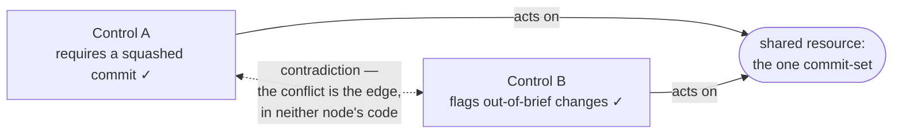

<!-- part-title: The Governed Engineering Environment -->
<!-- chapter-title: When Guardrails Collide -->

# When Guardrails Collide

<!-- gloss-only: Governance graph | A typed model whose nodes are the fleet's own governance mechanisms (each tagged by the event it fires on and the shared resources it reads, writes, or locks) and whose edges are the conflicts between them over a shared resource, in a closed taxonomy of contradiction, contention, ordering, and soft-versus-hard; the dynamic dual of a static catalogue of controls, holding the interaction dimension a list omits. -->

<!-- point: a-system-of-controls-has-the-one-failure-a-list-cannot-show | The stack gives four layers to steer at and a governed fleet fills them with accumulating constraints, each earning its place alone; but together they form a system, and a system of controls has the one failure a list of controls cannot show — two of them making incompatible demands on the same thing at the same moment. -->
The stack gives you four layers to steer at, and a governed fleet fills them: a hook at the
harness that fires at turn-end, a lint at the application that gates a commit, a skill that aims
a task, a mediator that rations a lock. Pick a layer, inject a constraint — and the constraints
accumulate. Each earns its place alone. Together they form a system, and a system of controls
has the one failure a list of controls cannot show — two of them making **incompatible demands
on the same thing at the same moment**.

<!-- point: each-collision-lives-in-the-space-between-two-controls-drawn-nowhere | Two collisions from the case study make it concrete — a squashed-commit requirement colliding with an out-of-brief check on the same commit-set, and two turn-end hooks firing with no order declared between them — and neither lives in any one control's code: each lives in the space between two controls, two correct controls making a contradictory demand on one shared resource, a space drawn nowhere until the graph draws it. -->
Two collisions from the case study make it concrete. In the first, one path required a commit
to take a squashed shape while a separate check flagged out-of-brief changes on that *same*
commit-set — two controls, one resource, contradictory demands, caught only when a real commit
tripped both. In the second, two hooks fired on the *same* turn-end with no order declared
between them, each able to block, resolved by hoping they composed. Neither collision lives in
any one control's code. Each lives in the space *between* two controls, and that space was
drawn nowhere — until [ref:collision-edge] draws it: two correct controls, one shared resource, a contradiction on the edge between them.

<!-- label: collision-edge -->

*The conflict is the edge, not either node. Read Control A alone and it is correct; read Control B alone
and it is correct. What they demand of the one resource they share collides — and that collision is drawn
nowhere until the graph draws it.*

## Drawing what lies between the controls

<!-- point: the-governance-graph-nodes-are-mechanisms-edges-are-conflicts-joined-by-shared-resource | The Governance Graph draws the space between controls: nodes are the mechanisms, each tagged with the event it fires on and the resources it reads, writes, or locks, and edges are the conflicts in a closed four-value taxonomy — contradiction, contention, ordering, and soft-versus-hard — joined by the shared resource rather than any call, so two controls that never call each other still collide if they touch the same slot, and typing the turn-end slot and the context budget as resources brings hook-pileup and injection-pressure under the same machinery as a contended lock. -->
The Governance Graph draws it. The nodes are the mechanisms — each tagged with the event it
fires on and the resources it reads, writes, or locks. The edges are the conflicts, in a
closed four-value taxonomy: **contradiction** (two demand incompatible shapes of one
resource), **contention** (two lock one resource, risking a deadlock cycle), **ordering** (one
writes what the other reads on the same slot, with no guaranteed order), and
**soft-versus-hard** (a soft aim overridden by a hard block on the same slot). The join key is
the shared resource. Two controls that never call each other still collide if they both touch
the turn-end slot, so the resource — not the call — is what makes them comparable. Type the
turn-end slot and the context budget as resources too, and hook-pileup and injection-pressure
fall under the same conflict machinery as a contended lock. One analysis covers all of it.

<!-- point: the-shared-resource-is-the-only-cross-lifecycle-coupling-surface-and-keeps-the-graph-sparse | The shared resource is what lets the graph reason across lifecycles: a turn-end hook and a commit-time check live in different lifecycles but still collide if they reach for one typed resource, and the resource is the only coupling surface between lifecycles — controls that share none cannot conflict, which keeps the graph sparse — and this is the semantic gap again, the collision a property of the interaction, invisible in either control's own code and legible only at the level where both are drawn. -->
The shared resource is also what lets the graph reason *across lifecycles*. Most collisions are
local — two controls in one lifecycle touching one nearby resource. But a hook that fires at turn-end
and a check that fires at commit live in different lifecycles, and they still collide if they both reach
for one typed resource. The resource is the *only* coupling surface between lifecycles: controls in
different lifecycles that share no resource cannot conflict, which is what keeps the graph sparse. And
this is the [semantic gap](2.2-models-and-the-semantic-gap.html) again — the collision is a property of the
*interaction*, invisible in either control's own code, legible only at the level where both are drawn.
The graph lifts the check to that level.

> Learn more about this governance mechanism: [Governance Graph](appendix-b-governance-graph.html).

<!-- point: the-graph-is-the-catalogues-dynamic-dual-splitting-decidable-edges-from-judgment-ones | A catalogue lists the controls but cannot show which two will crash; the graph draws exactly those crashes — the edges a list of nodes omits, the static catalogue's dynamic dual — and the answer splits cleanly: mechanically decidable edges (a same-slot pair with no declared order, a lock cycle) route to a sensor a lint settles, while semantic edges (are two demands on a commit-set truly incompatible, or do they compose?) route to a human prompt, so each edge carries its nature derived from its type and both the flag and the prompt land before the control ships, not at the collision. -->
A catalogue lists the controls; it can't show which two will crash into each other. The graph
draws exactly those crashes: which pairs collide, and over what. It is the edges a list of nodes
omits — the static catalogue's dynamic dual. And the two halves of that answer split cleanly. Some edges are
**mechanically decidable**: a same-slot pair with no declared order, a lock cycle. A lint
settles those. Others need **judgment**: are two constraints on a commit-set truly
incompatible, or do they compose? No lint decides that; a reader must. So each edge carries its
nature, derived from its type, and the decidable edges route to a sensor while the semantic
ones route to a human prompt. This is where the motivating commit-set collision was really
lost — the machine could flag that two controls touched the commit-set, but only judgment could
call the contradiction. The graph makes both the flag and the prompt land *before* the control
ships, not at the collision.

<!-- point: the-graph-makes-the-implicit-claim-that-mechanisms-compose-explicit-and-checkable | The operational payoff: a governed environment is not just a pile of running mechanisms but a claim that they compose — a claim that was implicit, checked only by collision — and the graph makes it explicit and checkable, answering at authoring time "what fires on this event, what touches this resource, is this new control consistent with the ones already wired," so the fleet stops merely running its guardrails and starts modeling how they interact. -->
That is the operational payoff. A governed environment is not just a pile of running
mechanisms; it is a claim that those mechanisms compose. The claim was implicit, checked by
collision. The graph makes it explicit and checkable: ask *what fires on this event, what
touches this resource, is this new control consistent with the ones already wired* — and get an
answer at authoring time. The fleet stops merely running its guardrails and starts modeling how
they interact.

## When the hooks aren't yours

<!-- point: outside-hooks-from-a-vendor-or-regulator-extend-the-graph-without-changing-shape | Every mechanism so far was one you wrote, but some hooks arrive from outside — a plugin, a teammate, and plausibly soon a regulator or model vendor mandating "run your agents with these prescribed governance hooks or fall out of compliance" — and the graph extends to these without changing shape. -->
Every mechanism so far was one you wrote. But some hooks arrive from outside — a plugin registers one, a
teammate adds a personal one, and, plausibly soon, a **regulator or a model vendor mandates** one: run
your agents with these prescribed governance hooks, or you are out of compliance. The graph extends to
these without changing shape.

<!-- point: an-unanalyzed-outside-hook-sits-on-a-possible-conflict-edge-against-its-whole-slot | An outside hook enters as a node with its firing event known but its resource footprint unknown — and unknown is not empty, since empty would mean "verified to touch nothing" — so it sits on a possible-conflict edge against every mechanism sharing its slot until someone analyzes it into a known node, and that conservative default is the honest reading of a black box, creating the right pressure: an unreconciled mandated hook shows up as unresolved conflict, never as silent trust. -->
An outside hook enters as a node with its firing event known (you can read *when* it fires from its
registration) but its resource footprint unknown. Unknown is not empty; empty would mean "verified to
touch nothing," and you have verified no such thing. So it sits on a *possible-conflict* edge against
every mechanism sharing its firing slot, until someone analyzes it into a known node or flags it
un-analyzable. That conservative default, *it might collide with everything on its slot*, is the honest
reading of a black box, and it creates the right pressure: a mandated hook you have not reconciled shows
up as unresolved conflict, never as silent trust.

<!-- point: composing-governance-you-did-not-author-is-checking-the-merged-graph-for-contradiction | The graph becomes a substrate for composing governance you did not author: satisfying one regulator is checking that your mechanisms plus theirs leave no unresolved conflict, satisfying several is the same check over the union, and because the graph types soft-versus-hard it can settle the property a mandate cares about most — that a required hard block is never quietly overridden by one of your soft aims on the same slot — so "do I satisfy all of them at once?" becomes a question the model answers at authoring time instead of at audit. -->
That makes the graph a substrate for *composing governance you did not author*. Satisfying one regulator
is checking that your mechanisms plus theirs leave no unresolved conflict. Satisfying several at once is
the same check over the union: the composition is compliant exactly when the merged graph carries no
contradiction, and a contradiction between one regulator's mandated hook and another's is a compliance
impossibility, surfaced at authoring time instead of at audit. Because the graph types soft-versus-hard,
it can settle the property a mandate cares about most: that a required *hard* block is never quietly
overridden by one of your own *soft* aims on the same slot. Your own guardrails were the first use;
governance handed to you (by a vendor, a regulator, a standard) is the same graph with more nodes, and
"do I satisfy all of them at once?" becomes a question the model answers.

## Keeping the model honest

<!-- point: keep-the-graph-honest-by-symbol-anchoring-and-a-descriptive-not-aspirational-model | Two disciplines keep the model honest: anchor each node to the code that implements its control by symbol, never by line, so a drift lint re-resolves the anchor every build and a control wired but unmodeled reddens the gate; and keep the model descriptive — it draws the controls that exist and checks proposed ones on request, it does not invent conflict-lints for collisions that never happened — because a governance graph is itself a governance mechanism, and the failure mode of governance is a tower nobody wants. -->
Two disciplines keep the model honest, and both are the book's. Anchor each node to the code
that implements its control by symbol, never by line, so a drift lint re-resolves the anchor on
every build and a control wired but unmodeled reddens the gate: the map stays equal to the
territory, or the graph lies about which collisions are covered. And keep the model
**descriptive** — it draws the controls that exist and checks proposed ones on request; it does
not invent conflict-lints for collisions that have never happened. A governance graph is itself
a governance mechanism, and the failure mode of governance is a tower nobody wants. This one
catches real collisions, not imagined ones.

> Learn more about this governance mechanism: [symbol-anchored traceability graph](appendix-b-symbol-anchored-traceability-graph.html).
