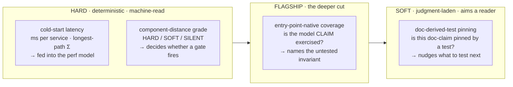

<!-- part-title: The Governed Engineering Environment -->
<!-- chapter-title: Metrics -->

# Metrics: The Sensing Half of the Loop

Every agent runs a loop. It takes an input, reasons, acts, and folds the result back around.
The chapter on loops said the metric is what the agent steers by — skip it and the agent
searches forever, never knowing when to stop. That chapter spent its words on the acting half.
This one develops the sensing half, because a loop with no honest sense of its own state cannot
steer at all.

A metric senses. A playbook acts. A mechanism enforces. Those three make up a governed loop, and
the metric comes first because the other two are blind without it. A playbook that fires on a
number that measures the wrong thing does the wrong work. A mechanism that grades on a number too
coarse to name the fault blocks the wrong commit. So the question that governs every metric in
this chapter is not "can I measure this?" — almost anything can be counted — but "does this
number drive a decision?"

## Measure one level deeper

<!-- index-def: measure-one-level-deeper -->
John Ousterhout gives the rule in one line: **measure one level deeper than the number you
think you want.** A metric earns its place only when it drives a decision, and the surface
number usually cannot. It affords the report; it does not afford the engineering.

Take cost. A cloud bill tells you what the whole project spent last month. That number is real,
and useless: it tells you to pay the invoice, not *what to change* — which service to slim, which
call to batch, which cascade to cut. Split the same bill by service and it starts to act. One
service usually dominates and the rest trail off in a thin tail, and the dominant one names your
first target. You measured one level deeper, and the deeper number carries a decision the shallow
one buried.

> ### Worked example — cost, one level deeper
>
> Say a monthly bill comes to $4,000. As one number it means only *pay it*. Split by service —
> $2,100 in GenAI calls, $600 in rendering, the rest a thin tail — and it means *batch the GenAI
> calls first*. Same dollars, one level deeper, and now the number drives an engineering decision
> instead of an accounting one. (Illustrative figures, not a real invoice.)

The same trap hides in test coverage. "The suite covers 87% of lines" is the invoice-level
number — a headline that reports and does not act. It cannot tell you *which* untested code
matters, because a line in a throwaway string helper counts the same as a line in the job
state machine. The rest of this chapter walks a spectrum of metrics from the hard,
deterministic end to the soft, judgment-laden one, and the flagship in the middle is exactly
coverage measured one level deeper — coverage that names the gap instead of hiding it in a
percentage.

The spectrum tracks the book's soft-versus-hard governance axis. A **hard** metric is
deterministic: a machine reads it, and the same input yields the same number every time. A
**soft** metric is judgment-laden: it points a human or an agent at a place to look, but it
cannot be reduced to a threshold that decides on its own. Both are worth having. The mistake is
to treat one as the other — to block a build on a soft signal, or to leave a hard fact to a
reviewer's memory.

## The hard end: cold-start latency, machine-read and model-fed

Start at the deterministic end, where a metric is a millisecond number nobody argues about.

A serverless fleet scales to zero. When a request wakes a cold instance, the user waits while
the container boots and the runtime loads. That wait is the cold-start latency, and the obvious
way to read it is as the penalty of scaling from zero: measure it, and if it hurts, pay to keep a
warm instance running.

The obvious reading was wrong, and measuring one level deeper is what showed it. The conformance
service — a PDF validator wrapping veraPDF, a Java tool — carried a 4,057 ms *warm* floor, a wait a
warm instance did nothing to remove. The deeper number named its own cause: veraPDF ran as a
subprocess launched once per request, so every call paid a fresh JVM startup. The tax was not
scale-from-zero; it was the process launch, and no warm-instance lever could reach it. The fix was
a re-architecture — keep the runtime resident instead of relaunching it — and the warm floor fell
from 4,057 ms to 109 ms, a thirty-seven-fold cut that took nearly four seconds off every request.
The .NET service told the same story smaller: 494 ms of per-request CLI launch, down to 103 ms once
the runtime stayed resident. And the tempting surface explanation, that the container images were
simply too big, was also wrong — a 433 MB service cold-started fine. The barrier was runtime
initialization, not image size, and only the deeper measurement said so.

That is a metric read at the level where the decision lives: resident-runtime versus warm-instance
is a different fork than the shallow cold-start number implied, and a fleet-average number would
have buried it. But I found that tax by hand — spot-checking the one service whose latency looked
wrong — and spot-checking does not scale. It catches the service that happens to draw your eye,
misses the ones that do not, and says nothing about how the services interact. The better instrument
is a model that holds every service's numbers and reasons over the paths between them, so the costly
case falls out of the graph instead of out of a hunch. Because the sharpest question is not any
single service. It is the *chain*. A request that lands when every
downstream service is cold triggers a cascade of cold-starts along the critical path. The
revenue-core journey runs its steps in sequence; within a step, its calls fan out in parallel.
So the worst case is a **longest-path sum**: each step contributes the slowest cold-start it
waits on, and the path total is the sum of those per-step maxima. That number — not the
per-service one, and certainly not the average — is the one that predicts the worst latency a
real user can hit. It is the metric measured at the level where the decision lives.

Here the hard end shows its defining move: **the number feeds the model.** The cold-start
measurements do not live in a dashboard a human reads and forgets. They land as typed fields on
the deployment-topology model the fleet reasons through — a `cold_start_ms` and a `warm_ms` on
each service's plane record. A recompute tool reads those fields and derives the longest-path
worst case over the journey graph. When a later measurement writes a fresher number onto a
service's annotation, the tool reads it live and the worst-case total refines on its own, no
edit required.

The commit is automated, and that is the point. The tempting alternative is a runbook step — *after
a measurement run, remember to commit the new numbers.* A reminder like that rots; someone forgets,
and the model drifts from the fleet it describes. So the pipeline commits the refreshed measurements
itself, under a bypass-prefixed housekeeping commit with no human in the loop, and the model's
cold-start parameters stay current with zero manual action. Build the map's upkeep into the machine
that changes the territory rather than asking a person to remember it — architecture over a reminder.
The runbook note then documents an automated step instead of a chore.

I want to be honest about where this stands. The live-annotation path is built but not yet
populated — today the tool runs off a snapshot table of measured values, each row citing the
commit that measured it, because the fleet is mid-migration and no service carries the live
annotation yet. The machinery to read the model live exists; the model is not fully fed. That
is the ordinary shape of real work: the seam is in, the data catches up. What matters for this
chapter is the pattern — a hard metric, measured deterministically, written into a typed model,
and consumed by a tool that turns it into a decision (which path, which service, which lever).

## The flagship: coverage measured one level deeper

Now the middle of the spectrum, and the chapter's teaching example. This is coverage done right
— the "measure one level deeper" rule applied to the number that most often gets it wrong.

Line coverage answers a **syntactic** question: did this line run under some test? That is a
fact about source text, and it is genuinely useful. But it cannot answer the question an engineer
actually has, which is **semantic**: is the *claim this code makes* exercised by a test? A file
can sit at 95% line coverage while the one function that implements a critical invariant — call
it INV-18 — is never called by any test at all. Its lines happen to be covered incidentally,
swept up by an unrelated test that imports the module. The 95% is true. It is also a lie about
the thing you care about, and the lie is invisible because a percentage has nowhere to put the
gap.

The fix comes from joining two things the system already has. The first is a **traceability
graph** that links each model claim — an invariant, a state-machine transition, a service-flow
edge — to the code that implements it. The link points at an **anchor**: the entry point, the
`(path, symbol)` of the function that carries the claim. The second is the ordinary coverage
oracle, which knows exactly which source lines ran. Compose them:

> anchor → its symbol → that symbol's line range → intersect with the covered-line set → *is this model claim's code exercised?*

That composition changes the unit of measurement. Line coverage counts lines. This counts
**model claims**. The anchors supply the numerator's units; coverage supplies the ground truth
of what ran. INV-18's anchor resolves to its function, the function's lines are checked against
what the tests actually executed, and the metric reports not a percentage but a named verdict:
*INV-18's implementing code is not exercised by any test.* An anonymous 87% becomes an
actionable list of the exact model claims your suite walks past.

This is not a new invention, and it should not be. Run the genre check and the family has a name:
**requirements-based coverage** — the discipline DO-178C mandates for avionics, and the shape the
open-source Doorstop tool encodes with git-native requirement items linked to their tests. The
system's traceability substrate already adopted that schema. So the work here is not to dream up
a bespoke "model coverage" number. It is to compute the requirements-based-coverage figure over a
graph that was already built for it — and to add the one synthesis the off-the-shelf tools lack.
Doorstop checks that a requirement *has* a linked test. It does not check that the linked test
*executes* the requirement's code. Joining the trace edge to the live coverage oracle closes that
last gap.

The single primitive underneath — `anchor_exercised`, which resolves an anchor to a line range
and intersects it with the covered set — supports several aggregations, each answering a
different decision:

- **Model-Element Coverage.** Of the model claims that anchor real code, what fraction is
  exercised? This is the headline: it turns 95%-line-covered into a named list of unexercised
  invariants, each a fix target.
- **Entry-Point Coverage.** Of the code roots the models declare as "changes here mean drift,"
  which are untested? This is the number to watch when refactoring — it tells you which anchored
  roots a regression would slip past.
- **Chain Coverage.** Does each model claim close end-to-end: code exists, a test names it as its
  verifier, *and* that test actually runs the code? This is the strictest cut, and it will report
  low at first, because few claims declare a verifying test today. That low number is the metric
  doing its job, not failing — it names the verification chains still to build.

The honesty layer matters as much as the aggregation. A single percentage lies when its
denominator is fuzzy, so every figure reports a breakdown: exercised, not-exercised, unmeasurable
(the anchor could not be resolved to code), and out-of-surface (a database-tier claim that is
legitimately not code you can cover). "80%" then reads as what it is — *80% of the fifty
measurable claims are exercised; twelve more are unmeasurable and owe a burn-down; eight are out
of surface by design.* That is a number that affords the engineering, because you can see which
part of it you can act on.

The design is deliberately light. Computing all of this requires no change to any model — the
anchors already carry their `(path, symbol)`, and the covered-line set is a plain read of the
coverage database the test runner already writes. The metric is a new consumer of two existing
substrates. That is the whole point: the expensive parts — the traceability graph, the
cross-language coverage oracle — were already paid for. Measuring one level deeper cost a join,
not a rebuild.

## The soft end: doc-derived tests

Slide to the far end of the spectrum, where the metric stops being a number a threshold can act
on and becomes a judgment a human has to make.

A **doc-derived test** pins a behavior stated in a cited document or spec. The test carries a
trailer naming the source it derived from, and when that source is edited, the test is
regenerated so the pin and the prose stay in step. The metric it invites is: *is this
doc-claim pinned by a test?* That question is genuinely soft. It has no clean denominator.
"How many claims does this document make?" is a matter of reading — one reader finds six, another
finds nine, and neither is wrong. You cannot reduce it to a percentage the way you can reduce
line coverage, because the set of claims is not enumerable by machine. The signal points a reader
at a document and says *these behaviors deserve a pin*; it does not decide.

The softness runs deeper than a fuzzy denominator, and this is the honest part. A doc-derived
test is only as good as the seam it tests against. If the code interleaves its decision logic
with live I/O — a poll loop welded to a queue, a validator welded to a database read — there is
no pure surface to assert a value against, and the test falls back to pinning the *shape* of the
source: that a function exists, that a docstring reads a certain way. That kind of test stays
green even when you gut the function's body. It measures nothing about behavior. So the
doc-derived-test signal is inseparable from a judgment about readiness: are the types sound, is
there a seam to test through, is the contract even documented? Only a human (or an agent
reasoning as one) can answer that, which is what plants this metric firmly at the soft end.
Treat it as hard — wire it to a gate that blocks on a coverage-of-doc-claims threshold — and you
manufacture exactly the hollow tests it was meant to prevent.

## The model runs the machinery

Step back and look at what the hard end and the flagship share, because it is the thread this
part of the book is weaving.

The MBSE models are not documentation that merely stays in sync with the code. They are
**consumed at runtime to produce the metrics.** The cold-start numbers are not a spreadsheet; they
are typed fields on the deployment-topology model, and a tool reads the model to derive the
longest-path worst case. The coverage flagship does not scan source text for functions that look
important; it walks the traceability graph, follows each model claim to its anchor, and measures
*that*. In both, the model is not a picture of the machinery. The model *is* the machinery — the
thing the metric tool reads to know what to measure and how to weigh it.

The sharpest instance ties metrics back to mechanisms, and it is worth ending on because it is
where the whole pattern earns its keep. A pre-commit gate has to decide whether a lint finding
should block a commit. The naive gate blocks on any finding anywhere, which drowns an agent in
pre-existing debt it did not cause. The better gate grades each finding by its **distance from
the change** in the typed component graph, and the grade decides the gate's behavior:

- **HARD** — the finding sits on a file this commit touched, or is directly caused by a touched
  input. Block. This is the commit's own debt, and it fails closed.
- **SOFT** — the finding sits in the *same component* as a touched file, but not on a touched
  file. Report it, name it, ask the agent whether the change plausibly caused it — but do not
  block. Blocking here would make concurrent agents race to fix the same pre-existing problem and
  collide.
- **SILENT** — the finding sits in a different component entirely. Suppress it at commit time; the
  whole-tree deploy gate remains the backstop.

The grade is a metric — a distance, read from the model at check time — and it drives a sensor's
decision directly. Same finding, three different gate behaviors, chosen by consulting the
component graph about how far the finding is from the change. Here the model is not describing the
system for a human to read later. It is being queried, at the moment a commit is made, to grade a
gate. Guidance aims; machinery holds — and this is the machinery, run by the model.

## A compact reference

The argument was the meal. The table is the lookup — one row per metric, the decision it drives,
where it sits on the hard-soft axis, and who reads it.

| Metric | Decision it drives | Hard / soft | Read by |
|---|---|---|---|
| Per-service cost | Which service to slim, which call to batch | Hard | Cost tooling, admin panel |
| Cold-start latency (per service) | Which service warrants a warm-up lever | Hard | Perf tool, admin panel |
| Cold-start longest-path Σ | Which critical-path chain bounds worst-case latency | Hard | Perf tool, deployment-topology model |
| Model-Element Coverage | Which model claim (invariant, transition, edge) is untested | Flagship (hard number, semantic unit) | Coverage tool, per-model backlog |
| Entry-Point Coverage | Which anchored code root a refactor regression would slip past | Flagship | Coverage tool |
| Chain Coverage | Which requirement lacks an end-to-end verifying test | Flagship | Coverage tool, requirements audit |
| Doc-claim pinning | Which documented behavior still needs a test | Soft | Author, reviewing agent |
| Component-distance grade | Whether a gate blocks, reports, or suppresses a finding | Hard (grade), soft (the causation nudge) | Pre-commit gate, the committing agent |

Read the table top to bottom and the spectrum is visible in one glance: the top rows are
stopwatch-hard and machine-consumed, the middle rows turn a hard measurement onto a semantic unit,
and the bottom rows aim a reader who still has to judge. Every row names a decision, because a
metric that names no decision was measured too shallow — and a loop steering by a shallow number
is a loop that cannot steer.
