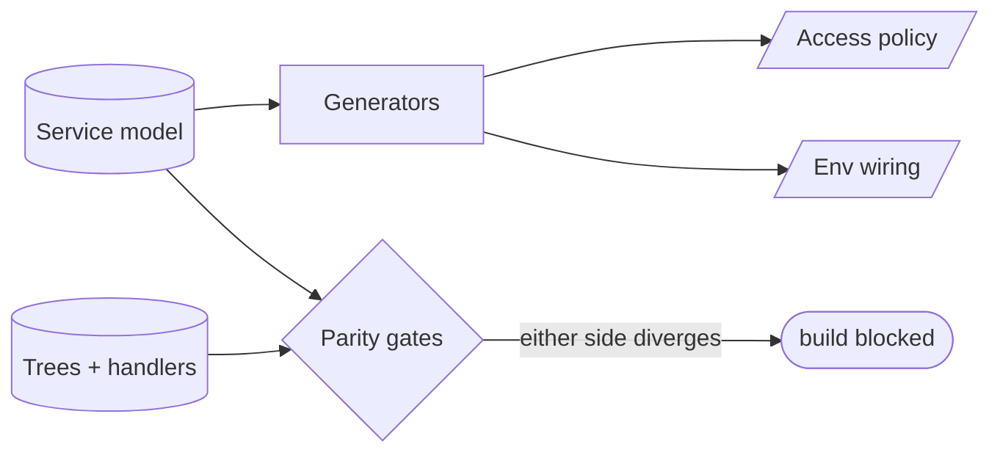
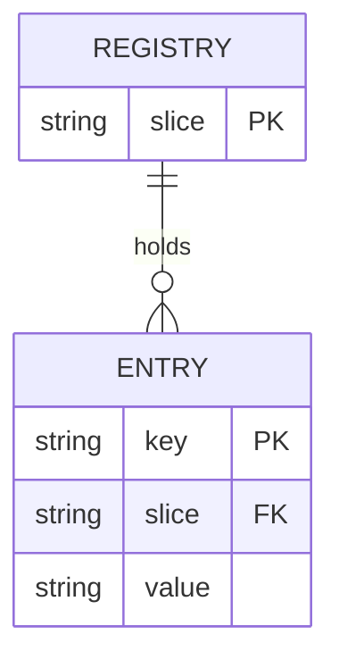

<!-- part-title: The Model Zoo -->
<!-- chapter-title: The Logical View -->

# The Logical View: what the system is

<!-- noqa: book-section-cap | The Logical View — the intro carries the boxed data-flow-diagram primer (Inset I5) the reader needs before the view's models; the inset is a self-contained primer, not prose to break up -->

<!-- index-def: logical-view -->
The Logical view is the functional structure — the objects, the types, and how they relate.
It answers the designer's question: *what is this system, as a set of concepts?* Before you
ask what runs at once, or where the parts live, or how the source is packaged, you ask what
the parts *are*. That is the logical view, and it is the one most engineers already draw
without naming — the boxes-and-arrows sketch of the domain.

Two general model types live here. A **data-flow diagram** traces what data exists and who
may touch it. An **inheritance hierarchy** shows which specializations of an abstract concept
exist. Two of the catalogue's real models embody the view on live code: the service-flow
model, which is the functional structure of a service-oriented architecture, and the domain
registries, which are the typed facts that functional model rests on.

<!-- index-def: data-flow-diagram -->
> ### Inset I5 — What is a data-flow diagram? {#inset-dataflow}
>
> A **data-flow diagram** traces *data* moving through transforms — a source, the stages that
> reshape it, and the sink — where each edge names *what flows across it*, not *what decides*.
> It differs from a control flowchart: a flowchart's diamonds branch on decisions; a
> data-flow's edges carry a document, a JSON blob, a rendered page. It is the natural lens for
> **security and privacy**, because the question there is exactly "where does this data go, and
> who may touch it on the way?" Draw it left to right, label each edge with the data on the
> wire, and a reader sees the path a piece of data takes and every component that handles it.
>
> ```mermaid
> flowchart LR
>   Doc[/Raw document/] -->|bytes| Parse[Parse]
>   Parse -->|typed model| Remediate[Remediate]
>   Remediate -->|stamped model| Write[/Output document/]
> ```
>
> *Accessible description: a raw document enters as bytes, is parsed into a typed model,
> remediated into a stamped model, and written out — each edge naming the data that crosses it,
> so a reader can see every component that touches the document.*

An **inheritance hierarchy** — the second logical-view type — shows an abstract concept and
its concrete specializations, so an engineer sees which extensions exist and where a new one
would attach. A remediation tool's inheritance hierarchy names the abstract "document format"
and its concrete leaves — the slide format, the word-processor format, the spreadsheet, the
PDF — each carrying the same operations against a different file model. The hierarchy is the
logical statement of *what kinds of thing the system knows how to handle*, and it is where a
reader looks to answer "can this system be extended to a new format, and what must the new
leaf provide?"

The two real models below carry the view. The data-flow and inheritance types are the
vocabulary; these are the worked embodiments.

## The service-flow / API model {#service-flow-model}

<!-- noqa: book-section-cap | The service-flow / API model — a model page rendered from the fixed five-field (a)-(e) template; the fields are one indivisible reference unit a reader scans by reflex across every model, so splitting one page breaks the uniform shape -->
*The typed source-of-truth for a service-oriented architecture — its services, their
endpoints, their authentication, and the wiring between them — from which the access policy
and environment wiring are generated and against which the real call graph is checked.*

**(a) Quality property it helps assess.** Three, each a question the scattered deploy config
and handler code cannot answer without a single model.

- **Wiring correctness**: *does every declared caller-to-callee edge have a real call site,
  and every real cross-service call a declared edge?* An undeclared call is an ungoverned one.
- **Access-policy soundness**: *does the generated network access policy match the wiring the
  model declares?* The policy is emitted from the model, so a service can reach only what the
  model says it may.
- **Contract parity**: *does each endpoint's declared request and response shape match the
  handler that serves it?* A drifted contract is a runtime failure the model turns into a
  build failure.

**(b) Constructs and relations.** A typed catalog in the dialect of a service-catalog schema,
adopted for its hard-won structure and read by the project's own tools.

- **`Service`**: one deployable unit, with its name, its owning layer, and the endpoints it
  serves.
- **`Endpoint`** — one API surface on a service: its path, its auth requirement, and its
  declared request and response contract.
- **`Wire`**: one declared caller-to-callee edge, joining a calling service to a called
  endpoint. The set of wires is the graph the access policy is generated from and the call
  graph is checked against.

**(c) Visual depiction.** The natural diagram is a data-flow — the model on the left, the
generators and parity gates it feeds on the right. Reused from the model's appendix Structure
slot:



*Accessible description: the service model feeds generators that emit the access policy and
environment wiring, and it feeds parity gates that compare it against the real service trees
and handlers. When either the model or reality diverges, the build is blocked. The model is
authoritative for what it generates and reconciled against reality for what it checks.*

**(d) Invariants, and how they are checked.** The checkers are the trunk drift-and-parity
machinery, pointed at the service graph:

| Invariant | Temporal shape | How it is checked |
|---|---|---|
| Every declared wire has a real call site | *□P* (safety) | Call-graph parity lint: each `Wire` edge must resolve to a real cross-service call. |
| Every real cross-service call is a declared wire | *□P* (safety) | Same lint, reverse direction — an undeclared call is a finding. |
| The generated access policy matches the wiring | *□P* (safety) | Freshness lint over the generated policy: regenerate from the model, diff against the committed artifact. |
| Each endpoint's contract matches its handler | *□P* (safety) | Contract parity check joining the `Endpoint` shape to the handler signature. |

**(e) Traceability and derivation direction.** *Bidirectional.* The access policy and
environment wiring are model-to-code — generated from the declared model. The call-graph
parity runs model-from-code — it re-reads the real call sites and reconciles. The join key
from a model row to the code is the endpoint path, which indexes both a `Wire` edge and the
handler that serves it.

*Also seen in:* Physical (the generated access policy is a placement artifact). Rendered in
full here; referenced from the Physical chapter.

## The domain registries {#domain-registries}

<!-- noqa: book-section-cap | The domain registries — a model page rendered from the fixed five-field (a)-(e) template; the fields are one indivisible reference unit a reader scans by reflex across every model, so splitting one page breaks the uniform shape -->
*Frozen typed registries for the system's domain facts — the file types it handles, its known
conformance gaps, its scheduled jobs, its user-facing surfaces, its competitor set — each the
single source of truth for its slice, read by the tools and docs that present it.*

**(a) Quality property it helps assess.** Two properties the raw code and scattered docs
cannot hold on their own.

- **Fact consistency**: *does every place that presents a domain fact agree with the one
  registry?* The competitor doc, the conformance-coverage table, and the code that switches on
  file type all read the same frozen registry, so they cannot disagree.
- **Coverage completeness**: *is every value the system must handle actually declared?* A new
  file type the code handles but the registry omits, or a conformance gap the code closes but
  the coverage table never listed, is a drift finding.

**(b) Constructs and relations.** Each registry is a frozen table keyed by its slice.

- **`Registry`**: one domain slice (file types, conformance gaps, scheduled jobs, surfaces).
- **`Entry`** — one fact in a slice: a key and its typed value. A file-type entry carries the
  extension and its handler class; a conformance-gap entry carries the criterion and its
  coverage status.
- **The single-source relation**: every consumer of a fact joins to the registry by key
  rather than embedding a copy, so the fact is stated once.

**(c) Visual depiction.** The natural diagram is an ER schema — a registry holding many typed
entries. Reused from the model's appendix Structure slot:



*Accessible description: a registry record holds many entry records, each an entry keyed
within its slice and carrying a typed value. Every consumer of a domain fact joins to the
registry by key rather than copying the fact, so the fact lives in one place.*

**(d) Invariants, and how they are checked.** The checkers are coverage lints and a
read-don't-hardcode ban:

| Invariant | Temporal shape | How it is checked |
|---|---|---|
| Every value the code handles is declared in the registry | *□P* (safety) | Coverage lint: the switch arms in the code must each map to a declared entry. |
| No consumer embeds a snapshot of a registry fact | *□P* (safety) | Snapshot-ban lint: a hardcoded copy of a registry value is a finding. |
| Every presenting doc agrees with the registry | *□P* (safety) | Freshness lint over the generated doc: regenerate from the registry, diff against the committed doc. |

**(e) Traceability and derivation direction.** *Model-from-code for coverage, model-to-code
for the generated docs.* The coverage lint reconciles the registry against the code's switch
arms; the presenting docs are generated from the registry. The join key from a model row to
the code is the entry key — the file-type extension, the conformance criterion — which indexes
both the registry and the code path that consumes it.

*Also seen in:* Development (a registry of scheduled jobs or user surfaces is a
development-substrate fact). One slice, the governance rules' own metadata, is rendered
separately in the Development chapter as the rule-metadata registry. Rendered in full here;
referenced from the Development chapter.

---

The Logical view names what the system is. The next chapter asks the question the logical view
cannot: not *what are the parts* but *what happens when many of them run at once*. That is the
Process view, and it is where invariants stop being predicates over one state and start being
predicates over an interleaving.
