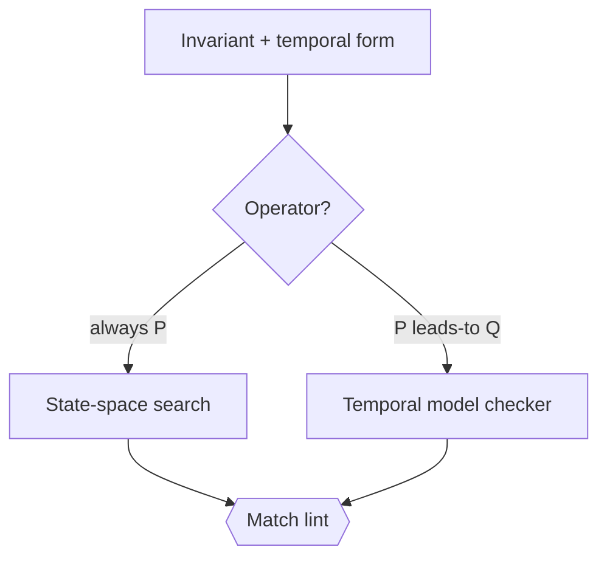
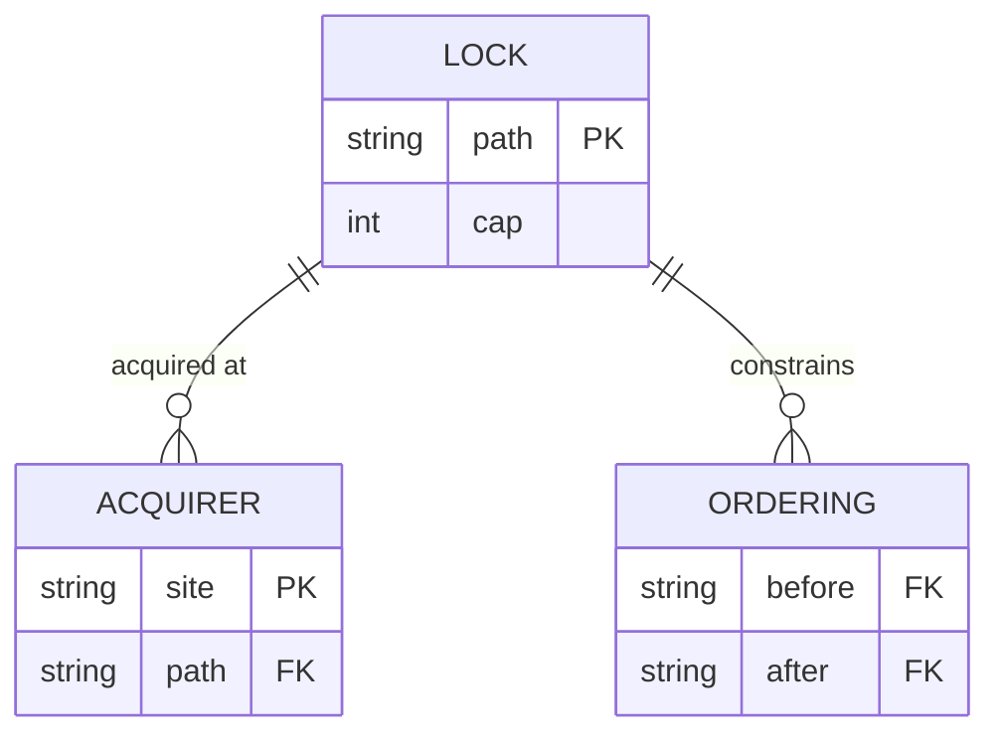
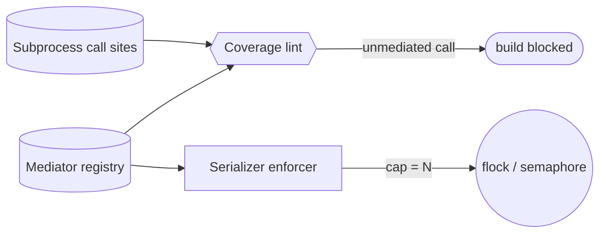
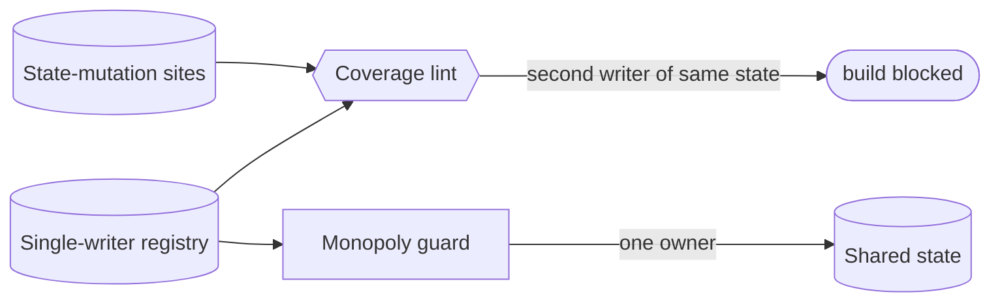

<!-- part-title: The Model Zoo -->
<!-- chapter-title: The Process View -->

# The Process View: what runs at once

<!-- index-def: process-view -->
The Logical view named the parts. The Process view asks the question the logical view cannot:
what happens when many parts run at the same time? Concurrency turns a correct-in-isolation
design into a source of races, deadlocks, and torn writes. The Process view is the lens for
that — the states a system moves through, the locks it takes, and the invariants that must
survive every interleaving.

This is the chapter where invariants stop being predicates over one state and become
predicates over an *order of events*. So it carries the concept insets a reader needs to read
its model pages: what an automaton is, safety versus liveness, bounded model checking, and the
temporal-logic step-up from a state assertion to a sequence assertion. Two general types live
here — the **state machine** and the **automaton / formal invariant** — and four real models
embody the view: formal invariant verification as the verification backbone, the
synchronization model, and the mediator and single-writer registries.

<!-- index-def: state-machine -->
> ### Inset I4 — What is an automaton / state machine? {#inset-automaton}
>
> An **automaton**, or **state machine**, is a finite set of states and the labeled
> transitions between them. It models computation as "which state am I in, and which moves are
> legal from here." A microwave is *idle*, *cooking*, or *door-open*; pressing start moves idle
> to cooking, opening the door moves cooking to door-open. The value of drawing it: the illegal
> states and the missing transitions become visible. If a path leads back to *cooking* while
> the door is open, the diagram shows you the way to cook yourself. A state machine is the
> logical spine the Process view's invariants attach to — the invariant is a predicate over the
> states, and the checker walks the transitions.

<!-- index-def: temporal-logic -->
> ### Inset I2 — Assertions over STATE vs over SEQUENCES {#inset-ltl}
>
> Some properties are about a **single state**: "a job is never both leased and free." You
> check one by visiting every reachable state and evaluating the predicate there (Inset I1).
> Other properties are about **order over time**: "a preempted job eventually re-runs." No
> single state can be inspected to settle that — it is a claim about the *sequence* of states,
> that a good state is always eventually reached. Claims about order need **temporal logic**
> (LTL, linear temporal logic), which adds operators over sequences: *always* (`[]`), *eventually*
> (`<>`), and *leads-to* (`~>`). The step-up matters because the two kinds route to different
> checkers, which is the next inset.

<!-- index-def: safety-property -->
<!-- index-def: liveness-property -->
> ### Inset I6 — Safety vs liveness {#inset-safety-liveness}
>
> Two shapes cover most invariants. **Safety** says *a bad thing never happens* — written
> `[]P`, "always P." "Never both leased and free" is safety. **Liveness** says *a good thing
> eventually happens* — written `P ~> Q`, "P leads to Q." "A preempted job eventually re-runs"
> is liveness. The shape is not decoration: it **derives the checker**. A safety property is
> settled by a state-space search that looks for any reachable bad state; a liveness property
> needs a temporal model checker that reasons about infinite or cyclic behaviors. Declare the
> shape wrong — route a liveness property to a safety runtime — and the checker structurally
> cannot see the violation, and reports green. So the shape is checked too: a lint asserts the
> declared temporal form matches the routed checker.

<!-- index-def: bounded-model-checking -->
> ### Inset I3 — What is bounded model checking? {#inset-bmc}
>
> A test *samples* the input space — it runs the cases you thought of and sails past the one
> adversarial schedule you did not. **Model checking** instead *exhaustively explores* the
> state space: it visits every reachable state, or every interleaving of a concurrent system,
> and either proves the invariant across all of them or hands you a concrete **counterexample
> trace** — the exact sequence of steps that reaches the bad state. **Bounded** model checking
> does this out to a fixed depth: it explores every state reachable in *k* steps. Within that
> bound the proof is total; a bug that needs *k+1* steps is out of scope, the honest limit you
> trade for a decidable check. Why it matters for a fleet of concurrent agents: a distributed
> race has failure traces no hand-picked example hits, and only an exhaustive walk of the
> interleavings finds them. A green sampled test over that race means nothing; a clean bounded
> model check means no bad state is reachable within the bound.

The general type behind these insets — an **automaton with a formal invariant** — is not a
separate model page. It is introduced here as trunk machinery and embodied by the first real
model below: formal invariant verification, which takes an invariant's temporal shape and uses
it to route the exhaustive checker that proves it.

## Formal invariant verification {#formal-invariant-verification}

<!-- index-def: formal-invariant-verification -->
*Give every invariant a temporal form — safety (`[]P`) or liveness (`P ~> Q`) — and make that
form the routing input that derives which exhaustive checker verifies it, so an invariant is
proven by the method its shape demands rather than sampled by a test.*

**(a) Quality property it helps assess.** Two, both invisible to a sampled test suite.

- **Invariant soundness under interleaving**: *does this property hold on every reachable
  state, or every interleaving, not just the ones a test happened to try?* The exhaustive check
  proves it or returns the counterexample trace.
- **Checker-routing correctness**: *is a liveness property being checked by a runtime that can
  actually see a liveness violation?* A mis-declared shape routed to the wrong checker reports a
  false green; the form-match lint makes that impossible.

**(b) Constructs and relations.** A small typed layer over the state model.

- **`Invariant`**: one predicate, carrying its temporal operator (`[]` for safety, `~>` for
  liveness) and the state model it ranges over.
- **The routing function** — a total map from the temporal operator to the checker: `[]` routes
  to a state-space search, `~>` routes to a temporal model checker.
- **The form-match relation**: the declared operator must match the checker that ran, or a lint
  fails. The form is consumed, not decorative.

**(c) Visual depiction.** The natural diagram is a decision flow — the operator routes to its
checker, and a lint checks the routing. Reused from the model's appendix Structure slot:



*Accessible description: an invariant with its temporal form routes on its operator — an "always
P" safety form goes to a state-space search, a "P leads-to Q" liveness form goes to a temporal
model checker. A match lint then asserts the declared form matches the checker that ran, so a
liveness property cannot be silently verified by a safety runtime.*

**(d) Invariants, and how they are checked.** This model *is* the checker machinery; its own
invariants are about routing:

| Invariant | Temporal shape | How it is checked |
|---|---|---|
| A safety invariant is verified by an exhaustive state-space search | `[]P` (safety) | The search visits every reachable state; a bad state is a counterexample trace, not a sampled miss. |
| A liveness invariant is verified by a temporal model checker | `P ~> Q` (liveness) | The model checker reasons over cyclic behaviors; a never-reached `Q` is a counterexample. |
| Every invariant's declared form matches its routed checker | `[]P` (safety) | Form-match lint: a `~>` invariant routed to a safety runtime is a finding. |

**(e) Traceability and derivation direction.** *Model-from-code.* The invariants are declared
over the real cross-service state model, and the checker walks that model's transitions. The
join key from an invariant to the code is the state model it ranges over — a reader round-trips
from a counterexample trace to the transition in the state machine that produced it.

*Also seen in:* every other view whose model carries an invariant table — this is the trunk
mechanism the field (d) tables reconnect to. Rendered in full here.

## The synchronization model {#synchronization-model}

<!-- index-def: synchronization-model -->
*A typed registry that models the system's synchronization behavior — every OS-level lock,
which shared resource it guards, and the required acquisition ordering — so concurrency
contracts are declared and checkable, not tribal.*

**(a) Quality property it helps assess.** Two, both catastrophic at runtime and invisible in
the code.

- **Lock coverage**: *is every OS lock in the codebase declared, and is what it guards known?*
  An undeclared lock is one nobody can reason about; the coverage lint makes it a build failure.
- **Deadlock-freedom**: *can two locks be acquired in an order that deadlocks?* The declared
  ordering graph lets a lint answer "which locks, in what order" before the code runs, so an
  inverted acquisition fails at author time instead of hanging in production.

**(b) Constructs and relations.** Three record kinds compose the registry.

- **`SyncLock`** — one OS primitive: its lock-file path, its cap (1 for a mutex, M for a
  semaphore), the resource it guards, its bypass-env, its audit-log.
- **`LockAcquirer`** — one declared acquisition site: where in the code a lock is taken, or a
  declared "takes none" with a rationale.
- **`LockOrdering`**: a before/after constraint between two locks, with a rationale. The set of
  these is the ordering graph the deadlock lint walks.

One `SyncLock` is acquired at many `LockAcquirer` sites and constrained by many `LockOrdering`
edges.

**(c) Visual depiction.** The natural diagram is an ER schema — three related record kinds with
crow's-foot cardinality. Reused from the model's appendix Structure slot:



*Accessible description: a lock record relates to many acquisition sites and many ordering
constraints. A coverage lint checks that every real lock call site is a declared acquirer; an
ordering lint checks that acquisitions respect the before/after constraints, so a
deadlock-inducing order is a build failure.*

**(d) Invariants, and how they are checked.** A coverage lint and an ordering lint, the second
doing genuine graph reasoning:

| Invariant | Temporal shape | How it is checked |
|---|---|---|
| Every real lock call site is a declared acquirer | `[]P` (safety) | Coverage lint scans the lock call sites; each must be declared or carry a "not a sync lock" rationale. |
| No acquisition inverts a declared ordering | `[]P` (safety) | Ordering lint walks each code path's acquisition sequence against the ordering graph; an out-of-order acquire is a finding. |
| Every exempt site carries a rationale | `[]P` (safety) | The closed set of exempt rationales — an unexplained exemption fails the coverage lint. |

The ordering lint walks a lock-acquisition sequence against the declared graph and fails on an
inversion, so a deadlock-inducing order is caught at author time:

```python
import sys

# Declared ordering: a lock in `before` must be acquired before its `after` lock.
ORDERINGS = [("db-lock", "cache-lock")]      # db before cache, always

def ordering_lint(acquire_sequence: list[str]) -> list[str]:
    """A held-lock acquiring one that must precede it is an inversion (deadlock risk)."""
    findings, held = [], []
    for lock in acquire_sequence:
        for before, after in ORDERINGS:
            if lock == before and after in held:
                findings.append(f"acquired '{before}' while holding '{after}' — order inverted")
        held.append(lock)
    return findings

if __name__ == "__main__":
    findings = ordering_lint(walk_acquisitions())   # a code path's acquisition order
    for f in findings:
        print(f"LOCK-ORDER: {f}")
    sys.exit(1 if findings else 0)
```

**(e) Traceability and derivation direction.** *Model-from-code.* The coverage lint scans the
real lock call sites and requires each to be a declared acquirer, so the code is the ground
truth and the model is the checked view. The join key is the lock `path` (which lock a site
takes) and the acquirer `site` (where the acquisition happens).

*Also seen in:* Physical (a lock is held per-host, so placement matters). Rendered in full here;
its higher-level siblings, the mediator and single-writer registries, sit beside it below.

## The mediator registry {#mediator-registry}

<!-- index-def: mediator-registry -->
*The subprocess-serializer half of the concurrency contracts: which heavy or shared-resource
subprocess invocations must run through a serializer, at what concurrency cap, so an unmediated
raw call is a build failure rather than a host-trampling race.*

**(a) Quality property it helps assess.** One property the enforcers cannot hold on their own.

- **Mediation coverage**: *does every subprocess of a mediated class actually route through
  its serializer?* The enforcer can only guard a call that reaches it; a newly-added raw call
  that skips the serializer is invisible to the enforcer but visible to the coverage lint.

**(b) Constructs and relations.** One record kind, the mediated-subprocess contract.

- **`Mediator`** — one serializer: the subprocess class it serializes (the test runner, the
  build tool, the whole-repo lint mutex), its concurrency cap (1 for a mutex, M for a
  semaphore), and its bypass-env for the sanctioned escape hatch.
- **The coverage relation**: every real call site of a mediated subprocess must resolve to a
  `Mediator` contract, or the coverage lint fails.

**(c) Visual depiction.** The natural diagram is a component/registry flow — the registry and
the call sites both feed a coverage lint that blocks the build on an uncovered call. Authored
for this split from the combined concurrency-contracts entry:



*Accessible description: the mediator registry and the real subprocess call sites both feed a
coverage lint, which blocks the build when a mediated-class call is not routed through its
serializer. The registry also drives the serializer enforcer, which holds a flock or semaphore
at the declared cap so at most N of that subprocess run at once.*

**(d) Invariants, and how they are checked.** A coverage lint over the mediated-subprocess
class:

| Invariant | Temporal shape | How it is checked |
|---|---|---|
| Every mediated-class subprocess call routes through its serializer | `[]P` (safety) | Coverage lint: a raw call to a mediated subprocess that skips the serializer is a finding. |
| At most `cap` instances of a mediated subprocess run at once | `[]P` (safety) | The serializer enforcer holds a flock or semaphore at the declared cap. |
| Every bypass carries the declared bypass-env | `[]P` (safety) | A bypass without the registered env value is a finding. |

**(e) Traceability and derivation direction.** *Model-from-code.* The coverage lint reconciles
the registry against the real subprocess call sites. The join key is the subprocess class name,
which indexes both the `Mediator` contract and the call sites the coverage lint scans.

*Also seen in:* Development (a mediator is a dev-substrate contract). Rendered in full here;
sits beside the synchronization model and the single-writer registry in this chapter.

## The single-writer registry {#single-writer-registry}

<!-- index-def: single-writer-registry -->
*The state-mutation half of the concurrency contracts: which state-mutating functions must have
exactly one writer, so a second concurrent writer to the same state is a declared violation
rather than a silent corruption.*

**(a) Quality property it helps assess.** One property the mediator registry cannot cover,
because its failure mode is different.

- **Single-writer coverage**: *does every function that mutates a piece of shared state have a
  declared monopoly, and only one?* A mediator caps *how many* may run; a single-writer contract
  says *exactly one* may write. The failure a second concurrent writer causes — a torn or
  interleaved write — is distinct from the resource-contention failure the mediator prevents,
  which is why it is a separate model.

**(b) Constructs and relations.** One record kind, the monopoly contract.

- **`SingleWriter`** — one state-mutation contract: the function that owns the write, the state
  it is the sole writer of, and the guard that enforces the monopoly (a lock, an ownership token,
  a single-process invariant).
- **The monopoly relation**: a piece of shared state maps to exactly one `SingleWriter`; a
  second declared or discovered writer of the same state is a violation.

**(c) Visual depiction.** The natural diagram is a registry flow whose failure edge is the
*second writer*, not the uncovered call. Authored for this split from the combined
concurrency-contracts entry:



*Accessible description: the single-writer registry and the real state-mutation sites feed a
coverage lint, which blocks the build when a second function is found writing state another
function already owns. The registry drives a monopoly guard that admits exactly one owner to the
shared state — the distinct failure here is a concurrent second writer, not resource contention.*

**(d) Invariants, and how they are checked.** A coverage lint whose finding is a duplicate
writer:

| Invariant | Temporal shape | How it is checked |
|---|---|---|
| Every mutated shared state has exactly one declared writer | `[]P` (safety) | Coverage lint: a state with two writers, or a mutator with no declared monopoly, is a finding. |
| The monopoly guard admits one owner at a time | `[]P` (safety) | The declared guard (lock / token / single-process) holds the monopoly at runtime. |

**(e) Traceability and derivation direction.** *Model-from-code.* The coverage lint reconciles
the registry against the real state-mutation sites. The join key is the state identifier the
contract owns, which indexes both the `SingleWriter` contract and the mutation sites the lint
scans.

*Also seen in:* Logical (a single-writer contract is a statement about a domain object's
ownership). Rendered in full here.

---

The Process view holds the system consistent under interleaving. The next chapter steps back
from the runtime to the source: not what runs at once, but how the code is packaged, layered,
and owned — the Development view.
