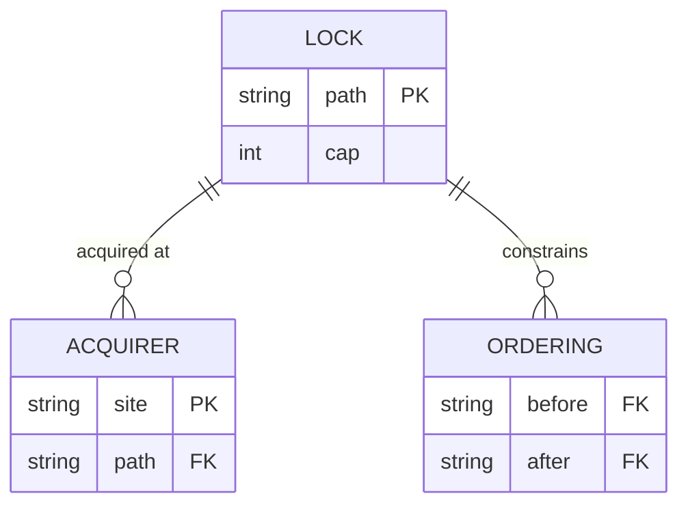

<!-- part-title: The Model Zoo -->
<!-- chapter-title: The Process View -->

# The Process View: what runs at once

<!-- noqa: book-section-cap | The Process View — the chapter front-loads five concept-primer insets (automaton, state-vs-sequence assertions, safety-vs-liveness, bounded model checking) that the reader needs before any Process-view model; the insets are self-contained boxed primers, not a wall of prose to break -->

<!-- index-def: process-view -->
The Logical view named the parts. The Process view asks the question the logical view cannot:
what happens when many parts run at the same time? Concurrency turns a correct-in-isolation
design into a source of races, deadlocks, and torn writes. The Process view is the lens for
that — the states a system moves through, the locks it takes, and the invariants that must
survive every interleaving.

This is the chapter where invariants stop being predicates over one state and become
predicates over an *order of events*. That step-up pulls in a cluster of ideas: what an automaton is, safety versus liveness, bounded
model checking, and the temporal-logic step from a state assertion to a sequence assertion. Two general types live
here — the **state machine** and the **automaton / formal invariant** — and four real models
embody the view: formal invariant verification as the verification backbone, the
synchronization model, and the mediator and single-writer registries.

<!-- index-def: state-machine -->
> ### Inset I4 — What is an automaton / state machine? {#inset-automaton}
>
> An **automaton**, or **state machine**, is a finite set of states and the labeled
> transitions between them. It models computation as "which state am I in, and which moves are
> legal from here." A microwave is *idle*, *cooking*, or *door-open*; pressing start moves idle
> to cooking, opening the door moves cooking to door-open. The value of drawing it: the illegal
> states and the missing transitions become visible. If a path leads back to *cooking* while
> the door is open, the diagram shows you the way to cook yourself. A state machine is the
> logical spine the Process view's invariants attach to — the invariant is a predicate over the
> states, and the checker walks the transitions.

<!-- index-def: temporal-logic -->
> ### Inset I2 — Assertions over STATE vs over SEQUENCES {#inset-ltl}
>
> Some properties are about a **single state**: "a job is never both leased and free." You
> check one by visiting every reachable state and evaluating the predicate there (Inset I1).
> Other properties are about **order over time**: "a preempted job eventually re-runs." No
> single state can be inspected to settle that — it is a claim about the *sequence* of states,
> that a good state is always eventually reached. Claims about order need **temporal logic**
> (LTL, linear temporal logic), which adds operators over sequences: *always* (*□*), *eventually*
> (*◇*), and *leads-to* (*⤳*). The step-up matters because the two kinds route to different
> checkers, which is the next inset.
>
> The four operators the rest of this chapter leans on all describe the shape of a *run* — a
> path the system walks, one state after another. They are claims about that path, not math:
>
> - **Always (□P)** — P holds at every step of every run: nothing bad ever slips through.
> - **Eventually (◇P)** — some step of the run satisfies P: the good thing arrives, sooner or later.
> - **Leads-to (P ⤳ Q)** — every step where P holds is followed by a later step where Q holds: once P, then Q eventually.
> - **Until (P U Q)** — P holds at every step until a step where Q becomes true, and Q does become true.

<!-- index-def: safety-property -->
<!-- index-def: liveness-property -->
> ### Inset I6 — Safety vs liveness {#inset-safety-liveness}
>
> Two shapes cover most invariants. **Safety** says *a bad thing never happens* — written
> *□P*, "always P." "Never both leased and free" is safety. **Liveness** says *a good thing
> eventually happens* — written *P ⤳ Q*, "P leads to Q." "A preempted job eventually re-runs"
> is liveness. The shape is not decoration: it **derives the checker**. A safety property is
> settled by a state-space search that looks for any reachable bad state; a liveness property
> needs a temporal model checker that reasons about infinite or cyclic behaviors. Declare the
> shape wrong — route a liveness property to a safety runtime — and the checker structurally
> cannot see the violation, and reports green. So the shape is checked too: a lint asserts the
> declared temporal form matches the routed checker.

<!-- index-def: bounded-model-checking -->
> ### Inset I3 — What is bounded model checking? {#inset-bmc}
>
> A test *samples* the input space — it runs the cases you thought of and sails past the one
> adversarial schedule you did not. **Model checking** instead *exhaustively explores* the
> state space: it visits every reachable state, or every interleaving of a concurrent system,
> and either proves the invariant across all of them or hands you a concrete **counterexample
> trace** — the exact sequence of steps that reaches the bad state. **Bounded** model checking
> does this out to a fixed depth: it explores every state reachable in *k* steps. Within that
> bound the proof is total; a bug that needs *k+1* steps is out of scope, the honest limit you
> trade for a decidable check. Why it matters for a fleet of concurrent agents: a distributed
> race has failure traces no hand-picked example hits, and only an exhaustive walk of the
> interleavings finds them. A green sampled test over that race means nothing; a clean bounded
> model check means no bad state is reachable within the bound.

The general type behind these insets — an **automaton with a formal invariant** — is not a
separate model page. It is introduced here as trunk machinery and embodied by the first real
model below: formal invariant verification, which takes an invariant's temporal shape and uses
it to route the exhaustive checker that proves it.

## Formal invariant verification {#formal-invariant-verification}

<!-- index-def: formal-invariant-verification -->
Formal invariant verification is the backbone the other three models hang their invariant
tables on. It assesses **invariant soundness under interleaving** — whether a property holds on
every reachable state, not just the schedules a test happened to try — and answers it by an
exhaustive check that either proves the property or returns a counterexample trace. The idea
worth carrying is that the invariant's *temporal form is a routing input, not a label*. A
safety form (*□P*) routes to a state-space search; a liveness form (*P ⤳ Q*) routes to a
temporal model checker. Get the form wrong — declare a liveness property as safety — and the
safety runtime structurally cannot see the violation and reports green. So a lint checks the
form against the checker that ran: the shape is consumed, and a mis-routed invariant is a build
failure rather than a false all-clear. Its full construct-and-invariant treatment is in the
appendix; the temporal operators it routes on are in the insets above.

## The synchronization model {#synchronization-model}

<!-- noqa: book-section-cap | The synchronization model — a model page rendered from the fixed five-field (a)-(e) template plus its ordering-lint code sample; the fields are one indivisible reference unit a reader scans by reflex across every model -->

<!-- index-def: synchronization-model -->
*A typed registry that models the system's synchronization behavior — every OS-level lock,
which shared resource it guards, and the required acquisition ordering — so concurrency
contracts are declared and checkable, not tribal.*

**(a) Quality property it helps assess.** Two, both catastrophic at runtime and invisible in
the code.

- **Lock coverage**: *is every OS lock in the codebase declared, and is what it guards known?*
  An undeclared lock is one nobody can reason about; the coverage lint makes it a build failure.
- **Deadlock-freedom**: *can two locks be acquired in an order that deadlocks?* The declared
  ordering graph lets a lint answer "which locks, in what order" before the code runs, so an
  inverted acquisition fails at author time instead of hanging in production.

**(b) Constructs and relations.** Three record kinds compose the registry.

- **`SyncLock`** — one OS primitive: its lock-file path, its cap (1 for a mutex, M for a
  semaphore), the resource it guards, its bypass-env, its audit-log.
- **`LockAcquirer`** — one declared acquisition site: where in the code a lock is taken, or a
  declared "takes none" with a rationale.
- **`LockOrdering`**: a before/after constraint between two locks, with a rationale. The set of
  these is the ordering graph the deadlock lint walks.

One `SyncLock` is acquired at many `LockAcquirer` sites and constrained by many `LockOrdering`
edges.

**(c) Visual depiction.** The natural diagram is an ER schema — three related record kinds with
crow's-foot cardinality. Reused from the model's appendix Structure slot:



*Accessible description: a lock record relates to many acquisition sites and many ordering
constraints. A coverage lint checks that every real lock call site is a declared acquirer; an
ordering lint checks that acquisitions respect the before/after constraints, so a
deadlock-inducing order is a build failure.*

**(d) Invariants, and how they are checked.** A coverage lint and an ordering lint, the second
doing genuine graph reasoning:

| Invariant | Temporal shape | How it is checked |
|---|---|---|
| Every real lock call site is a declared acquirer | *□P* (safety) | Coverage lint scans the lock call sites; each must be declared or carry a "not a sync lock" rationale. |
| No acquisition inverts a declared ordering | *□P* (safety) | Ordering lint walks each code path's acquisition sequence against the ordering graph; an out-of-order acquire is a finding. |
| Every exempt site carries a rationale | *□P* (safety) | The closed set of exempt rationales — an unexplained exemption fails the coverage lint. |

The ordering lint walks a lock-acquisition sequence against the declared graph and fails on an
inversion, so a deadlock-inducing order is caught at author time:

```python
import sys

# Declared ordering: a lock in `before` must be acquired before its `after` lock.
ORDERINGS = [("db-lock", "cache-lock")]      # db before cache, always

def ordering_lint(acquire_sequence: list[str]) -> list[str]:
    """A held-lock acquiring one that must precede it is an inversion (deadlock risk)."""
    findings, held = [], []
    for lock in acquire_sequence:
        for before, after in ORDERINGS:
            if lock == before and after in held:
                findings.append(f"acquired '{before}' while holding '{after}' — order inverted")
        held.append(lock)
    return findings

if __name__ == "__main__":
    findings = ordering_lint(walk_acquisitions())   # a code path's acquisition order
    for f in findings:
        print(f"LOCK-ORDER: {f}")
    sys.exit(1 if findings else 0)
```

**(e) Traceability and derivation direction.** *Model-from-code.* The coverage lint scans the
real lock call sites and requires each to be a declared acquirer, so the code is the ground
truth and the model is the checked view. The join key is the lock `path` (which lock a site
takes) and the acquirer `site` (where the acquisition happens).

*Also seen in:* Physical (a lock is held per-host, so placement matters). Rendered in full here;
its higher-level siblings, the mediator and single-writer registries, sit beside it below.

## Two ways to make a concurrent write safe: the mediator and the single-writer registries

The synchronization model catalogs the raw locks. Two higher-level registries sit above it, and
together they draw a distinction worth keeping sharp: **there are two ways to make a concurrent
write safe, and they fail differently.** You can *cap how many* run at once, or you can insist
that *exactly one* may write. A mediator does the first; a single-writer contract does the
second. Confusing them is how a torn write hides behind a semaphore that was only ever rationing
load.

### The mediator registry {#mediator-registry}

<!-- index-def: mediator-registry -->
The mediator registry is the *how-many* half. It declares which heavy or shared-resource
subprocess invocations must run through a serializer — the test runner, the build tool, the
whole-repo lint mutex — and at what concurrency cap (1 for a mutex, M for a semaphore). Its
quality property is **mediation coverage**: the serializer enforcer can only guard a call that
reaches it, so a newly-added raw call that skips the serializer is invisible to the enforcer.
The coverage lint closes exactly that blind spot — an unmediated call to a mediated class is a
build failure, not a host-trampling race discovered in production. The failure it prevents is
*resource contention*: too many heavy processes on one box. Its full construct-and-invariant
treatment is in the appendix.

### The single-writer registry {#single-writer-registry}

<!-- index-def: single-writer-registry -->
The single-writer registry is the *exactly-one* half, and its failure mode is what makes it a
separate model. A mediator caps how many may run; a single-writer contract says one function,
and only one, may write a given piece of shared state. The failure that guards against is a
*torn or interleaved write* — two writers corrupting the same state — which a concurrency cap
of two would happily permit, because two mediated processes racing on the same record is still
within cap. Its quality property is **single-writer coverage**: every mutator of shared state
has a declared monopoly, and a second discovered writer of that state is a finding. That is the
distinction to hold onto — the mediator bounds contention, the single-writer registry bounds
*ownership*, and only naming both keeps a corruption bug from hiding inside a load limit. Its
full construct-and-invariant treatment is in the appendix.

---

The Process view holds the system consistent under interleaving. The next chapter steps back
from the runtime to the source: not what runs at once, but how the code is packaged, layered,
and owned — the Development view.
