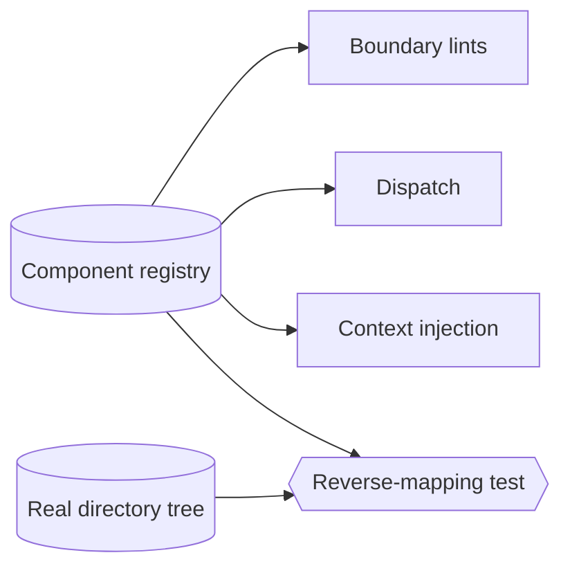
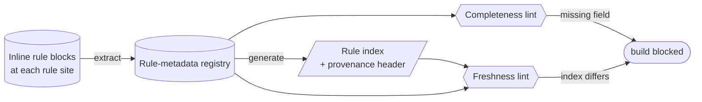

<!-- part-title: The Model Zoo -->
<!-- chapter-title: The Development View -->

# The Development View: how the source is organized

<!-- index-def: development-view -->
The Process view held the running system consistent. The Development view steps off the
runtime entirely and looks at the source: how the code is packaged into modules, which layer
may depend on which, and who owns each piece. It is the view the people and agents who *build*
the system reason through — the map an agent needs to answer "where am I in this codebase, and
what may this file touch?" before it changes a line.

One general type anchors the view. A **bill of materials** captures a project's dependencies,
direct and transitive — the software supply chain a build rests on. Two real models embody the
view on live code: the component and zone model, which is the ownership and boundary map, and
the rule-metadata registry, the slice of the domain registries that models the governance
substrate's own rules — the model the book itself is partly governed by.

<!-- index-def: bill-of-materials -->
A **bill of materials** — the view's general type — is the dependency graph of a build: every
third-party package it pulls in, direct and transitive, the SBOM lens on the code. It is a
development-view concern because a dependency is a packaging fact, not a runtime one: it decides
what the build fetches and what a fresh checkout must resolve. The discipline it enforces is
completeness. Every package the code or the quality gates use must appear in the matching
manifest, or a fresh checkout's build breaks on a resolve the developer never saw fail. An
out-of-band install that never lands in the manifest is invisible to the bill of materials, and
invisible is where a supply-chain surprise lives.

## The component & zone model {#component-zone-model}

<!-- noqa: book-section-cap | The component &amp; zone model — a model page rendered from the fixed five-field (a)-(e) template; the fields are one indivisible reference unit a reader scans by reflex across every model, so splitting one page breaks the uniform shape -->

<!-- index-def: component-zone-model -->
*A typed catalog of every component's code zone — its focus directories, its tags, its boundary
kind, its external seams, its read surfaces — so "which component owns this file, and what may
touch it" is a queried fact rather than a per-tool guess.*

**(a) Quality property it helps assess.** Two, both drifting silently the moment a directory
moves.

- **Ownership correctness**: *which component owns this file, and does that answer match the
  real directory tree?* A reverse-mapping test reconciles the declared zones against the tree in
  both directions, so a moved directory fails the test instead of quietly staling every tool's
  private inference.
- **Boundary soundness**: *may this component's zone reach that seam?* The declared boundary
  kind and sanctioned seams make an out-of-bounds reach a lint finding, not a slow erosion.

**(b) Constructs and relations.** A typed registry keyed by component.

- **`Component`** — one unit of ownership: its focus directories, its tags, its boundary kind
  (internal, a trust edge, an external seam), and its declared read surfaces.
- **The zone relation**: each `Component` claims a set of directories; the union must partition
  the real tree, and the reverse-mapping test asserts the match both ways.
- **The seam relation**: each boundary component declares the external seams it may cross, so a
  reach outside the declared set is a finding.

**(c) Visual depiction.** The natural diagram is a component flow — the registry feeding the
tools that read it, with a reverse-mapping test joining registry to real tree. Reused from the
model's appendix Structure slot:

*Accessible description: the component registry feeds the boundary lints, the agent dispatch,
and the dynamic context injection, so every tool reads the same ownership answer. A
reverse-mapping test joins the registry to the real directory tree and fails the build if the
declared zones and the tree disagree in either direction.*

**(d) Invariants, and how they are checked.** A reverse-mapping test and boundary lints:

| Invariant | Temporal shape | How it is checked |
|---|---|---|
| Every declared zone matches a real directory | *□P* (safety) | Reverse-mapping test, model ⊆ reality — a declared zone with no directory is a finding. |
| Every source directory is owned by exactly one component | *□P* (safety) | Reverse-mapping test, reality ⊆ model — an unowned or double-owned directory is a finding. |
| No component reaches a seam its boundary kind forbids | *□P* (safety) | Boundary lint over the declared seam set. |

**(e) Traceability and derivation direction.** *Model-from-code.* The reverse-mapping test
re-reads the real directory tree and reconciles the declared zones against it, so the tree is
the ground truth. The join key is the focus directory: a reader round-trips from a `Component`
record to the files it owns by that path prefix, and dispatch, lints, and context injection all
resolve ownership through the same key.

*Also seen in:* Logical (a component is a functional-structure unit). Rendered in full here.

## The rule-metadata registry {#rule-metadata-registry}

<!-- noqa: book-section-cap | The rule-metadata registry — a model page rendered from the fixed five-field (a)-(e) template; the fields are one indivisible reference unit a reader scans by reflex across every model, so splitting one page breaks the uniform shape -->

<!-- index-def: rule-metadata-registry -->
*The self-referential slice of the domain registries: the governance rules' own metadata,
extracted from inline blocks in the codebase and generated into the rule index — the model the
governance substrate, and this book, are partly governed by.*

**(a) Quality property it helps assess.** Two properties about the governance rules themselves.

- **Rule-index consistency**: *does the published rule index match the rule metadata declared
  in the code?* The index is generated from the metadata, so a rule added in the code but missing
  from the index, or an index entry with no backing rule, is a drift finding.
- **Metadata completeness**: *does every governance rule carry the metadata its class requires?*
  A rule that omits a required field — its enforcement scope, its bypass, its owning component —
  fails the completeness lint before it can ship half-specified.

**(b) Constructs and relations.** A registry keyed by rule, extracted from the source.

- **`Rule`** — one governance rule: its stable identifier, its enforcement scope, its severity,
  its owning component, and its bypass path if any.
- **The extraction relation**: each `Rule` is induced from an inline metadata block at the rule's
  own site in the code, so the metadata lives next to the thing it governs.
- **The generation relation**: the rule index is generated from the set of `Rule` records, each
  index entry carrying a provenance header so a hand-edit is caught.

**(c) Visual depiction.** The natural diagram is a data-flow — inline blocks extracted to the
registry, the registry generated to the index, with drift gates on both hops. Authored for this
self-referential slice, distinct from the generic domain-registries ER diagram:

*Accessible description: inline metadata blocks at each rule's own site in the code are extracted
into the rule-metadata registry, which is then generated into the published rule index with a
provenance header. A completeness lint fails the build if a rule omits a required field, and a
freshness lint fails it if the committed index differs from a regeneration — so the index cannot
drift from the rules and no rule can ship half-specified.*

**(d) Invariants, and how they are checked.** A completeness lint and a freshness lint:

| Invariant | Temporal shape | How it is checked |
|---|---|---|
| Every rule in the index has a backing metadata block | *□P* (safety) | Freshness lint, index ⊆ registry — an index entry with no rule is a finding. |
| Every rule's metadata block appears in the index | *□P* (safety) | Freshness lint, registry ⊆ index — regenerate and diff. |
| Every rule carries the metadata its class requires | *□P* (safety) | Completeness lint over the required-field set for the rule's class. |

**(e) Traceability and derivation direction.** *Bidirectional.* The registry is model-from-code
— extracted from inline blocks at each rule's site — and the index is model-to-code, generated
from the registry with a provenance header. The join key is the rule identifier, which indexes
the inline block, the registry record, and the index entry, so a reader round-trips from a
published rule straight to the code site that declares it.

*Also seen in:* Logical (it is one slice of the domain registries). Rendered in full here as the
governance substrate's own model.

---

The Development view maps how the source is organized for the people who build it. The next
chapter maps where the built parts actually run — across which hosts and network boundaries,
under what per-host cost and load policy. That is the Physical view.
