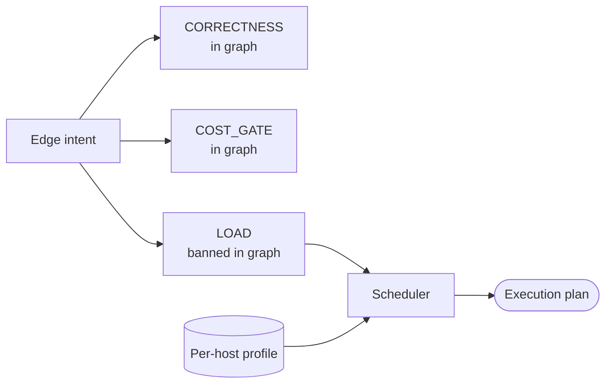

<!-- part-title: The Model Zoo -->
<!-- chapter-title: The Physical View -->

# The Physical View: where the parts live

<!-- index-def: physical-view -->
The Development view mapped how the source is organized. The Physical view — Kruchten's
deployment view — maps where the built software actually runs: which process lands on which
host, across which network boundaries, under what per-host cost and load policy. It is the
placement lens. A model that is functionally correct can still be mis-deployed, and only a view
that names *where things run* catches it.

<!-- index-def: performance-cost-model -->
One general type anchors the view, and it is the honest exception in this zoo. A
**performance and cost model** models the computation itself — what it costs to run, what it
costs to move data, whether to compute locally or remotely, whether to cache or recompute. The
next section takes that gap head-on: the framework supports the cost view, and one real model
*embodies* the load-and-cost half of it, but the pure-latency slice has no dedicated instance,
because no failure has yet justified building one. Three real models carry the view: the
invariant-DAG execution policy (the flagship — per-host cost and load rationing, and the one
idea this chapter turns on), the deployment and tier topology model (placement parity), and the
control-to-substrate dependency model (a computed migration blast radius).

## The performance/cost view: mostly embodied, one honest gap

The zoo names a performance and cost model as a general type, and the framework supports it.
But the catalogue holds only a partial instance, and the book states that flat rather than
inventing a model to fill the slot.

The load-and-cost half of the view *is* embodied — by the invariant-DAG execution policy below.
Its Scheduler reads a per-host profile of a concurrency ceiling and a budget, and rations both:
it fans work out on an elastic host and serializes it on a scarce one, and it honors a cost gate
everywhere but a scarce-resource gate only where a box demands it. That is a real cost model in
action — cost-to-run and resource-contention, driven from a declared per-host profile.

<!-- index-def: model-only-where-a-failure-lives -->
What has no dedicated instance is the *pure-latency* slice: a model of request latency, cache-hit
ratios, and compute-local-versus-remote data-movement cost, the kind a performance engineer draws
to decide where a computation should run for speed. The framework would carry it the same way it
carries the others — a typed profile, invariants over it, a drift gate — but no failure has yet
justified building it. The zoo names the gap rather than padding it, on the same discipline the
whole harness leads with: **model only where a failure lives.** A model built ahead of a failure
is a diagram that will rot before it is ever checked.

## The deployment & tier topology model {#deployment-topology-model}

<!-- index-def: deployment-topology-model -->
The deployment and tier topology model is the typed statement of where things run: each
service's name, its layer, and its tier, from which the deploy scripts and layering lints reason
about a declared topology rather than scattered constants. It assesses **deployment parity** —
whether every service the model declares deploys at the tier the model says, and every deployed
service appears in the model. The mechanism is a bidirectional set-diff against the live deploy
table: model ⊆ reality catches a declared service missing or mis-tiered, reality ⊆ model catches
a deployed service the model never declared. A tier that drifts in the code without a matching
model edit fails the build instead of surfacing as a production surprise. The same model carries
the layer-boundary graph a cross-layer-import lint holds, and it is the ground truth the
migration blast-radius query joins against. Its full construct-and-invariant treatment, with the
parity-check code, is in the appendix.

## The invariant-DAG execution policy {#invariant-dag-execution-policy}

<!-- noqa: book-section-cap | The invariant-DAG execution policy — a model page rendered from the fixed five-field (a)-(e) template; the fields are one indivisible reference unit a reader scans by reflex across every model, so splitting one page breaks the uniform shape -->

<!-- index-def: invariant-dag-execution-policy -->
*A deploy graph whose edges carry a typed intent — correctness, cost-gate, or load — kept
host-identical, plus a typed Scheduler that reads a per-host profile and rations load and cost so
one host fans work out while a scarce one serializes it.*

**(a) Quality property it helps assess.** Two, both about how a host runs the work it was handed.

- **Graph portability**: *is the deploy graph the same on every host?* Load-specific edges are
  banned from the graph and migrated to the Scheduler, so the graph itself carries only host-
  identical correctness and cost intents, and cannot fork per host.
- **Rationing correctness under cost and resource pressure**: *does the deploy fan work out when
  it safely can, and serialize only when it must?* The Scheduler honors a cost gate everywhere but
  rations concurrency only where a scarce box demands it, all from one profile table.

**(b) Constructs and relations.** An edge-intent axis plus a per-host Scheduler.

- **The edge intent** — each deploy-graph edge carries a typed intent: `CORRECTNESS` (B is wrong
  without A — honored on every host), `COST_GATE` (A is a cheap check gating an expensive B —
  honored by default, relaxable only under an unbounded budget), and `LOAD` (B contends with A for
  a scarce box — *banned in the graph*, migrated to the Scheduler).
- **`HostLoadProfile`** — a per-host record: a concurrency ceiling (1 for a single scarce box,
  large for an elastic one) and a budget (finite to honor cost gates, unbounded to relax them).
- **The Scheduler** — reads a host's profile and emits an execution plan: how many roster items
  may run at once, and whether to honor the cost gate. Load rationing is a semaphore, not a graph
  edge.

**(c) Visual depiction.** The natural diagram is a data-flow — edge intents route, load leaves the
graph for the Scheduler, and a per-host profile drives the plan. Reused from the model's appendix
Structure slot:

*Accessible description: a deploy-graph edge carries one of three intents. Correctness and
cost-gate edges stay in the graph, host-identical. A load edge is banned from the graph and
migrated to the Scheduler, which reads a per-host profile and emits an execution plan — the
concurrency and cost-gate decisions for that host. Moving the stress burden between hosts is a
profile edit, never a graph edit.*

**(d) Invariants, and how they are checked.** A load-edge ban and a plan derivation:

| Invariant | Temporal shape | How it is checked |
|---|---|---|
| No deploy edge carries the `LOAD` intent | *□P* (safety) | Load-edge lint reads the graph and the Scheduler's graph-resident intent set; a `LOAD` edge is a finding. |
| The deploy graph is identical on every host | *□P* (safety) | Graph-parity check: the same graph is emitted for every host; a per-host fork is a finding. |
| The execution plan is a pure function of the host profile | *□P* (safety) | Derive-and-assert: the plan is recomputed from the profile, never hand-stored. |

**(e) Traceability and derivation direction.** *Model-from-code.* The plan is derived from the
per-host profile by a pure function, and a hand-stored plan or a `LOAD` edge is banned outright.
The join key is the host name, which indexes both the `HostLoadProfile` and the deploy phase that
runs under the emitted plan. This model is walked in full, with its Scheduler code, in the
Scenarios chapter's join example — here it is the Physical-view resident that the join reaches
into.

*Also seen in:* Process (concurrency rationing is a runtime-dynamics concern) and Scenarios (the
join example). Rendered in full in the Scenarios chapter; referenced here for the placement and
cost half.

## The control↔substrate dependency model {#control-substrate-dependency}

<!-- index-def: control-substrate-dependency -->
The control-to-substrate dependency model makes each control declare, as typed metadata, the
substrate assumption it bakes in — bound to one substrate, substrate-aware, or
substrate-agnostic. It assesses **migration safety**: before a cross-cutting substrate change,
exactly which controls assume the old substrate? The idea worth carrying is that this turns a
grep into a *computed blast radius*. Joining the declared stances against the topology model on
the migration target prints the in-scope controls as a table — a real answer, not a hopeful
search that misses the control whose assumption is implicit. A declaration lint requires the
stance, so a control that reads the substrate silently cannot hide from the join. Its full
construct-and-invariant treatment is in the appendix.

---

The Physical view places the parts and rations their cost. The four views so far are static —
they say what the system is, does at once, is packaged as, and runs where. The final view sets
them in motion: the scenarios that walk a real goal end to end and validate that the other four
actually hold up. That is the +1.
