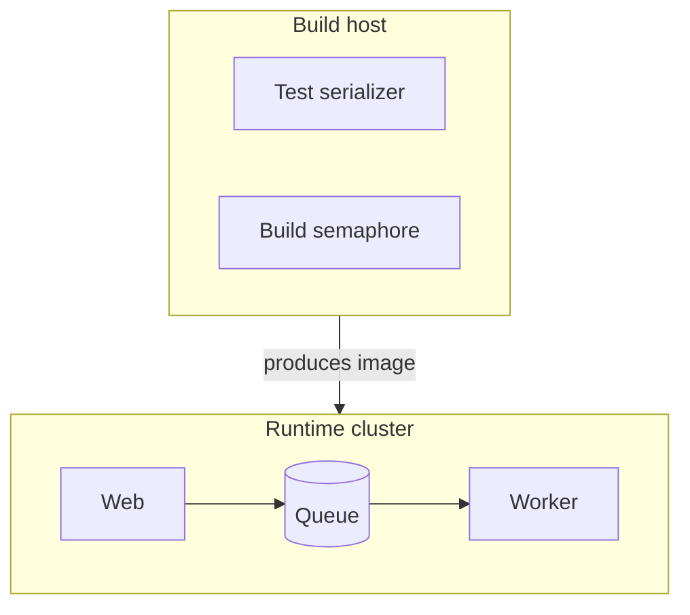
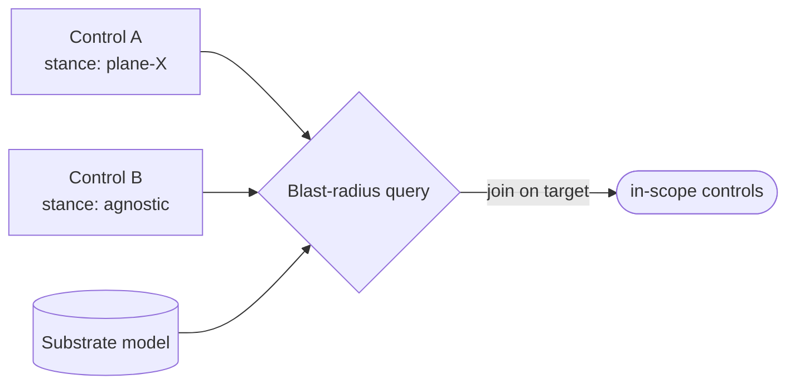

<!-- part-title: The Model Zoo -->
<!-- chapter-title: The Physical View -->

# The Physical View: where the parts live

<!-- index-def: physical-view -->
The Development view mapped how the source is organized. The Physical view — Kruchten's
deployment view — maps where the built software actually runs: which process lands on which
host, across which network boundaries, under what per-host cost and load policy. It is the
placement lens. A model that is functionally correct can still be mis-deployed, and only a view
that names *where things run* catches it.

<!-- index-def: performance-cost-model -->
One general type anchors the view, and it is the honest exception in this zoo. A
**performance and cost model** models the computation itself — what it costs to run, what it
costs to move data, whether to compute locally or remotely, whether to cache or recompute. The
next section takes that gap head-on: the framework supports the cost view, and one real model
*embodies* the load-and-cost half of it, but the pure-latency slice has no dedicated instance,
because no failure has yet justified building one. Three real models carry the view: the
deployment and tier topology model (the flagship, our first worked example), the invariant-DAG
execution policy (per-host cost and load rationing), and the control-to-substrate dependency
model (a computed migration blast radius).

## The performance/cost view: mostly embodied, one honest gap

The zoo names a performance and cost model as a general type, and the framework supports it.
But the catalogue holds only a partial instance, and the book states that flat rather than
inventing a model to fill the slot.

The load-and-cost half of the view *is* embodied — by the invariant-DAG execution policy below.
Its Scheduler reads a per-host profile of a concurrency ceiling and a budget, and rations both:
it fans work out on an elastic host and serializes it on a scarce one, and it honors a cost gate
everywhere but a scarce-resource gate only where a box demands it. That is a real cost model in
action — cost-to-run and resource-contention, driven from a declared per-host profile.

<!-- index-def: model-only-where-a-failure-lives -->
What has no dedicated instance is the *pure-latency* slice: a model of request latency, cache-hit
ratios, and compute-local-versus-remote data-movement cost, the kind a performance engineer draws
to decide where a computation should run for speed. The framework would carry it the same way it
carries the others — a typed profile, invariants over it, a drift gate — but no failure has yet
justified building it. The zoo names the gap rather than padding it, on the same discipline the
whole harness leads with: **model only where a failure lives.** A model built ahead of a failure
is a diagram that will rot before it is ever checked.

## The deployment & tier topology model {#deployment-topology-model}

<!-- noqa: book-section-cap | The deployment &amp; tier topology model — a model page rendered from the fixed five-field (a)-(e) template plus its parity-check code sample; the fields are one indivisible reference unit a reader scans by reflex across every model -->

<!-- index-def: deployment-topology-model -->
*Typed models of where things run and how they layer — the managed-deployment topology, each
service's tier class, and the substrate's layer boundaries — so deploy scripts and layering
lints reason about a declared topology, not scattered constants.*

**(a) Quality property it helps assess.** Three, each a question the raw deploy scripts cannot
answer without this model.

- **Deployment parity**: *does every service the model declares deploy at the tier the model
  says, and does every deployed service appear in the model?* A drifted tier or an unmodeled
  service is a failed check, not a silent production surprise.
- **Layering soundness**: *may this layer import that one?* A declared boundary makes a
  cross-layer import a build failure rather than a slow architectural erosion.
- **Migration blast radius**: *if I move a service to a new substrate, which controls assume the
  old one?* The topology is the ground truth the control-to-substrate query joins against.

**(b) Constructs and relations.** A small typed record set, importing nothing.

- **`Service`** — one deployable unit: its name, its layer (web, worker, shared), and its tier
  (critical, batch). The tier is the placement fact the parity check guards.
- **The layer axis**: a service's layer names its architectural stratum; the layer-boundary
  contracts declare which layers may depend on which, and the import-layer lint holds that graph.
- **The parity relation**: the declared service-to-tier map is joined bidirectionally against the
  live deploy table: model ⊆ reality (no declared service missing or mis-tiered) and reality ⊆
  model (no deployed service unmodeled).

**(c) Visual depiction.** The natural diagram is a deployment diagram — subgraphs are runtime
boundaries, edges cross them. Reused from the model's appendix Structure slot:



*Accessible description: a build host runs the test serializer and build semaphore and produces
the image the runtime cluster deploys, where the web service enqueues onto a queue drained by a
worker. The model declares this placement; parity lints hold it to the real deploy tables.*

**(d) Invariants, and how they are checked.** The checkers are the trunk drift-and-parity gates:

| Invariant | Temporal shape | How it is checked |
|---|---|---|
| Every declared service deploys at its declared tier | *□P* (safety) | Deploy-table parity lint: joins the model's name-to-tier map against the live deploy table, fails on any mismatch. |
| No deployed service is absent from the model | *□P* (safety) | Same parity lint, reverse direction — a deployed name not in the model is a finding. |
| No layer imports a layer its contract forbids | *□P* (safety) | Import-layer boundary lint over the declared layer graph. |
| Every topology-reading control declares its substrate assumption | *□P* (safety) | Declaration lint; the computed blast-radius table rides on it. |

The parity check is real code — the model is a frozen record, the check reads the live deploy
table and set-diffs it both ways:

```python
from dataclasses import dataclass
import sys

@dataclass(frozen=True)
class Service:
    name: str
    layer: str      # e.g. "web" / "worker" / "shared"
    tier: str       # e.g. "critical" / "batch"

MODEL = [Service("web", "web", "critical"), Service("worker", "worker", "batch")]

def parity(deploy_table: dict[str, str]) -> list[str]:
    """Declared tier must match the real deploy table; no service may go unmodeled."""
    findings = []
    declared = {s.name: s.tier for s in MODEL}
    for name, tier in declared.items():
        if deploy_table.get(name) != tier:
            findings.append(f"'{name}': model tier '{tier}' != deploy '{deploy_table.get(name)}'")
    for name in deploy_table.keys() - declared.keys():
        findings.append(f"'{name}' is deployed but absent from the topology model")
    return findings

if __name__ == "__main__":
    findings = parity(read_deploy_table())   # live service->tier map the deploy scripts use
    for f in findings:
        print(f"TOPOLOGY-DRIFT: {f}")
    sys.exit(1 if findings else 0)
```

**(e) Traceability and derivation direction.** *Bidirectional.* The tier facts are model-to-code
— the deploy env and access policy are generated from the declared topology. The parity check
runs the model-from-code direction too — it re-reads the live deploy table and set-diffs, so a
service that moved tier in the code without a model edit fails. The join key from a model row to
the code is the service `name`, which indexes both the model's name-to-tier map and the live
deploy table.

*Also seen in:* Development (the layer graph is a packaging fact) and, through the next model,
the migration story. Rendered in full here; referenced from the Development chapter.

## The invariant-DAG execution policy {#invariant-dag-execution-policy}

<!-- noqa: book-section-cap | The invariant-DAG execution policy — a model page rendered from the fixed five-field (a)-(e) template; the fields are one indivisible reference unit a reader scans by reflex across every model, so splitting one page breaks the uniform shape -->

<!-- index-def: invariant-dag-execution-policy -->
*A deploy graph whose edges carry a typed intent — correctness, cost-gate, or load — kept
host-identical, plus a typed Scheduler that reads a per-host profile and rations load and cost so
one host fans work out while a scarce one serializes it.*

**(a) Quality property it helps assess.** Two, both about how a host runs the work it was handed.

- **Graph portability**: *is the deploy graph the same on every host?* Load-specific edges are
  banned from the graph and migrated to the Scheduler, so the graph itself carries only host-
  identical correctness and cost intents, and cannot fork per host.
- **Rationing correctness under cost and resource pressure**: *does the deploy fan work out when
  it safely can, and serialize only when it must?* The Scheduler honors a cost gate everywhere but
  rations concurrency only where a scarce box demands it, all from one profile table.

**(b) Constructs and relations.** An edge-intent axis plus a per-host Scheduler.

- **The edge intent** — each deploy-graph edge carries a typed intent: `CORRECTNESS` (B is wrong
  without A — honored on every host), `COST_GATE` (A is a cheap check gating an expensive B —
  honored by default, relaxable only under an unbounded budget), and `LOAD` (B contends with A for
  a scarce box — *banned in the graph*, migrated to the Scheduler).
- **`HostLoadProfile`** — a per-host record: a concurrency ceiling (1 for a single scarce box,
  large for an elastic one) and a budget (finite to honor cost gates, unbounded to relax them).
- **The Scheduler** — reads a host's profile and emits an execution plan: how many roster items
  may run at once, and whether to honor the cost gate. Load rationing is a semaphore, not a graph
  edge.

**(c) Visual depiction.** The natural diagram is a data-flow — edge intents route, load leaves the
graph for the Scheduler, and a per-host profile drives the plan. Reused from the model's appendix
Structure slot:


*Accessible description: a deploy-graph edge carries one of three intents. Correctness and
cost-gate edges stay in the graph, host-identical. A load edge is banned from the graph and
migrated to the Scheduler, which reads a per-host profile and emits an execution plan — the
concurrency and cost-gate decisions for that host. Moving the stress burden between hosts is a
profile edit, never a graph edit.*

**(d) Invariants, and how they are checked.** A load-edge ban and a plan derivation:

| Invariant | Temporal shape | How it is checked |
|---|---|---|
| No deploy edge carries the `LOAD` intent | *□P* (safety) | Load-edge lint reads the graph and the Scheduler's graph-resident intent set; a `LOAD` edge is a finding. |
| The deploy graph is identical on every host | *□P* (safety) | Graph-parity check: the same graph is emitted for every host; a per-host fork is a finding. |
| The execution plan is a pure function of the host profile | *□P* (safety) | Derive-and-assert: the plan is recomputed from the profile, never hand-stored. |

**(e) Traceability and derivation direction.** *Model-from-code.* The plan is derived from the
per-host profile by a pure function, and a hand-stored plan or a `LOAD` edge is banned outright.
The join key is the host name, which indexes both the `HostLoadProfile` and the deploy phase that
runs under the emitted plan. This model is walked in full, with its Scheduler code, in the
Scenarios chapter's join example — here it is the Physical-view resident that the join reaches
into.

*Also seen in:* Process (concurrency rationing is a runtime-dynamics concern) and Scenarios (the
join example). Rendered in full in the Scenarios chapter; referenced here for the placement and
cost half.

## The control↔substrate dependency model {#control-substrate-dependency}

<!-- noqa: book-section-cap | The control↔substrate dependency model — a model page rendered from the fixed five-field (a)-(e) template; the fields are one indivisible reference unit a reader scans by reflex across every model, so splitting one page breaks the uniform shape -->

<!-- index-def: control-substrate-dependency -->
*Make each control declare the substrate assumption it bakes in as typed metadata, so "which
controls depend on which part of the substrate, and what breaks when I change it" is a computed
query rather than a grep.*

**(a) Quality property it helps assess.** One property no grep can hold reliably.

- **Migration safety**: *before a cross-cutting substrate change, exactly which controls assume
  the old substrate?* The blast radius is computed by joining each control's declared assumption
  against the topology model, so a migration's in-scope set is a table, not a hopeful search.

**(b) Constructs and relations.** A typed assumption on each control, joined to the topology.

- **The stance** — each substrate-reading control declares a typed assumption: bound to one
  substrate, substrate-aware, or substrate-agnostic. A declaration lint requires it.
- **The blast-radius join**: the query joins the set of stances against the deployment-topology
  model on the target being migrated, and prints exactly the controls the change puts in scope.

**(c) Visual depiction.** The natural diagram is a data-flow — controls with stances and the
substrate model both feed a blast-radius query. Reused from the model's appendix Structure slot:



*Accessible description: each control declares its substrate stance, and those stances plus the
substrate model feed a blast-radius query that joins on the migration target and prints the
in-scope controls. A substrate change's blast radius becomes a computed table rather than a grep.*

**(d) Invariants, and how they are checked.** A declaration lint and the computed join:

| Invariant | Temporal shape | How it is checked |
|---|---|---|
| Every substrate-reading control declares its assumption | *□P* (safety) | Declaration lint: a control that reads the substrate with no declared stance is a finding. |
| The blast-radius table matches the declared stances | *□P* (safety) | The table is computed from the stances joined to the topology, never hand-maintained. |

**(e) Traceability and derivation direction.** *Model-from-code.* Each stance is declared at the
control's own site and joined to the topology model. The join key is the migration target — a
substrate element — which indexes both a control's stance and the topology row it depends on.

*Also seen in:* Development (a control is a dev-substrate artifact). Rendered in full here.

---

The Physical view places the parts and rations their cost. The four views so far are static —
they say what the system is, does at once, is packaged as, and runs where. The final view sets
them in motion: the scenarios that walk a real goal end to end and validate that the other four
actually hold up. That is the +1.
