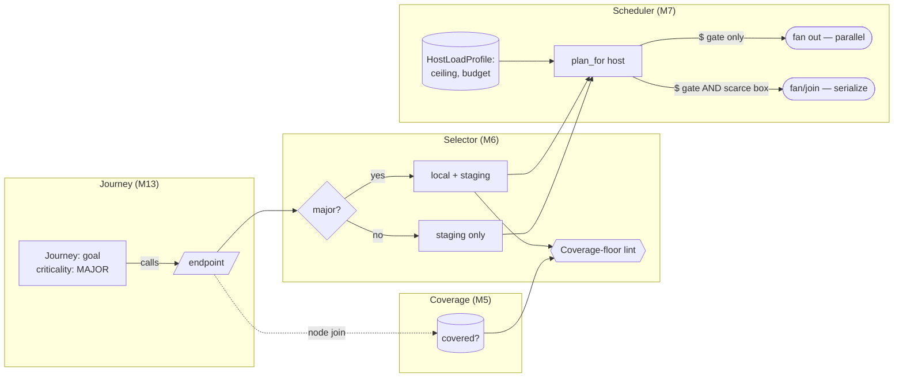

<!-- part-title: The Model Zoo -->
<!-- chapter-title: The Scenarios View -->

# The Scenarios View: what the system does for someone

<!-- noqa: book-section-cap | The Scenarios View — the intro carries the two boxed primers (node-coverage vs line coverage, protocols and TLA+) the reader needs before this view's model pages; the insets are self-contained primers, not prose to break up -->

<!-- index-def: scenarios-view -->
The four views so far are static portraits. The Logical view says what the system is, the
Process view what it does at once, the Development view how it is packaged, the Physical view
where it runs. The +1 view sets them in motion. A **scenario** — a use case, a journey — walks
a real goal end to end, and in walking it exercises the other four and validates that they hold
up. Kruchten made scenarios the +1 for exactly this reason: they are how you check that the
four architectural views describe a system that actually works.

One general type anchors the view. A **user journey** names the interfaces a user moves through
and the actions they take to accomplish something of value. Four real models embody the view:
the user-journey model (the product-goal-to-code bridge), the agent-orchestration model (the
*developer*-journey counterpart, the scenarios view pointed at the fleet rather than the user),
journey-criticality-to-test-placement, and coverage-to-model-node mapping. The chapter closes
with the zoo's flagship demonstration — four models joined so a product goal reaches all the way
to how the deploy rations its tests.

Two insets a reader needs for this view's model pages:

<!-- index-def: node-coverage -->
> ### Inset I10 — Coverage over model nodes vs line coverage {#inset-node-coverage}
>
> **Line coverage** counts *lines* — which source lines a test suite executed. It is easy to
> game and easy to misread: a high percentage can hide the one untested branch that matters. Node
> coverage counts *meanings* instead. Project the coverage onto a model's nodes — its states, its
> seams, its invariants, its journey endpoints — and ask which *nodes* a test exercised. Now an
> untested invariant cannot hide inside a 95% line number, because the invariant is a node, and
> the node is either covered or it is a visible gap. The shift is from "how much code ran" to
> "which meanings are checked," and only the second answers "is the thing I care about tested?"

<!-- index-def: protocols-and-tla -->
> ### Inset I7 — Protocols and TLA+ {#inset-tla}
>
> When a property is not about one component but a *protocol* — many actors interleaving over
> time, each taking steps in an order you do not control — a single state assertion is not enough
> and even a bounded walk of one component misses the cross-actor races. You specify the protocol
> in a **temporal-logic language** (TLA+ is the best-known), stating the actors, their steps, and
> the safety and liveness properties the interleaving must satisfy. A model checker then explores
> *every* interleaving the actors can produce and either proves the properties or hands you a
> trace. This is the heaviest tool in the zoo, reserved for the invariant whose failure lives in a
> schedule no example test will ever pick — a distributed reservation, a lease-and-preempt loop,
> a two-phase hand-off between services.

The four models that feed the flagship join get a paragraph each here; each sets up its part of
the composition, and its full construct-and-invariant treatment is in the appendix.

## The user-journey model {#user-journey-model}

<!-- index-def: user-journey-model -->
The user-journey model makes the product's journeys first-class typed entities — each an actor
pursuing a goal through ordered steps, every boundary-crossing step joined to the endpoint it
calls. It assesses **dependency correctness**: does every step a journey declares have a real
call site, and is every real call declared? A call-site drift lint checks both directions. The
idea that makes it the join's entry point is that the journey *copies nothing* — a step's
endpoint references the service-flow model, its call-site anchor references the real code, and
those two references are the keys the coverage and placement models reach through. Name the
journey once and the rest of the zoo joins to it.

## The agent-orchestration model {#agent-orchestration-model}

<!-- index-def: agent-orchestration-model -->
The agent-orchestration model is the developer-journey counterpart — the scenarios view pointed
at the fleet rather than the user. It models the agent lifecycle
(`Dispatched`→`Working`→`Landed`→`Tombstoned`, with `Abandoned` and recovery) as a typed state
machine, and the orchestrator's own refill-and-bank loop as a journey. It assesses **lifecycle
soundness**: a tombstone before a commit, or a landed agent that never tombstones, is an illegal
transition a checker catches. The distinctive move is **method parity** — the substrate that
produces the software is governed by the same tier-derivation and drift machinery pointed at the
product, so "is the fleet as checkable as what it ships" is a checked property. One of its
invariants is liveness (*a landed agent eventually tombstones*), which routes to a temporal
checker per the Process view's form-match rule. Its full construct-and-invariant treatment is in
the appendix.

## Journey-criticality → test-placement {#journey-criticality-test-placement}

<!-- index-def: journey-criticality-test-placement -->
This model — the **Selector** in the join below — derives which environment tier a journey's
tests run in from the journey's criticality: a `MAJOR` part runs the fast local tier and the
full staging matrix, a `MINOR` part runs staging only. It assesses **placement soundness**. The
idea worth carrying is that the tier is *derived, never stored*: a stored tier literal is banned,
so you cannot quietly push a major path off the slow local gate to speed a run up. To move it you
must demote it to `MINOR` — a visible edit that says out loud "this path is no longer major." A
coverage-floor lint then holds the promise "every major part has a fast-tier test," which makes a
green local run mean something. Its full construct-and-invariant treatment is in the appendix.

## Coverage → model-node mapping {#coverage-model-mapping}

<!-- index-def: coverage-model-mapping -->
Coverage-to-node mapping projects the test suite's coverage onto the model's *nodes* — states,
seams, invariants, journey endpoints — instead of its lines. It assesses **node-coverage
adequacy**: is every meaning I care about exercised by some test? The idea it turns on is that an
untested invariant cannot hide inside a 95% line number, because the invariant is a node, and a
node is either covered or a visible gap. An uncovered node is a backlog item; an uncovered node
in the critical subset is a build-blocking gate. In the join below it answers the plain question
the criticality floor rests on — are the journey's endpoints tested at all? Its full
construct-and-invariant treatment is in the appendix.

---

## Worked join — the journey↔coverage↔deploy-policy composition {#worked-join}

*Four models composed on a shared key so a product goal reaches all the way to how the deploy runs
its tests: a journey's criticality derives which tests run on which host tier, and that placement
joins to the deploy execution policy, which rations each host by fanning tests out or serializing
them.*

<!-- index-def: models-join-not-repeat -->
This is the zoo's central thesis made concrete — **models join, they do not repeat.** The other
model pages each show a single model. This one traces one fact — a journey is *major* — through
four models with no fact stated twice. The user-journey model (M13) names the journey and its
endpoints. The coverage-to-node map (M5) asks whether those endpoints are tested at all. The
journey-criticality-to-test-placement model (M6, the **Selector**) derives which host tier each
test runs on from the journey's criticality. And the invariant-DAG execution policy (M7, the
**Scheduler**) decides *how* each host runs the tests it was handed — fan out, or serialize. No
model owns another's facts; each joins on the journey and its endpoints.

### The three questions the join answers

Three questions the raw deploy scripts and test config cannot answer on their own.

- **Goal-to-gate coverage**: *does a green local run mean every major journey actually ran?* The
  criticality floor makes "local-green implies every major path was exercised locally" a checked
  property, not a hope.
- **Placement soundness**: *is any major journey mis-filed as staging-only?* Because the host tier
  is derived from criticality and stored nowhere by hand, you cannot quietly shove a major path off
  the local gate; you must demote it to minor, a visible edit.
- **Rationing correctness under cost and resource pressure**: *does the deploy fan tests out when
  it safely can, and serialize them only when it must?* The Scheduler honors a cost gate everywhere
  but rations concurrency only where a scarce box demands it, so a single-worker host serializes
  while an elastic host fans out, from one profile table.

### The four models and their join keys

The four models compose through shared keys.

- **The `Journey` (M13)**: an actor, a goal, ordered steps; each boundary-crossing step names its
  **endpoint** and records a **call-site anchor**. These are the join keys the other three reach
  through.
- **The criticality axis (M6)**: each journey-part carries `MAJOR` or `MINOR`. A total derivation
  maps `MAJOR` to local-depth and `MINOR` to staging-only. The tier is derived, never stored.
- **The coverage join (M5)**: the suite's coverage projected onto the journey's endpoint nodes:
  covered, uncovered, by-which-tests. An uncovered major endpoint is a floor violation.
- **The edge-intent axis and Scheduler (M7)**: the deploy graph's edges carry `CORRECTNESS`,
  `COST_GATE`, or `LOAD`; `LOAD` is banned from the graph and migrated to the Scheduler, which reads
  a per-host `HostLoadProfile` and emits a `ConcurrencyPlan`.

The through-line: a journey's endpoint is the coverage join key (M13→M5); its criticality is the
Selector's input (M13/M6); the Selector's per-host test set is what the deploy phase runs; and the
Scheduler's profile decides whether that host fans those tests out or serializes them (M6→M7). One
fact, four models, no repetition.

### The composite picture

The join has no single appendix diagram, so this composite is composed from the four real panels,
adding only the join edges between them. The data-flow reads left to right — criticality derives
placement, placement joins to coverage, and the deploy Scheduler rations the resulting test set
per host:



*Accessible description: a major journey names an endpoint. The Selector derives that endpoint's
tests to the local-plus-staging tier (a minor one to staging only), and a coverage-floor lint fails
if a major endpoint has no local test. The coverage model joins to the same endpoint to check it is
tested at all. The resulting test set flows to the deploy Scheduler, which reads a per-host profile:
when only a cost gate applies it fans the tests out in parallel, but when both a cost gate and a
scarce-resource gate apply it serializes them.*

### The invariants the join spans

The join's invariants span all four models; two are the trunk derive-the-checker discipline.

| Invariant | Temporal shape | How it is checked |
|---|---|---|
| Every major journey-part has a test in the fast local tier | *□P* (safety) | Coverage-floor lint (M6) walks the model; a major part with no local test is a finding. |
| A journey's declared deps match its real call sites, both ways | *□P* (safety) | Call-site drift lint (M13): every declared dep has a real call site, every call site is declared. |
| Every declared journey endpoint is exercised by some test | *□P* (safety) | Undertested-journey audit (M5): join coverage to the endpoint nodes; an uncovered endpoint is a gap. |
| The host tier is a pure function of criticality | *□P* (safety) | Derive-and-assert (M6): a stored tier literal is banned; the lint recomputes the derivation. |
| No deploy edge carries the `LOAD` intent | *□P* (safety) | Load-edge lint (M7) reads the graph and the Scheduler's graph-resident intents; a `LOAD` edge is a finding. |
| Staging's test set is a superset of local's and of prod's | *□P* (safety) | Containment property test plus a live-model lint (M6): recompute containment by calling the selector, not auditing a matrix. |

### The Selector and Scheduler in code

<!-- noqa: book-section-cap | The Selector and Scheduler in code — the length is the two policy-code samples (the Selector's tier derivation and the Scheduler's rationing) that make the join land on code, not prose; the code block is one indivisible worked example, and the surrounding prose is already two short paragraphs -->

Two pieces of real policy code show the join landing on code, not prose. The **Selector** derives a
host's test roster from the journey model; the **Scheduler** decides how that host runs it:

```python
from dataclasses import dataclass
from enum import Enum

# --- M6: the Selector — criticality derives the host tier, tier derives the test roster ---
class Criticality(Enum):
    MAJOR = "major"
    MINOR = "minor"

def tier_for(crit: Criticality) -> frozenset[str]:
    """Pure derivation: a MAJOR part runs local + staging; a MINOR part runs staging only.
       Stored nowhere by hand — a tier literal is banned, so moving a part off the local
       floor forces a visible MAJOR->MINOR demotion, not a silent tier edit."""
    if crit is Criticality.MAJOR:
        return frozenset({"local", "staging"})
    return frozenset({"staging"})

def roster_for(host: str, journey_parts: dict[str, Criticality]) -> list[str]:
    """The test set this host runs: every part whose derived tier contains this host."""
    return [name for name, crit in journey_parts.items() if host in tier_for(crit)]

# --- M7: the Scheduler — a per-host profile decides fan-out vs serialize for that roster ---
@dataclass(frozen=True)
class HostLoadProfile:
    concurrency_ceiling: int   # 1 = single scarce box; large = elastic
    budget: float              # inf = unbounded (cost gates relaxable); finite = honor $ gates

@dataclass(frozen=True)
class ConcurrencyPlan:
    permits: int               # how many roster items may run at once
    honor_cost_gate: bool      # run an expensive test only if its cheap gate passed

def plan_for(profile: HostLoadProfile) -> ConcurrencyPlan:
    """The load + cost rationing decision, per host, from the profile alone.
       Fan OUT freely when only a $ (COST_GATE) gate applies (elastic box, permits high);
       fan/join — SERIALIZE — when a $ gate AND a scarce-resource (LOAD) gate both apply
       (single box: permits collapse to 1, the queue-drain that used to be a graph edge)."""
    permits = profile.concurrency_ceiling          # LOAD rationing: a semaphore, not an edge
    honor_cost_gate = profile.budget != float("inf")  # COST_GATE: honored unless budget unbounded
    return ConcurrencyPlan(permits=permits, honor_cost_gate=honor_cost_gate)

# Three named host profiles — moving the stress burst between hosts is a one-row edit:
PROFILES = {
    "local":   HostLoadProfile(concurrency_ceiling=1,    budget=100.0),   # scarce VM: serialize
    "staging": HostLoadProfile(concurrency_ceiling=999,  budget=float("inf")),  # elastic: fan out
    "prod":    HostLoadProfile(concurrency_ceiling=4,    budget=50.0),    # low finite smoke ceiling
}
```

The behavior the code makes concrete: **staging** (ceiling 999, unbounded budget) permits the whole
ready wave and relaxes cost gates — pure fan-out, no box scarce. **Local** (ceiling 1, budget 100)
collapses to one permit and honors cost gates — the serialize case, where a cost gate and a scarce-box
load gate both apply, so the locally-placed tests run one at a time behind their cheap gates. Raising
the local ceiling is a one-cell profile edit, never a graph edit — which is why `LOAD` stays out of
the DAG.

### Tracing one fact through four models

*Model-from-code, joined.* Every leg derives from the
code: the journey's deps from its real call sites (M13), coverage from the real test run (M5), the
host tier from the criticality field by a pure function (M6), the rationing plan from the per-host
profile (M7). Nothing is hand-stored — a stored tier or a `LOAD` edge is banned outright. The join
keys chain: the **endpoint** ties M13 to M5, the **criticality** ties M13 to M6, the **derived tier**
ties M6 to M7's roster, and the **host profile** ties the roster to the plan. A reader round-trips
from "this journey is major" to "these tests serialize on the local box" by following those four keys,
and the drift lints mechanize each hop.

*Also seen in:* Physical (the Scheduler half). This join is why the Physical and Scenarios chapters
cross-reference each other most; it is rendered in full here.

---

Five views, walked on real code, each with its invariants and the checker that holds them true. The
zoo has {{model_count}} named models, and the point of the number is the one Kruchten made: no single
view is ever the whole picture. What the safety-critical world did because lives were at stake — keep
the models honest, trace every requirement to the code that realizes it — the rest of us now do because
an agent will pay the upkeep, and because it is the cheapest way to trust what the fleet ships.
