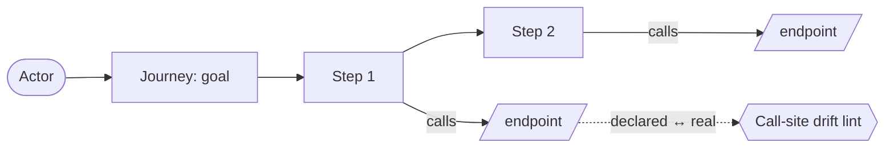
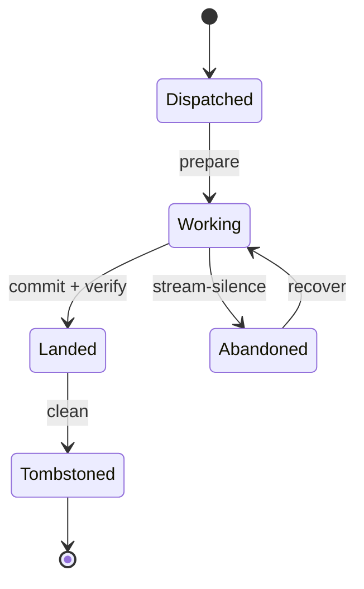
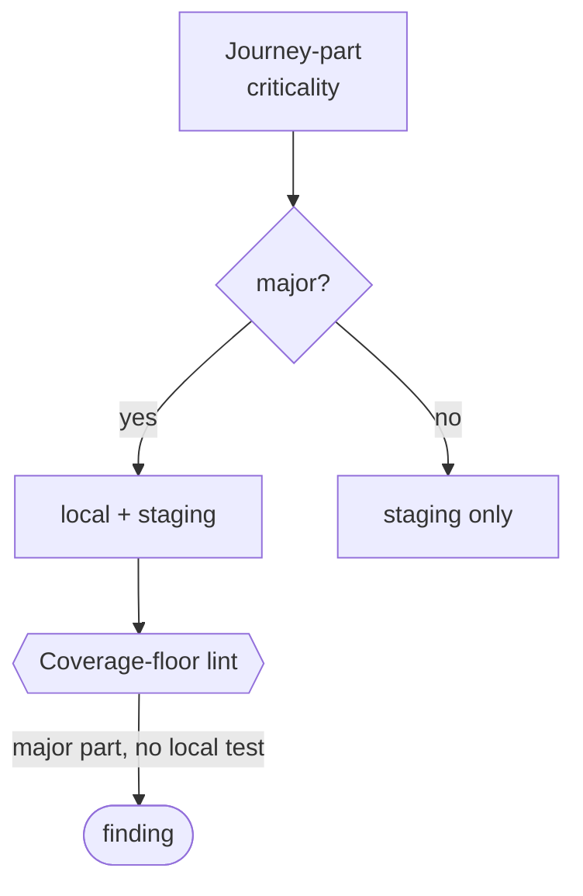
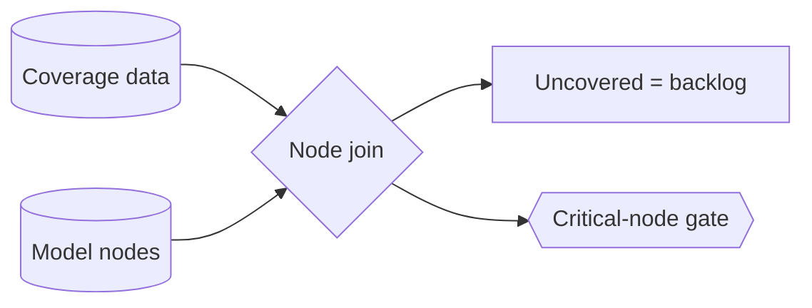

<!-- part-title: The Model Zoo -->
<!-- chapter-title: The Scenarios View -->

# The Scenarios View: what the system does for someone

The four views so far are static portraits. The Logical view says what the system is, the
Process view what it does at once, the Development view how it is packaged, the Physical view
where it runs. The +1 view sets them in motion. A **scenario** — a use case, a journey — walks
a real goal end to end, and in walking it exercises the other four and validates that they hold
up. Kruchten made scenarios the +1 for exactly this reason: they are how you check that the
four architectural views describe a system that actually works.

One general type anchors the view. A **user journey** names the interfaces a user moves through
and the actions they take to accomplish something of value. Four real models embody the view:
the user-journey model (the product-goal-to-code bridge), the agent-orchestration model (the
*developer*-journey counterpart, the scenarios view pointed at the fleet rather than the user),
journey-criticality-to-test-placement, and coverage-to-model-node mapping. The chapter closes
with the zoo's flagship demonstration — four models joined so a product goal reaches all the way
to how the deploy rations its tests.

Two insets a reader needs for this view's model pages:

> ### Inset I10 — Coverage over model nodes vs line coverage {#inset-node-coverage}
>
> **Line coverage** counts *lines* — which source lines a test suite executed. It is easy to
> game and easy to misread: a high percentage can hide the one untested branch that matters. Node
> coverage counts *meanings* instead. Project the coverage onto a model's nodes — its states, its
> seams, its invariants, its journey endpoints — and ask which *nodes* a test exercised. Now an
> untested invariant cannot hide inside a 95% line number, because the invariant is a node, and
> the node is either covered or it is a visible gap. The shift is from "how much code ran" to
> "which meanings are checked," and only the second answers "is the thing I care about tested?"

> ### Inset I7 — Protocols and TLA+ {#inset-tla}
>
> When a property is not about one component but a *protocol* — many actors interleaving over
> time, each taking steps in an order you do not control — a single state assertion is not enough
> and even a bounded walk of one component misses the cross-actor races. You specify the protocol
> in a **temporal-logic language** (TLA+ is the best-known), stating the actors, their steps, and
> the safety and liveness properties the interleaving must satisfy. A model checker then explores
> *every* interleaving the actors can produce and either proves the properties or hands you a
> trace. This is the heaviest tool in the zoo, reserved for the invariant whose failure lives in a
> schedule no example test will ever pick — a distributed reservation, a lease-and-preempt loop,
> a two-phase hand-off between services.

## The user-journey model {#user-journey-model}

*Model the product's user journeys as first-class typed entities — each an actor pursuing a goal
through ordered steps, every boundary-crossing step joined to the endpoint it calls — so the path
from what the product is for to what the code must provide is a queryable model.*

**(a) Quality property it helps assess.** Two, both about the goal-to-code path.

- **Dependency correctness**: *does every step a journey declares have a real call site, and is
  every real call declared?* A call-site drift lint checks both directions, so a journey cannot
  claim a dependency it does not exercise, nor exercise one it does not declare.
- **Goal reachability**: *is every product goal backed by a journey whose steps reach real
  endpoints?* A goal with no journey, or a journey step that names no endpoint, is a gap between
  intent and implementation.

**(b) Constructs and relations.** A `Journey` entity grafted into the service-flow dialect.

- **`Journey`**: an actor, a goal, and ordered steps. It reuses the service dialect rather than
  standing up a parallel model.
- **`Step`**: one action in the journey. A boundary-crossing step names the endpoint it calls and
  records a call-site anchor — the join keys the coverage and placement models reach through.
- **The join relation**: a step's endpoint joins to the service-flow model's endpoint; its
  call-site anchor joins to the real code. The journey copies neither; it references both.

**(c) Visual depiction.** The natural diagram is a data-flow — an actor through a journey's steps
to the endpoints they call, with a drift lint on the declared-versus-real join. Reused from the
model's appendix Structure slot:



*Accessible description: an actor moves through a journey's ordered steps, each boundary-crossing
step calling an endpoint. A call-site drift lint checks the declared endpoints against the real
call sites in both directions, so a journey's dependencies stay equal to the code it exercises.*

**(d) Invariants, and how they are checked.** A call-site drift lint:

| Invariant | Temporal shape | How it is checked |
|---|---|---|
| Every declared journey dependency has a real call site | `[]P` (safety) | Call-site drift lint, model ⊆ reality. |
| Every real call from a journey step is declared | `[]P` (safety) | Call-site drift lint, reality ⊆ model. |
| Every boundary-crossing step names a real endpoint | `[]P` (safety) | Endpoint join against the service-flow model; an unresolvable endpoint is a finding. |

**(e) Traceability and derivation direction.** *Model-from-code.* The dependency list is derived
from the real call sites and reconciled. The join key is the endpoint (ties a step to the
service-flow model) and the call-site anchor (ties a step to the code). This model is the entry
point of the flagship join below.

*Also seen in:* Logical (a journey references the service-flow structure). Rendered in full here.

## The agent-orchestration model {#agent-orchestration-model}

*Model the agent fleet and the orchestrator's own loop with the same MBSE method you point at
the product — typed lifecycle states, typed seams, derived verification tiers, held true by a
drift gate — so the substrate that produces the software is as checkable as the software.*

**(a) Quality property it helps assess.** Two, about the fleet's own correctness.

- **Lifecycle soundness**: *can an agent reach an illegal lifecycle state, or skip a required
  transition?* The dispatch-to-work-to-land-to-tombstone lifecycle is a typed state machine, so a
  landed-but-never-tombstoned agent, or a tombstone before a commit, is an illegal transition the
  checker catches.
- **Method parity**: *is the orchestration substrate governed as strictly as the product?* The
  model reuses the product's own tier-derivation and drift machinery, so the answer is a checked
  property, not an aspiration.

**(b) Constructs and relations.** A developer-journey state machine.

- **The lifecycle states**: `Dispatched`, `Working`, `Landed`, `Abandoned`, `Tombstoned`, and the
  legal transitions between them (prepare, commit-and-verify, recover, clean).
- **The refill/bank loop** — the orchestrator's own steps modeled as a journey: land a freed slot,
  dispatch the next, bank progress. The developer is the actor; the fleet is the system.
- **The reflection-facet registry**: a first-class modeled node, so the fleet's self-review
  surfaces are governed like any other.

**(c) Visual depiction.** The natural diagram is a state machine — the agent lifecycle with its
legal transitions. Reused from the model's appendix Structure slot:



*Accessible description: an agent moves from dispatched to working on prepare, to landed on commit
and verify, and to tombstoned on clean. A working agent silenced mid-flight goes to abandoned, from
which a recover returns it to working. The lifecycle is a typed state machine, so an illegal
transition — a tombstone before a commit — is a checker finding.*

**(d) Invariants, and how they are checked.** A lifecycle state-machine check and a derived tier:

| Invariant | Temporal shape | How it is checked |
|---|---|---|
| No agent reaches an illegal lifecycle state | `[]P` (safety) | State-space search over the lifecycle machine; an unreachable-should-be state is a finding. |
| A tombstone follows a landed commit | `P ~> Q` (liveness) | A landed agent eventually reaches tombstoned; a temporal check over the lifecycle. |
| Each invariant's verification tier is derived, not hand-typed | `[]P` (safety) | Derive-and-assert: a hand-stored tier is a finding. |

**(e) Traceability and derivation direction.** *Model-from-code.* The lifecycle states are
reconciled against the real agent-registry records. The join key is the agent identifier, which
indexes both a lifecycle node and the registry record for that agent.

*Also seen in:* Process (the lifecycle is a concurrency machine). Rendered in full here as the
developer-journey counterpart to the user-journey model.

## Journey-criticality → test-placement {#journey-criticality-test-placement}

*Derive which environment tier a journey's tests run in from the journey's criticality — a major
journey-part runs in the fast local tier and the full staging matrix, a minor one runs staging only
— with a coverage-floor lint holding "every major part has a fast-tier test."*

**(a) Quality property it helps assess.** Two, about test placement.

- **Placement soundness**: *is any major journey mis-filed as staging-only?* Because the tier is
  derived from criticality and stored nowhere by hand, you cannot quietly push a major path off the
  local gate to speed it up; you must demote it to minor, a visible edit.
- **Local-gate adequacy**: *does a green local run mean every major journey ran?* The coverage
  floor makes "local-green implies every major part was exercised locally" a checked property.

**(b) Constructs and relations.** A criticality axis and a total derivation function.

- **The criticality level**: each journey-part carries `MAJOR` or `MINOR`.
- **The derivation function** — a total map: `MAJOR` to local-plus-staging, `MINOR` to
  staging-only. The tier is derived, never stored, so a stored tier literal is banned.
- **The coverage floor**: a lint asserting every major part has a test in the fast local tier.

**(c) Visual depiction.** The natural diagram is a decision flow — criticality derives the tier,
and a floor lint guards the local gate. Reused from the model's appendix Structure slot:



*Accessible description: a journey-part's criticality routes on major-or-not — a major part derives
to the local-plus-staging tier, a minor one to staging only. A coverage-floor lint then fails the
build if a major part has no test in the fast local tier. The tier is derived from criticality,
never hand-stored.*

**(d) Invariants, and how they are checked.** A derive-and-assert and a coverage floor:

| Invariant | Temporal shape | How it is checked |
|---|---|---|
| The host tier is a pure function of criticality | `[]P` (safety) | Derive-and-assert: a stored tier literal is banned; the lint recomputes the derivation. |
| Every major journey-part has a test in the fast local tier | `[]P` (safety) | Coverage-floor lint walks the model; a major part with no local test is a finding. |
| Staging's test set contains local's | `[]P` (safety) | Containment check by recomputing the derivation, not auditing a matrix. |

**(e) Traceability and derivation direction.** *Model-from-code.* The tier is a pure function of
the criticality field; nothing is hand-stored. The join key is the journey-part name, which indexes
the criticality field and the derived test roster.

*Also seen in:* Physical (the derived tier joins to the deploy Scheduler). Rendered in full here;
its join to the Scheduler is the flagship example below.

## Coverage → model-node mapping {#coverage-model-mapping}

*Project the test suite's coverage onto the model's nodes — states, seams, invariants, journey
endpoints — so an untested node is a visible gap rather than hidden inside a line-coverage
percentage.*

**(a) Quality property it helps assess.** One property line coverage cannot express.

- **Node-coverage adequacy**: *is every meaning I care about — every invariant, every journey
  endpoint — exercised by some test?* An uncovered node is a backlog item; an uncovered *critical*
  node is a build-blocking gate.

**(b) Constructs and relations.** A join between coverage data and model nodes.

- **The model node** — a state, a seam, an invariant, or a journey endpoint: the unit coverage is
  projected onto.
- **The coverage join** — the test run's coverage data joined to the nodes: covered, uncovered, and
  by-which-tests.
- **The critical-node gate**: a subset of nodes marked critical; an uncovered critical node fails
  the build rather than joining the backlog.

**(c) Visual depiction.** The natural diagram is a data-flow — coverage and nodes joined, splitting
into a backlog and a gate. Reused from the model's appendix Structure slot:



*Accessible description: coverage data and model nodes feed a node join, which sorts each node into
covered or uncovered. Uncovered nodes become a backlog; an uncovered node in the critical subset
trips a gate that blocks the build. Coverage is measured over meanings, not lines.*

**(d) Invariants, and how they are checked.** A node join and a critical-node gate:

| Invariant | Temporal shape | How it is checked |
|---|---|---|
| Every critical model node is exercised by some test | `[]P` (safety) | Critical-node gate: an uncovered critical node blocks the build. |
| Every journey endpoint is covered or on the backlog | `[]P` (safety) | Undertested-journey audit joins coverage to the endpoint nodes. |

**(e) Traceability and derivation direction.** *Model-from-code.* The join is computed from the real
coverage run against the model nodes. The join key is the node identity — an invariant id, an
endpoint path — which ties a coverage row to the model element it exercises.

*Also seen in:* Process (an invariant node is a concurrency contract). Rendered in full here.

---

## Worked join — the journey↔coverage↔deploy-policy composition {#worked-join}

*Four models composed on a shared key so a product goal reaches all the way to how the deploy runs
its tests: a journey's criticality derives which tests run on which host tier, and that placement
joins to the deploy execution policy, which rations each host by fanning tests out or serializing
them.*

This is the zoo's central thesis made concrete — **models join, they do not repeat.** The other
model pages each show a single model. This one traces one fact — a journey is *major* — through
four models with no fact stated twice. The user-journey model (M13) names the journey and its
endpoints. The coverage-to-node map (M5) asks whether those endpoints are tested at all. The
journey-criticality-to-test-placement model (M6, the **Selector**) derives which host tier each
test runs on from the journey's criticality. And the invariant-DAG execution policy (M7, the
**Scheduler**) decides *how* each host runs the tests it was handed — fan out, or serialize. No
model owns another's facts; each joins on the journey and its endpoints.

**(a) Quality property it helps assess.** Three questions the raw deploy scripts and test config
cannot answer.

- **Goal-to-gate coverage**: *does a green local run mean every major journey actually ran?* The
  criticality floor makes "local-green implies every major path was exercised locally" a checked
  property, not a hope.
- **Placement soundness**: *is any major journey mis-filed as staging-only?* Because the host tier
  is derived from criticality and stored nowhere by hand, you cannot quietly shove a major path off
  the local gate; you must demote it to minor, a visible edit.
- **Rationing correctness under cost and resource pressure**: *does the deploy fan tests out when
  it safely can, and serialize them only when it must?* The Scheduler honors a cost gate everywhere
  but rations concurrency only where a scarce box demands it, so a single-worker host serializes
  while an elastic host fans out, from one profile table.

**(b) Constructs and relations.** The four models compose through shared keys.

- **The `Journey` (M13)**: an actor, a goal, ordered steps; each boundary-crossing step names its
  **endpoint** and records a **call-site anchor**. These are the join keys the other three reach
  through.
- **The criticality axis (M6)**: each journey-part carries `MAJOR` or `MINOR`. A total derivation
  maps `MAJOR` to local-depth and `MINOR` to staging-only. The tier is derived, never stored.
- **The coverage join (M5)**: the suite's coverage projected onto the journey's endpoint nodes:
  covered, uncovered, by-which-tests. An uncovered major endpoint is a floor violation.
- **The edge-intent axis and Scheduler (M7)**: the deploy graph's edges carry `CORRECTNESS`,
  `COST_GATE`, or `LOAD`; `LOAD` is banned from the graph and migrated to the Scheduler, which reads
  a per-host `HostLoadProfile` and emits a `ConcurrencyPlan`.

The through-line: a journey's endpoint is the coverage join key (M13→M5); its criticality is the
Selector's input (M13/M6); the Selector's per-host test set is what the deploy phase runs; and the
Scheduler's profile decides whether that host fans those tests out or serializes them (M6→M7). One
fact, four models, no repetition.

**(c) Visual depiction.** The join has no single appendix diagram, so this composite is composed
from the four real panels, adding only the join edges between them. The data-flow reads left to
right — criticality derives placement, placement joins to coverage, and the deploy Scheduler rations
the resulting test set per host:


*Accessible description: a major journey names an endpoint. The Selector derives that endpoint's
tests to the local-plus-staging tier (a minor one to staging only), and a coverage-floor lint fails
if a major endpoint has no local test. The coverage model joins to the same endpoint to check it is
tested at all. The resulting test set flows to the deploy Scheduler, which reads a per-host profile:
when only a cost gate applies it fans the tests out in parallel, but when both a cost gate and a
scarce-resource gate apply it serializes them.*

**(d) Invariants, and how they are checked.** The join's invariants span all four models; two are
the trunk derive-the-checker discipline:

| Invariant | Temporal shape | How it is checked |
|---|---|---|
| Every major journey-part has a test in the fast local tier | `[]P` (safety) | Coverage-floor lint (M6) walks the model; a major part with no local test is a finding. |
| A journey's declared deps match its real call sites, both ways | `[]P` (safety) | Call-site drift lint (M13): every declared dep has a real call site, every call site is declared. |
| Every declared journey endpoint is exercised by some test | `[]P` (safety) | Undertested-journey audit (M5): join coverage to the endpoint nodes; an uncovered endpoint is a gap. |
| The host tier is a pure function of criticality | `[]P` (safety) | Derive-and-assert (M6): a stored tier literal is banned; the lint recomputes the derivation. |
| No deploy edge carries the `LOAD` intent | `[]P` (safety) | Load-edge lint (M7) reads the graph and the Scheduler's graph-resident intents; a `LOAD` edge is a finding. |
| Staging's test set is a superset of local's and of prod's | `[]P` (safety) | Containment property test plus a live-model lint (M6): recompute containment by calling the selector, not auditing a matrix. |

Two pieces of real policy code show the join landing on code, not prose. The **Selector** derives a
host's test roster from the journey model; the **Scheduler** decides how that host runs it:

```python
from dataclasses import dataclass
from enum import Enum

# --- M6: the Selector — criticality derives the host tier, tier derives the test roster ---
class Criticality(Enum):
    MAJOR = "major"
    MINOR = "minor"

def tier_for(crit: Criticality) -> frozenset[str]:
    """Pure derivation: a MAJOR part runs local + staging; a MINOR part runs staging only.
       Stored nowhere by hand — a tier literal is banned, so moving a part off the local
       floor forces a visible MAJOR->MINOR demotion, not a silent tier edit."""
    if crit is Criticality.MAJOR:
        return frozenset({"local", "staging"})
    return frozenset({"staging"})

def roster_for(host: str, journey_parts: dict[str, Criticality]) -> list[str]:
    """The test set this host runs: every part whose derived tier contains this host."""
    return [name for name, crit in journey_parts.items() if host in tier_for(crit)]

# --- M7: the Scheduler — a per-host profile decides fan-out vs serialize for that roster ---
@dataclass(frozen=True)
class HostLoadProfile:
    concurrency_ceiling: int   # 1 = single scarce box; large = elastic
    budget: float              # inf = unbounded (cost gates relaxable); finite = honor $ gates

@dataclass(frozen=True)
class ConcurrencyPlan:
    permits: int               # how many roster items may run at once
    honor_cost_gate: bool      # run an expensive test only if its cheap gate passed

def plan_for(profile: HostLoadProfile) -> ConcurrencyPlan:
    """The load + cost rationing decision, per host, from the profile alone.
       Fan OUT freely when only a $ (COST_GATE) gate applies (elastic box, permits high);
       fan/join — SERIALIZE — when a $ gate AND a scarce-resource (LOAD) gate both apply
       (single box: permits collapse to 1, the queue-drain that used to be a graph edge)."""
    permits = profile.concurrency_ceiling          # LOAD rationing: a semaphore, not an edge
    honor_cost_gate = profile.budget != float("inf")  # COST_GATE: honored unless budget unbounded
    return ConcurrencyPlan(permits=permits, honor_cost_gate=honor_cost_gate)

# Three named host profiles — moving the stress burst between hosts is a one-row edit:
PROFILES = {
    "local":   HostLoadProfile(concurrency_ceiling=1,    budget=100.0),   # scarce VM: serialize
    "staging": HostLoadProfile(concurrency_ceiling=999,  budget=float("inf")),  # elastic: fan out
    "prod":    HostLoadProfile(concurrency_ceiling=4,    budget=50.0),    # low finite smoke ceiling
}
```

The behavior the code makes concrete: on **staging** (ceiling 999, unbounded budget) the plan permits
the whole ready wave at once and relaxes cost gates — pure fan-out, because no box is scarce. On
**local** (ceiling 1, budget 100) the plan collapses to one permit *and* honors cost gates — the
fan/join serialize case, where both a cost gate and a scarce-box load gate apply, so the tests the
Selector placed locally run one at a time behind their cheap gates. Raising the local ceiling is a
one-cell profile edit, never a graph edit — the whole point of keeping `LOAD` out of the DAG.

**(e) Traceability and derivation direction.** *Model-from-code, joined.* Every leg derives from the
code: the journey's deps from its real call sites (M13), coverage from the real test run (M5), the
host tier from the criticality field by a pure function (M6), the rationing plan from the per-host
profile (M7). Nothing is hand-stored — a stored tier or a `LOAD` edge is banned outright. The join
keys chain: the **endpoint** ties M13 to M5, the **criticality** ties M13 to M6, the **derived tier**
ties M6 to M7's roster, and the **host profile** ties the roster to the plan. A reader round-trips
from "this journey is major" to "these tests serialize on the local box" by following those four keys,
and the drift lints mechanize each hop.

*Also seen in:* Physical (the Scheduler half). This join is why the Physical and Scenarios chapters
cross-reference each other most; it is rendered in full here.

---

Five views, walked on real code, each with its invariants and the checker that holds them true. The
zoo has {{model_count}} named models, and the point of the number is the one Kruchten made: no single
view is ever the whole picture. What the safety-critical world did because lives were at stake — keep
the models honest, trace every requirement to the code that realizes it — the rest of us now do because
an agent will pay the upkeep, and because it is the cheapest way to trust what the fleet ships.
