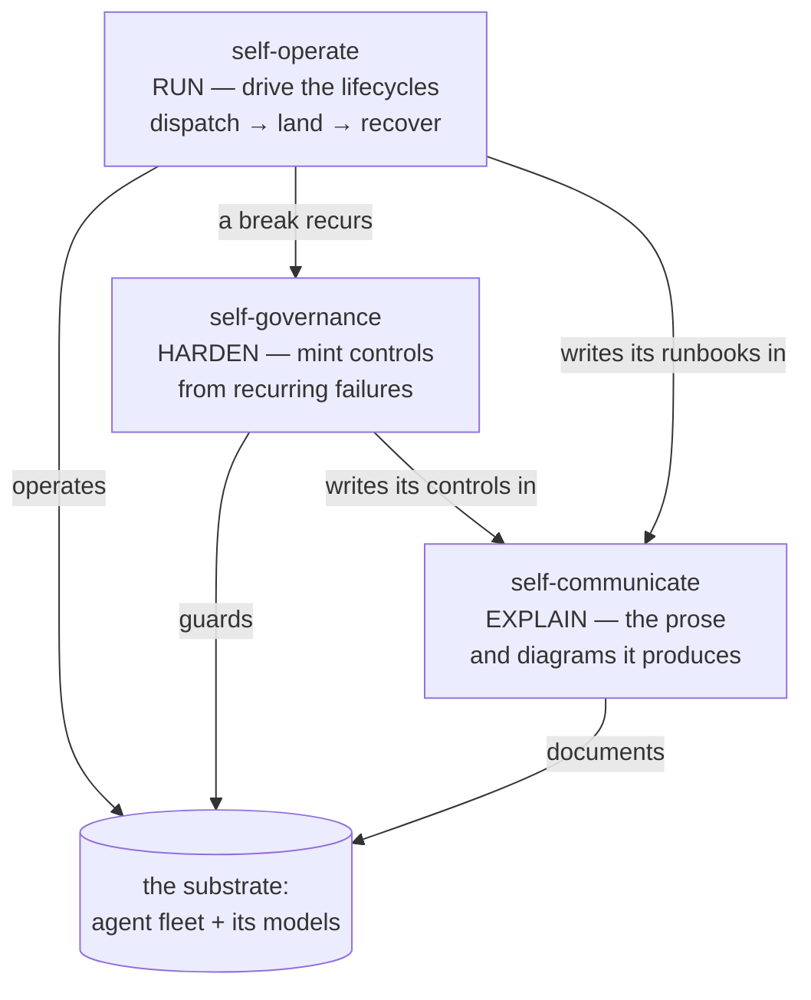
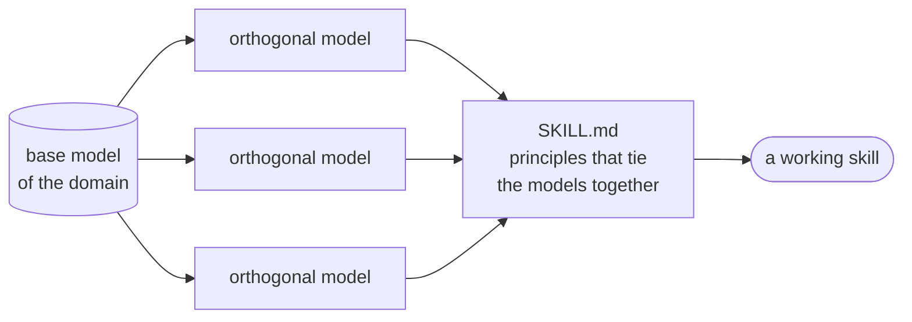

<!-- part-title: Putting It to Work -->
<!-- chapter-title: The Skills -->

# The Skills

This book is not only a methodology — it ships with batteries. There is a repository
that goes with it, and it contains three Claude skills you can install and use today:
**self-operate**, **self-governance**, and **self-communicate**. Each is the methodology
of the preceding chapters, packaged as something an agent triggers and follows. This
chapter walks all three.

The three are complements, not rivals. One hardens the substrate, one runs it, one
explains it — the same fleet seen from three angles.

## Self-operate: the lifecycles, made runnable

<!-- index-def: self-operate -->
Self-operate is the starting point, because it holds the lifecycles of running a repo —
everything an engineering team actually does. Pull a ticket and build a feature. Pull a
ticket and fix a bug. Optimize the codebase. Handle resource exhaustion. Each of those is
written down as a model — I did say models everywhere, and I meant it — because that is how
you constrain the agent's search and bias it toward doing the work the way you want.

On top of the models sit the playbooks, and there is a playbook for everything, each with
briefs for its judgment steps. This is what lets an orchestrator agent — itself running as a
reactive loop — know how to respond when an event arrives. An agent finished? Reach for the
next step: *agent landed*. Is the feature done? Open the Epic file, which lists the launches
needed to complete it, and check. Not done — launch the next item. Done — run the
definition-of-done audit over the whole Epic, the one that asks, among other things, whether
the model drifted from the code. Passes — mark it done and move it to the closed pile.
Still active — record the status and the commit that made progress, and launch the next
agent from the Epic's list. The playbook keeps the loop turning on inputs from the
environment, which is precisely the *dispatch → work → land → tombstone* lifecycle from
[Loops and Models](2.2-loops-and-models.html), now written down for the operator to run.

That definition-of-done audit exists because of one hard-won rule.

> "Done" is a claim, not a fact.

An agent reporting a task complete is describing its *intent*, not the state of your repository,
and the two drift apart constantly — a sibling change broke a test, a marker rotted, the thing
it "verified" quietly routed through a fallback. So you do not trust the claim. You re-run the
gates yourself, at HEAD, and let a fact answer where a claim was offered.

That rule is one of several the skill teaches. Three worth quoting, because they show the shape
of the whole:

> ### Self-operate — three principles
>
> - **Determinize the runnable, brief the judgment.** A runbook step is one of three kinds. If a
>   machine can do it, make it a runnable line. If it needs judgment a brief can carry, write the
>   brief. If it needs judgment no brief can carry, escalate. A runbook that blurs the three sends a
>   human to do a machine's work, or a machine to make a human's call.
> - **The lifecycle is a state machine, not a habit.** Dispatch, work, land, tombstone — an agent's
>   life is a sequence of states with legal transitions, and you write it down as one. A habit lives
>   in the operator's head and rots; a state machine names every state and the move out of it, so the
>   loop turns on events from the environment instead of on memory.
> - **Orient positive before you hunt a break.** Know the healthy baseline first — what "normal"
>   looks like for each lifecycle. Most sessions are steady-state; you cannot recognize a break
>   until you can state the shape it broke from.

## Self-governance: the catalogue and the posture

<!-- index-def: self-governance -->
The second skill, self-governance, triggers on a simple signal: a bad thing happened more
than once — sometimes just once, if it was bad enough. Recurrence is the clue that you are
either failing to *detect* the problem (you need a control, a sensor) or failing to *prevent*
it (you need architecture, a wall). You have not put the wall in the right spot, or you have
not put a badge reader on the door.

<!-- index-def: governance-catalogue -->
At its center is a catalogue of governance mechanisms and worked examples — around {{mechanism_count}}
at last count, and still growing as new failures surface new mechanisms. I did not know these
were the controls I would need until I started building and kept hitting failures; as velocity
rose, more failures and new *kinds* of failure appeared, and each mechanism I invented to kill
one went into the catalogue. The hope is that this becomes ex-ante governance for *you*: the
mistakes I made and solved, you inherit for free — install it and say "audit my codebase and
help me find room for governance." But you will find your own failures too, because you run a
different model, different constraints, different customers, different operators, and all of it
shapes your agent's behavior. So the skill ships not just the catalogue but a **posture** — the
heuristics for minting new mechanisms well.

### The posture: minting new mechanisms well

<!-- index-def: teetering-tower -->
The first heuristic is to **avoid a teetering tower of governance.** Ask how detailed the check
should really be. Is this generic or specific — do you need a lint for "never type the word X"?
Almost certainly the wrong level, but a lint that blocks typing anything is worse. Decide
whether false positives or false negatives hurt you more, because that governs which control
fits. And when you say "this must *never* happen," you are choosing architecture — a wall — and
every wall constrains the model. A well-placed wall is pure gain. A wall across the only fire
exit is a disaster the day there is a fire and no one can get to work. Because of this, the
skill will not silently enforce a mechanism without checking with you — you are the engineer who
knows the context. Its own trigger is a control at the right semantic level: a hook that fires
every thirty minutes or so in the orchestrator loop and asks, "since I last checked, did we hit
any recurring failure, or solve one problem several different ways?" Solving it several ways is a
don't-repeat-yourself smell in the code; hitting the same *process* wall repeatedly — "I failed
to create a VM," again — is a process smell. At agentic velocity you cover enormous ground in
thirty minutes, so a repeat inside that window is the signal that a mechanism is owed.

Underneath the posture sit a few reflexes the skill applies on every touch. Three of them:

> ### Self-governance — three principles
>
> - **Convert, don't just repair — audit becomes lint.** When a failure smells class-level, do not
>   only patch the instance. Build the durable control that kills the class. Today's audit finding —
>   a thing you noticed by reading — is tomorrow's lint, a thing the machine notices for you. A bug
>   in more than one file means "fix the sites *and* add the check," not "fix the sites and hope."
> - **Guidance aims; machinery holds.** A control is soft or hard. A soft one — a brief, a house-rule
>   — can *aim* a probabilistic agent but cannot block it, and it rots. A hard one — a lint, a gate,
>   a typed seam — *holds the line* regardless of whether the agent cooperates. Know which you are
>   minting, and never claim a control is enforced when you have only recommended it.
> - **Architecture before controls.** Prefer making the error impossible over catching it after. A
>   typed model with one sanctioned seam beats a validator that scolds you for using the wrong one.
>   Where a failure is costly, do both — belt-and-suspenders is a feature. But reach for the wall
>   first, and remember that every wall you raise also constrains the agent, so place it with care.

## Self-communicate: how the agent writes and draws

<!-- index-def: self-communicate -->
The third skill, self-communicate, governs how the agent explains itself — to you and to other
people. Docs are a soft control for an agent, but they are a genuine tool for humans, so the
skill carries guidance on the kinds of technical documentation, crediting the Diátaxis project
for enumerating them and the Apache Foundation for the exemplars it learns style and voice from.
It targets prose that avoids imprecise claims and the grating verbal tics, and that is as terse
as it can be without losing the reader. When the agent writes, it turns here; when it needs a
drawing, the skill says "use me," and teaches drawing in Mermaid — dropping to HTML or SVG only
when Mermaid cannot express the shape — which keeps the agent from trying to hand-generate raw
PNGs, a thing it will attempt and be bad at.

### The lexicon: one concept, one word

<!-- index-def: lexicon -->
Self-communicate also owns a **lexicon**: the house vocabulary for your repo, so one concept gets
one word, used consistently. You can bootstrap it — point the skill at existing material and have
it walk the repository, surface the terms you use with specific meaning, and write down the
working definitions. That walk tends to catch two failures at once: different words for the same
concept, and the same word for different concepts. Both confuse any reader, human or agent, and
finding them may show you mistakes in your own thinking. "There are actually two concepts here —
help me name them." Now they have names, and you can retrofit structure onto the writing — which
is, exactly, the code problem from [Brownfield](5.1-brownfield.html), wearing different clothes.

The lexicon is one specialization of a stance the skill carries into both legs. Three of its
principles govern the whole:

> ### Self-communicate — three principles
>
> - **Less is more — the representation must not distract from the idea.** In prose that means
>   Hemingway: cut the fluffy adjective, the qualifier, the sentence that restates the last one. In
>   drawing it means Tufte's data-ink ratio and Picasso's *Bull* — strip the chartjunk, the gradients
>   and bevels that decorate without informing, until only the marks that carry the idea remain.
> - **Name the concept, then use the name.** A name is a handle: it carries a concept's meaning and
>   its constraints in one token. In prose, reach for the established term — say "circuit breaker,"
>   not a fresh paragraph re-deriving one. In drawing, reach for the format's native construct — an
>   SVG `<marker>` with `orient="auto"` *is* an arrowhead; it rotates to its line and pins to the
>   endpoint, so it cannot land crooked the way a hand-stitched triangle can. Use the marker.
> - **Decide the doc's mode before its sentences.** A doc is a tutorial, a how-to, a reference, or an
>   explanation — the four Diátaxis shapes — and it is exactly one of them. A how-to written as an
>   explanation confuses the reader who wanted steps. Fix the shape first; the prose follows.

Those are the three skills that ship with the book. I hope they are of use.

## The construction recipe is a pattern of its own

Here is what makes the three feel of a piece: they were all built the same way. Three layers, every
time. A **base model of the domain** at the bottom. **Orthogonal models** layered on top — cuts
through the base along independent axes, each adding a dimension without disturbing the others. And a
top-level **`SKILL.md` of principles** that ties the models together and tells the agent when to reach
for which. Set the three skills side by side along those layers and the shared skeleton shows through.

**self-operate** — the *operate* leg.

| Layer | For this skill | Remark |
|---|---|---|
| **Base model** | the lifecycles a repo runs — dispatch, land, recover, deploy, reclaim | the base is the work an engineering team actually does, written down |
| **Orthogonal models** | runbooks (typed steps), the lifecycle state machine, event-bus observability | each cuts the base a different way — one names the states, one names the steps, one names the signals |
| **`SKILL.md`** | orient-positive-first, route-a-break-to-its-class, hand a recurrence to self-governance | ties the models into a loop that turns on events from the environment |

**self-governance** — the *harden* leg.

| Layer | For this skill | Remark |
|---|---|---|
| **Base model** | the catalogue of governance mechanisms — around {{mechanism_count}} failure-killing patterns | the base is a census of failures and the control each one earns |
| **Orthogonal models** | soft-vs-hard enforcement, the agent / models-bridge target axis, the form taxonomy | independent axes over the same catalogue — a mechanism has a target *and* a form *and* an enforcement |
| **`SKILL.md`** | convert-don't-repair, architecture-before-controls, right-size the fix | the posture for minting a new mechanism well, so the catalogue grows without teetering |

**self-communicate** — the *communicate* leg.

| Layer | For this skill | Remark |
|---|---|---|
| **Base model** | the crafts of engineer-facing prose and technical drawing | the base is two legs — words and shapes — not one |
| **Orthogonal models** | rhetoric, Diátaxis doc-shapes, the lexicon, voice, the diagram vocabulary | each is a separable cut: a doc has a *shape* and a *voice* and a *vocabulary*, chosen independently |
| **`SKILL.md`** | less-is-more, name-the-concept-then-use-the-name | two stances that specialize per leg — cut the adjective in prose, cut the chartjunk in a diagram |

Once you see it laid out, it reads as obvious — of course that is how you build one. That is the sign
of a pattern worth naming.

[Appendix E](appendix-skill-recipe.html) draws the recipe out step by step, with self-operate,
self-governance, and self-communicate as its three worked examples — so the payoff of seeing the
shape here is a working procedure there.

> **Left for later: the team dimension.** This book is written as "you and your agents," but
> production software is built by teams, and the team dimension is its own chapter. A model that
> governs one person's work has to become a shared artifact — reviewed, owned, and defended by
> more than its author. Review changes shape when an agent wrote the diff: who reads it, and
> against what. And when a model drifts, someone has to own the reconciliation. Those are real
> questions with real answers, and they are not this book's. This is a field report and a method,
> not a survey of team practice, so I mark the boundary here rather than gesture past it.
