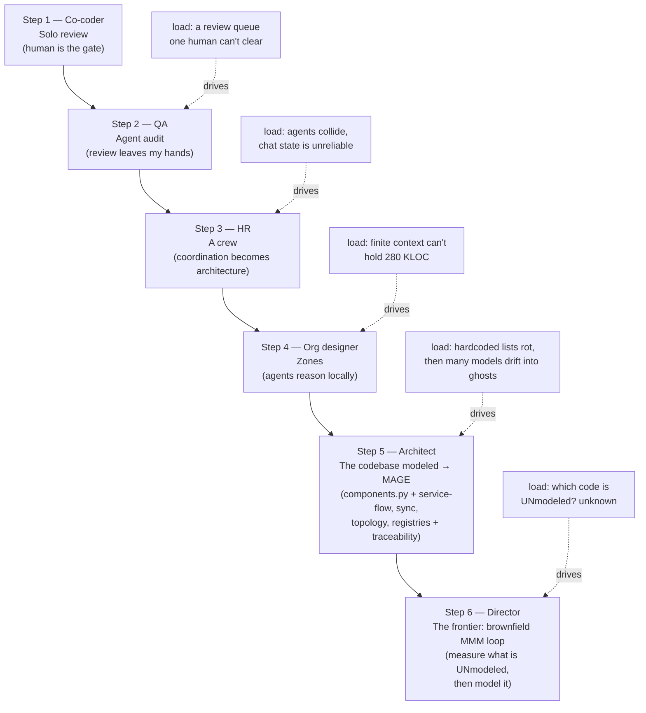

<!-- part-title: The Context -->
<!-- chapter-title: The Road to MAGE -->

# The Road to MAGE

The MAGE methodology emerged from months of work with coding agents.
I initially expected to just prompt the agents and have them make what I wanted.
As my ambition grew, I found that insufficient, and I accumulated more and more of the method.
Every model, every constraint, every sensor in the built system arrived the same way:
  a growing codebase and a rising quality bar demanded it, and I minted the smallest thing that met the demand.
Then the system grew again, and the bar rose again; the current system proved inadequate, and the next thing was demanded.
MAGE is the name for what was left standing after enough of those rounds.

What follows walks the order in which the pieces appeared.
You should read it as a staircase. Each step is a response to a load the step before it could no
longer carry. Watch the job title climb as you go — co-coder, QA, HR, org designer, architect,
director — each rung a job the one before it could no longer do, and each one handed off only
because the step below had made it safe to let go.

> ### Why the job title climbs
>
> The whole ladder rests on one hinge, and it is **governance**. Every rung is a successive delegation. I hand
> the agents a piece of the *tactics* — write this code, audit that diff, run this zone — and keep
> the *strategy* for myself. That handoff is only safe because a control caught what the delegation
> would otherwise have dropped. A lint reddens on the boundary I stopped watching; a gate
> refuses the commit I stopped reading; a model the fleet reasons through means I no longer have to
> hold the map in my head. Governance is what makes it safe to let go — so delegation climbs exactly
> as far as the controls will carry it, and no farther.
>
> Get the governance wrong and the ladder runs in reverse. The controls that were supposed to catch
> the dropped thing miss it, the misses surface days later in some downstream gate, and I am pulled
> back down into the tactics to firefight. I am reading diffs again, chasing a drift the
> map no longer shows, with no one left minding the strategy. That is the *Claude is the fastest road to
> hell* principle at fleet scale: the same speed, now pointed through a governance gap instead of riding atop,
> carrying the whole crew downhill as fast as it once carried them up.

## [role: Co-coder] Step one — I reviewed everything myself

At the start there was one document format, a few hundred lines, and me. When the agent
proposed a change I read the diff, decided it was right or wrong, and merged it. That is
the whole method in the first week: a human is the quality gate. It works, and it works
precisely because the volume is small enough that one person can hold the whole thing in
his head and say yes or no to every line.

The obvious trouble with that gate is that it does not scale.
It takes too much code to build a real system, and agents can write that code far faster than a human can review it.
The first crack was thus a queue — work finished faster than I could bless it, and I became the bottleneck.

## [role: QA] Step two — I dispatched an agent to audit the work

The first offload was to hand the review itself to an agent. Instead of reading every diff,
I dispatched a second agent to audit the first one's work and report what it found. Now the
*checking* of the work had left my hands and entered the fleet. The human stopped being the
reviewer of record and started being the reviewer of the reviewer.

That move taught a lesson. A test or an audit is not
a chore bolted onto the work — it is a **control**, a discrete artifact that fires on a
violation so a failure caught once is caught every time after. An *audit* is the weakest
kind of control, because it is expensive, deferrable, and after-the-fact. It runs when I remember to
run it, over a codebase that has already drifted. The audit worked, but it planted a
question that drove everything downstream: which of these audit findings could become a
*lint* — deterministic and cheap static analysis — so I never had to look for that class of failure again?
Today's audit finding is tomorrow's lint. 

## [role: HR] Step three — one agent became a crew

Then I stopped dispatching one agent and started dispatching several at once. The moment
there is more than one agent in flight, a new problem exists that did not exist before:
coordination. Two agents editing the same file collide. A finished agent's work has to be
landed before a dependent agent starts, or the second one builds on a base that is already
stale. The fleet, once it is a fleet, has to be *run*.

The earliest hard lesson here was that a conversational agent cannot be trusted to run
itself. Asked to schedule its own work, track its own state, and narrate its own progress, a
chat agent collapses six distinct states — planned, briefed, submitted, running, completed,
landed — into one prose register, so a *prepared* brief reads as *executed* work and a
permission-rejected dispatch gets narrated as progress. The coordinator lies, not from
malice, but because language is not state. The fix was not to give the agent more autonomy
in chat. It was to pull the fleet's real state out of the conversation and into durable,
inspectable artifacts the orchestrator reacts to rather than reasons about.

That is the seed of an event-driven reactor: the plan says what *should* unlock, the
substrate with authority says what *did* unlock, and the orchestrator acts at their
intersection. Coordinating a fleet of semi-reliable agents is not glue. It is an architecture
in its own right — one I had to design, and one that matured over weeks from that first shout
at the machine to a policy-driven worker pool borrowed, ten years late, from an operating
system's thread-pool design. The crew created a coordination problem, and the coordination
problem created a substrate.

What does "running the fleet" look like on the page? It looks like a **brief** — a typed
work order the orchestrator hands to one agent. A brief is not a chat message. It carries a
role, a compute class, a set of files the agent may touch, and a commit discipline, so the
substrate can schedule it, fence it, and hold it to its lane. Here is the head of a real
standing brief — one the orchestrator re-dispatches whenever it needs a fresh full lint
count:

<!-- inset: A standing brief — the lint-all baseline runner -->
```markdown
# Brief: lint-all baseline (REUSABLE standing brief — CORE only)

**Purpose (reusable):** run a FULL `lint-all` over the tree and emit a fresh baseline JSON
so the scorecard / orchestrator reads an accurate current BLOCKING count.

<!-- subagent-type: general-purpose -->
<!-- model: sonnet -->
<!-- compute-class: lint-all-explicit -->
<!-- role: lint-runner -->

## Discipline
- Role `lint-runner` (allowed to run lint-all; acquires the host flock — if a pre-commit
  lint-all is running, WAIT). Rule #44: exactly one `lint-all-explicit` brief in flight.
- Hard cap 1200s (full lint sweep).
```

Three of those metadata lines carry the coordination story. `role:
lint-runner` says which *kind* of worker this is — a read-only measurer, not a code writer.
`compute-class: lint-all-explicit` plugs the brief into the resource scheduler, and the rule
it cites next enforces that *at most one* such heavy job runs at a time, so the fleet does not
eat its own machine. And `WAIT` is the fleet acknowledging shared state: this job takes a host
lock, and if another already holds it, this one blocks rather than collides.

A code-writing brief carries one more discipline the measurement brief does not — **worktree
isolation** — the one rule that lets many agents write at once without trampling each other:

<!-- inset: The rule that lets many agents write at once -->
```markdown
**WORKTREE PATH RULE** — your worktree is the directory where the harness started you.
Discover it with `pwd` as your very first Bash call; it is NOT hard-coded in this brief.

    export ADA_TOOL_AGENT_WORKTREE_ROOT="$(pwd)"
    [[ "$(pwd)" == */.claude/worktrees/agent-* ]] || { echo "ERROR: not in a worktree"; exit 1; }
```

Each code agent works in its own git worktree — a private checkout on its own branch — so two
agents editing "the same file" are really editing two copies, and their work is reconciled by
a merge step the substrate owns, not by luck. The agent discovers its own worktree at boot
rather than being told where it is, because the harness allocates the directory, and a brief
that hard-coded the path would be wrong the moment the harness chose a different one. That is
what "the fleet has to be run" cashes out to: typed briefs, role lanes, a resource scheduler,
host locks, and one private worktree per writer.

## [role: Org designer] Step four — zones, so an agent can reason locally

A crew that coordinates is still a crew of agents each of whom has to understand the code
it touches. And here the agent's nature bites. A cold-start agent with a finite context
window cannot reach the tacit knowledge a human team keeps in its collective head — which
file is canonical, what this module *means*, which of two look-alikes is the live one. A
human learns that by working in the codebase for months. An agent arrives knowing nothing
and has to be *told*, in the code, every time.

The answer was to partition the system into named **zones** — a model that says, out loud
and in a queryable form, what the parts are and where their boundaries lie. Once the system
is carved into zones, an agent can be handed one zone, reason inside it locally, and be
fenced from the rest. A boundary lint can then refuse an edit that reaches across a zone it
has no business touching. The zone model turns "understand the whole 280-thousand-line
codebase" — which no finite-context agent can do — into "understand this zone," which it can.

A zone is a small typed record. Here are two real ones — the PDF and PowerPoint object
models, side by side:

<!-- inset: Two zones, side by side -->
```python
Component(
    name="pdf-model",
    focus_dirs=(RepoRelPath("backend/src/AdaTool.PdfModel"),),
    boundary_kind="internal",
    external_seams=("pdf-lib",),          # the canonical PDF library — this zone alone
    description="PDF object model + typed mutators",
),
Component(
    name="slides-model",
    focus_dirs=(RepoRelPath("backend/src/AdaTool.SlidesModel"),),
    boundary_kind="internal",
    external_seams=("openxml",),          # the Office library — this zone alone
    description="PPTX Office-XML model + typed mutators",
),
```

Read `external_seams` and the whole discipline is legible. The `pdf-model` zone is the *only*
one allowed to reach the canonical PDF library; `slides-model` is the only one allowed to reach
the Office library. A boundary lint reads that field at check-time and reddens on any file
outside the `pdf-model` zone that imports the PDF library directly — the "one typed model per
format" rule from the built-system chapter, enforced not by vigilance but by a zone declaration
a machine walks. The agent working the PDF zone is handed `focus_dirs` as its lane and
`external_seams` as its permission slip, and it cannot wander.

The zone model is the first piece of MAGE proper, because it is the first time I wrote down
a *model of the system's own structure* for the fleet to read, rather than a piece of the
product. It exists for the agents, not for the users.

## [role: Architect] Step five — the codebase modeled, from components.py to MAGE {#refactor-cost}

This is the step where I stopped writing code and started designing the system the fleet
reasons *through*. It has one shape with three movements: a first model the fleet reads at
runtime, a set of sibling models that grew up around it, and a substrate that keeps all of
them honest. Together they are MAGE.

The first movement was to make the zone model a file the fleet reads at runtime. That is where
the method crosses from *documenting* the structure to *executing* on it.

A typed registry of the system's own components — its zones, their focus directories, the
seams each one is allowed to cross — is not documentation *about* the architecture. It *is*
the architecture, in a form a tool can query. The zone I showed above is one row of it; the
row's *shape* is a frozen dataclass:

<!-- inset: The registry the fleet reads -->
```python
@dataclass(frozen=True)
class Component:
    """One system component."""
    name: str
    focus_dirs: tuple[RepoRelPath, ...]
    tags: frozenset[str] = field(default_factory=frozenset)
    kind: str = "leaf"                                      # leaf | group | meta
    external_seams: tuple[ExternalSeam, ...] = ()           # the powerful libs it may reach
    import_allowed_components: tuple[ComponentName, ...] = ()  # who it may import
```

Every field is a machine-readable answer to a question an agent would otherwise have to guess.
`focus_dirs` answers "what files are in my lane?" `external_seams` answers "which powerful
library am I permitted to touch?" `import_allowed_components` answers "who am I allowed to
depend on?" When a lint needs to know "which components may cross which external boundary," it
does not hardcode a list that rots — it reads `external_seams` at lint-time. When the
dispatcher needs to know which files a brief may touch, it reads `focus_dirs`. When context has
to be injected into an agent's prompt, the question stops being "which files do I paste?" and
becomes "what durable artifact should exist so the right context is *selectable
deterministically*?"

The payoff was concrete and it compounded. Adding a single typed field to that registry —
one field naming which components cross an external boundary — replaced four hand-maintained
allowlists that were quietly drifting and unlocked three new lints all reading the same field.
On its first run it surfaced roughly eighteen hundred latent violations no one had a way to
ask about before. The type named a previously-anonymous shape, and the named shape became a
question you could pose to the whole codebase at once. The reflective codebase *is* the agent
substrate. The more the system knows about itself, the less the agent has to guess.

There is a reason this step was affordable.
Somewhere back around step three, refactoring stopped being expensive. A cross-format
migration that touched fifty-eight files and rewrote five thousand lines — the kind of change
I might once have deferred — took about five hours of agent time over a dinner
break. When the mechanical cost of restructuring collapses, the economics of architecture
invert: postponing the right shape becomes the expensive choice, and building the right model
becomes something you can do the moment you see you need it. The hard part was never touching
fifty-eight files; it was knowing that fifty-eight files should be touched. The mechanics went
free. Deciding *which* model to build did not.

### More models, accreting

Once that first model paid off, the others followed the same way — each minted when a growing
system and a rising bar demanded it, none planned in advance.

- **A service-flow model** appeared when the back end became enough services that no one could hold the event wiring in their head — which handler reacts to which topic, what the durable-versus-transient split is. Modeling it is what later made a hard re-platforming close to a change of deployment target.
- **Synchronization contracts** appeared when concurrent agents and concurrent workers started tripping over shared state, and the invariants that had lived only in prose had to be encoded where a checker could walk them.
- **A deployment-topology model** appeared when the system ran in more than one place and the boot-time environment each service needs stopped fitting in anyone's memory.
- **Domain registries** — the closed edit vocabulary, the remediation verbs, the mutator stamps — appeared each time a set of strings wanted to be a typed, enumerable thing a lint could hold closed.

None of these was drawn from a master diagram. Each was the smallest model that met a real
load. But a pile of models has a failure mode of its own, and it is the one that turns a map
into a lie: **drift**. A model that names a code symbol goes stale the moment that symbol is
renamed, deleted, or moved, and nothing notices — the model still *looks* authoritative while
pointing at a ghost. The fleet reads the ghost as truth, and the blow-up lands days later in
a downstream gate instead of at the change that caused it.

### The substrate that keeps the models honest

So the models grew a nervous system. A traceability substrate links every model to its lint,
its code entry-point, its proof, and its sibling models as a typed graph whose every edge is
a *derived* obligation a lint re-checks against a resolvable symbol — never a snapshotted line
number. Derived edges defend; snapshotted ones drift. That graph is what keeps the map equal
to the territory, which is the only condition under which a context-bounded agent can safely
operate a context-exceeding codebase *through* the models. The typed models, the substrate
that keeps them honest, and the query surface the fleet reasons through — together these are
MAGE.



*Accessible description: a six-step staircase, each step driven by a load the previous step
could no longer carry, and each step labelled with the engineer's climbing title. Step one,
Co-coder: solo review, overwhelmed by a review queue, gives way to step two, QA: an agent
audit. Step three, HR: the audit becomes a crew, whose collisions and unreliable chat state
force coordination to become a designed architecture. Step four, Org designer: finite agent
context forces the code into zones. Step five, Architect: hardcoded lists that rot, and then a
growing set of models drifting into stale ghosts, force the codebase to be modeled — a
reflective components registry, sibling models for service-flow, synchronization, topology and
domain registries, and a traceability substrate that keeps them honest; together these are
MAGE. Step six, Director: the current frontier, a brownfield loop that measures which code is
still unmodeled and models it.*

## [role: Director] Step six — the frontier, and it is brownfield

Here is the newest work, and it is not finished as I write this — so read it as the road's
current edge, not a landed result.

Every model so far was built the same way: I noticed a load and modeled it. That is a
*supply-side* method — it models what I happen to see. The obvious question, once there are a
dozen models and a traceability graph, is the one I could not answer: **what is still
unmodeled?** A greenfield method invents the models it wants up front. A **brownfield** method
inherits a large, already-built system and has to *discover* the models the system already
implies but nobody has drawn yet. That is the situation I am actually in, and it needs a
different instrument.

The instrument is a metric that is the dual of test coverage. Ordinary coverage walks
model-to-code: for each model node, is it tested? This one walks the other way,
**code-to-model**: start from a test, reach the production code it exercises, and ask whether
any of that code traces up to a model node. A test whose exercised code reaches *no* model
node is an **orphan** — and the orphans, clustered by the unmodeled code they run through, are
a candidate list of *missing models*. It is negative-space modeling: instead of asking "is my
model tested," it asks "what am I running in production that no model has ever named?" On its
first pilot over the dispatch subsystem, more than half the tests came back orphaned. That
number is not a bug. It is a map of where the models aren't.

That map drives a loop — the one underway now. Measure the orphan rate. Rank the biggest
orphan clusters. For the largest, found a modeling Epic and drive it to a strong typed model
under a real design review. Re-measure. Take the next cluster. Repeat until the unmodeled
fraction falls past a threshold, or until a cluster resists — in which case park it, note why,
and move to the next, because a hard cluster must not stall the loop. The first turns have
already minted models for the persistence layer, the cost-and-subprocess pipeline, and the
chunking-and-merge path, and each new model serializes onto the same shared model file the rest
of MAGE lives in. The loop is measurement-driven modeling on an existing system: the metric
finds the gap, a designed model fills it, the metric confirms the fill, and the gap list
shrinks.

The method began with a human reviewing every line, and it has arrived at a system that
measures its own modeling completeness and dispatches work to close the gap it finds — a
codebase modeling *itself*, brownfield, in a loop. MAGE was never designed. It was demanded,
step by step, by a system that kept growing and a bar that kept rising, and the newest step is
the system finally turning the method's own instruments back on the parts of itself it had not
yet named.
