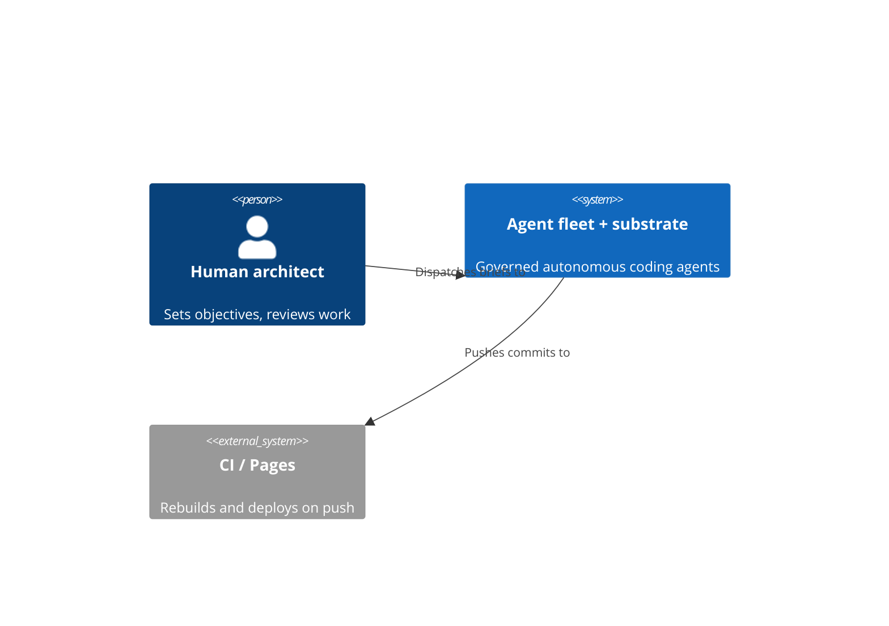
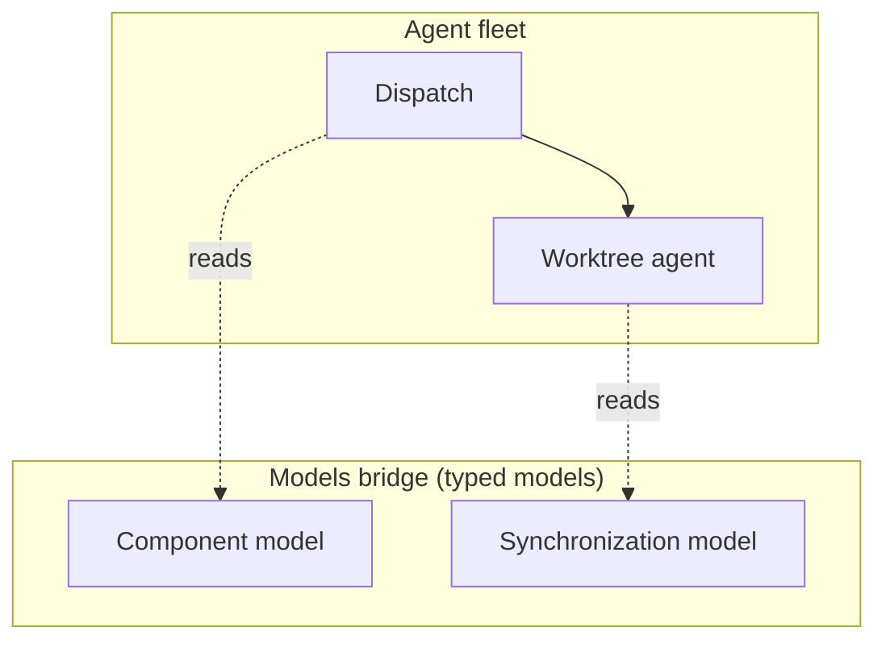
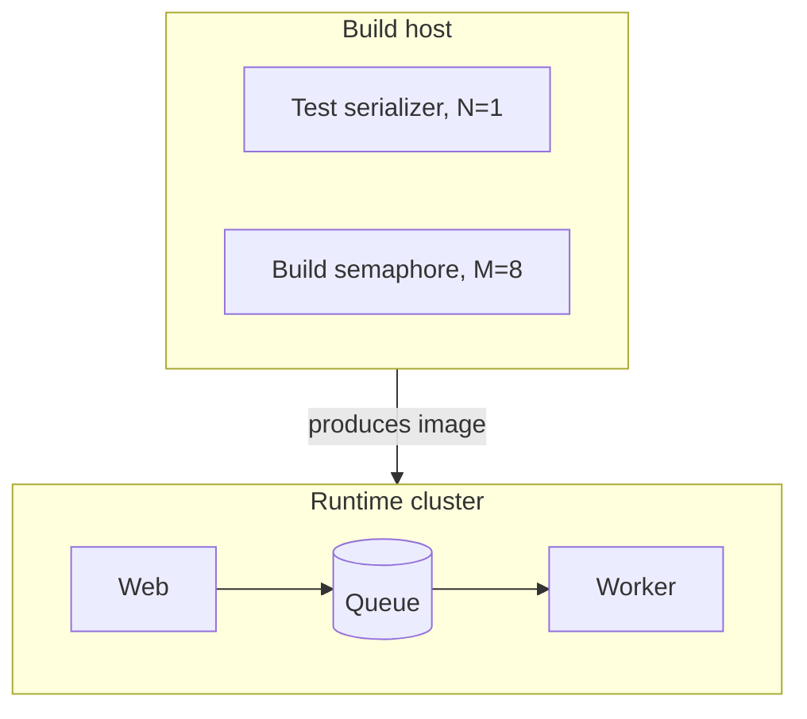
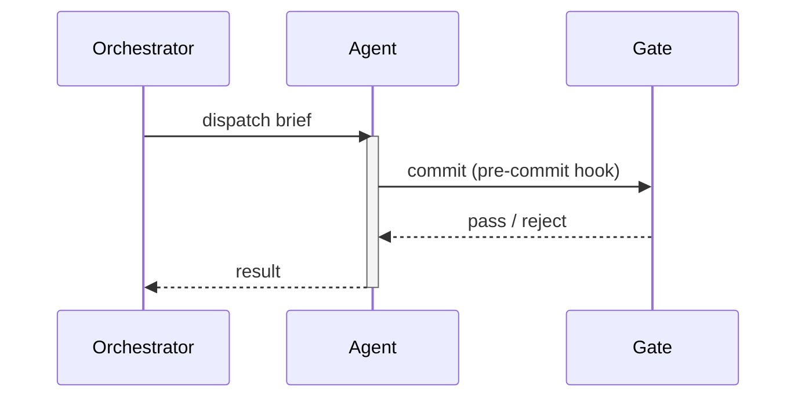
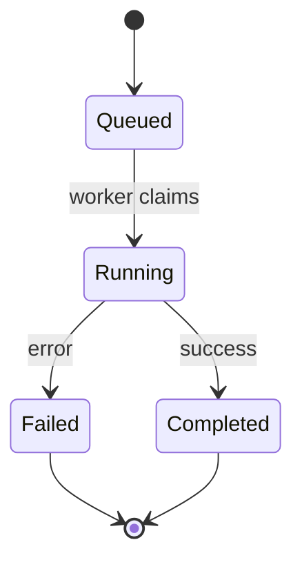
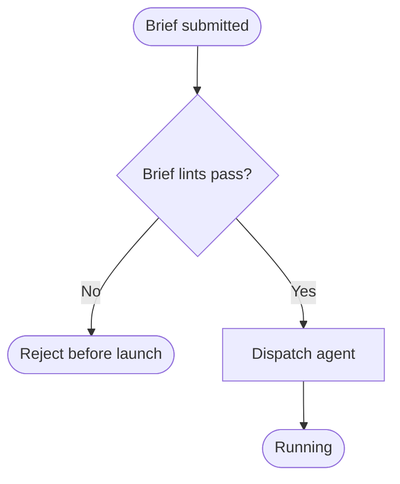
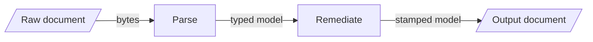
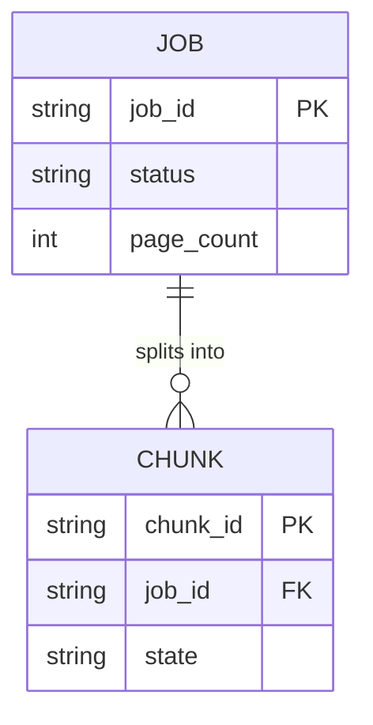
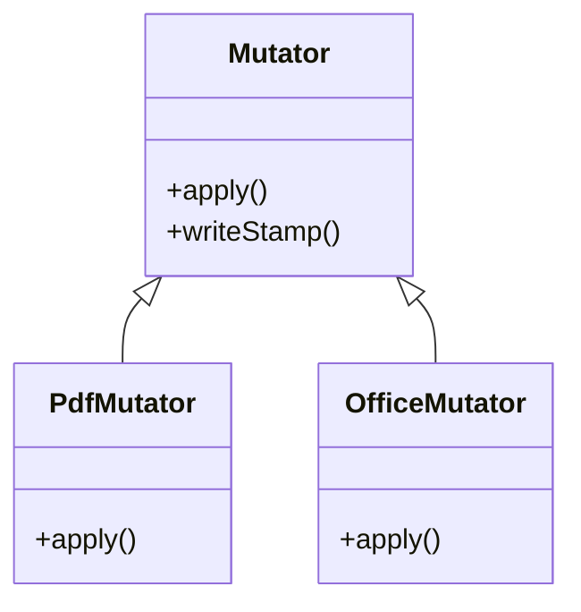

# diagrams.md — technical-diagram types and how to realize them

This is an **agent-facing** style doc (the drawing leg of the `self-communicate` skill, alongside the writing files), not a catalogue entry.
It is not rendered to HTML or served. It is the **visualization leg** of
self-communicate: the standard technical-diagram types, when to reach for each, and how to realize one.

Read it alongside its prose siblings — [`../writing/engineering.md`](../writing/engineering.md) (the
engineering-discourse layer: Diátaxis modes, docs-as-code), [`../writing/voice.md`](../writing/voice.md) (the
target register), [`../writing/rhetoric.md`](../writing/rhetoric.md) (the prose device toolkit), and
[`../writing/lexicon.md`](../writing/lexicon.md) (term discipline). Prose carries the argument; a diagram carries
the *shape* — a structure, a flow, a lifecycle, a schema. When the thing you are explaining has a shape,
draw it.

---

## Realization rule — Mermaid first, HTML/SVG only when it can't

**Author the diagram in [Mermaid](https://mermaid.js.org/) unless the layout genuinely needs a hand.**
Mermaid is text: an agent writes the diagram source directly in a fenced ```` ```mermaid ```` block, the
same way it writes a code sample. That text renders inline on GitHub and in most Markdown viewers, lives
in the same file as the prose it supports, and diffs like code. It fits docs-as-code — the diagram is
reviewed, versioned, and regenerated in the same pass as the paragraph beside it, so it can't silently
fall out of date the way a checked-in `.png` exported from a drawing tool does.

**Drop to hand-authored HTML / inline SVG only for a bespoke layout Mermaid cannot express.** The escape
hatch is real but narrow: reach for it when the picture needs precise spatial control Mermaid's
auto-layout won't give — overlapping zones, a custom legend, a non-graph geometry, a figure that is as
much an infographic as a diagram.

The canonical example is the catalogue's own landing figure — a hand-authored **"Y"** that draws one
method forking into a product-facing arm and an orchestration-facing arm over a shared spine, as
full-width inline SVG, because the fork-with-a-straddling-spine geometry is not a tree, a flowchart, or
any Mermaid graph shape. That figure earned the drop to SVG. Most diagrams do not; **default to Mermaid,
and justify the escape.**

- **Reach for Mermaid when:** the diagram is a graph, sequence, state machine, ER schema, or class model
  — anything with nodes and edges an auto-layout can place. This covers almost every case.
- **Drop to HTML/SVG when:** you need spatial control Mermaid won't give (custom zones, overlays,
  legends, a non-graph geometry). Cite the reason in a comment so the next reader knows it was a choice,
  not a default. See the accessibility section below — a hand-authored SVG carries its own a11y burden.

---

## Less is more — the simplest form that carries the idea

The drawing leg of the skill's governing stance (SKILL.md, §"The governing stance: less is more"): **a visual
aid is the simplest form that carries the idea.** Tufte's data-ink ratio and Picasso's *Bull* name the
discipline — every mark on the page should earn its place by carrying part of the idea; strip the marks that
only decorate.

- **Pick the simplest type that carries the shape.** Before a C4 four-box context diagram, ask whether a
  one-line "A → B → C" flow says the same thing. A three-node point is a sentence, not a diagram; two nodes
  and an arrow are often enough. The eleven-plate *Bull* reduces a bull to a few lines because each removed
  line was one the idea could spare — reduce a diagram the same way, and stop at the plate where the next
  cut would lose the thing.
- **Strip the chartjunk.** Drop the ornament that decorates without informing — gratuitous color, gradients,
  3-D bevels, drop shadows, redundant gridlines, a legend for two colors a label would name. Mermaid's plain
  default *is* the low-chartjunk choice; do not reach for custom styling to dress a diagram up. Color should
  carry a distinction (and never carry it *alone* — see the accessibility section), not brighten the picture.
- **Do not elaborate when simple works.** A ten-node diagram with three-word labels that a reader can't parse
  on one look is usually two clearer diagrams, or one prose sentence plus a three-node picture of the part
  that has a real shape. The failure is drawing more than the idea needs, not less. When you are tempted to
  add a node, an annotation, or a second color, ask what part of the idea it carries; if the answer is
  "none, it looks more complete," cut it.

This is the visual twin of the prose economy rule in [`../writing/voice.md`](../writing/voice.md)
(§"Economy — less is more"): there, cut the fluffy adjective; here, cut the decorative mark. The
[`../writing/audit.md`](../writing/audit.md) procedure flags an over-elaborate diagram in its visualization
pass.

---

## The diagram vocabulary

The types below are locked. They group into **structure** (what the system *is*), **behavior** (what it
*does* over time), and **data** (what it *stores*). For each: what it shows, when to reach for it, when
not, and a minimal, correct Mermaid example.

### Structure — what the system is

#### C4 (context / container / component)

The [C4 model](https://c4model.com/) draws architecture at four zoom levels; you pick the level, not draw
all four. **Level 1 — System Context:** your system as one box, with the users and external systems it
talks to. Draw it to fix scope. **Level 2 — Container:** the deployable/runnable units inside your system
(a web app, a worker, a database, a queue) and how they communicate. Draw it for the high-level technical
shape. **Level 3 — Component:** the major parts inside one container. Draw it to explain one container's
internals. **Level 4 — Code** (classes) is rarely worth drawing by hand — use a class diagram if you need
it.

- **Reach for it when:** you are orienting a reader to an architecture — a new service, a subsystem, the
  whole system's place among its neighbors. Pick the *coarsest* level that answers the question.
- **Not when:** you only need to show one interaction (use a sequence) or one lifecycle (use a state
  diagram). C4 is for standing structure, not for a flow.

Mermaid's C4 support is **experimental** — the syntax may change across releases. For a stable Level-1
context it is fine; for finer levels a component diagram (below) is often the safer choice.



#### Component diagram

A component diagram shows the internal parts of one system or container and the wiring between them. In
Mermaid, realize it as a `flowchart` with **subgraphs** marking boundaries (a container, a zone, a tier).
This is the workhorse for "here are the pieces and how they connect" when C4's experimental syntax is more
than you want.

- **Reach for it when:** you are showing a fixed set of parts and their connections — the components of a
  pipeline, the seams between modules, a models-bridge component/zone map.
- **Not when:** the emphasis is *ordered* interaction over time (sequence) or a single entity's states
  (state). A component diagram shows *what connects to what*, not *what happens first*.



#### Deployment topology

A deployment diagram shows *where things run* — which process sits on which host, cluster, or tier, and
what talks to what across those boundaries. Realize it as a `flowchart` whose **subgraphs are the
runtime boundaries** (a cluster, a node, a network zone). It answers a different question from a component
diagram: not "what are the parts" but "where do the parts live."

- **Reach for it when:** the runtime placement matters — a service that must run on one host, a lock held
  per-machine, a queue crossing a network boundary, a "this cluster owns this prefix" invariant.
- **Not when:** placement is irrelevant to the point. If the reader doesn't need to know *where* a part
  runs, a component diagram is simpler.



### Behavior — what the system does over time

#### Sequence diagram — interactions over time

A sequence diagram shows a set of participants exchanging messages in order down the page. Time flows top
to bottom; each arrow is one message. It is the right tool when the *ordering* of a cross-actor exchange
is the content — a request/response, a handshake, a protocol.

- **Reach for it when:** you are explaining a multi-actor interaction where order matters — a client
  calling a service that calls a store, a dispatch handshake, a commit-then-verify exchange.
- **Not when:** there is only one actor (use a flowchart or state diagram), or the parts don't
  interact in a fixed order (use a component diagram).

Solid arrow `->>` is a call; dashed arrow `-->>` is the return. `activate`/`deactivate` (or the `+`/`-`
shorthand on an arrow) shows when a participant is doing work.



#### State diagram — lifecycles

A state diagram shows one entity moving through a fixed set of states via labeled transitions. `[*]` marks
the start and end. It is the right tool for a lifecycle — a job, a worktree, an agent — where the value is
seeing *which states exist* and *which transitions are legal* (and, by absence, which are not).

- **Reach for it when:** you are documenting a lifecycle with named states and constrained transitions —
  exactly the shape a code state machine encodes. Draw the states an entity can be in and the events that
  move it.
- **Not when:** the "states" are really steps in a linear procedure with no branching or return (a
  flowchart reads better), or when the emphasis is interaction between actors (sequence).



#### Flowchart — control and decision flow

A flowchart shows control flowing through steps and **decisions** (the diamond). It is the most general
and most over-used type: it fits any "do this, then check that, then branch" procedure. Reach for it when
the content is a decision-bearing process; do **not** reach for it as a default when a more specific type
(sequence, state, ER) fits the shape better.

- **Reach for it when:** the point is a branching procedure or decision logic — a triage rule, a gate's
  pass/fail path, an "if X then Y else Z" the reader must follow.
- **Not when:** a more specific type fits. Ordered actor messages → sequence. A single entity's
  lifecycle → state. Standing structure → component. A flowchart used where a state diagram belongs hides
  the fact that the "steps" are really states.

Node shapes carry meaning: `[rectangle]` a step, `{diamond}` a decision, `([rounded])` a start/end.



#### Data-flow

A data-flow view shows *data* moving through transforms — a source, the stages that reshape it, and the
sink. It differs from a control flowchart: the edges carry *data*, not *control*, and the labels name what
flows, not what decides. Realize it as a `flowchart` (usually left-to-right) whose edge labels name the
data on the wire.

- **Reach for it when:** the story is a pipeline — input reshaped through stages to output, where the
  interesting content is *what data crosses each edge* (a document, a JSON blob, a rendered page).
- **Not when:** the branching decisions matter more than the data (control flowchart), or the stages are
  standing components you're not tracing data through (component diagram).



### Data — what the system stores

#### ER / schema diagram

An entity-relationship diagram shows the entities (tables), their attributes, and the cardinality of the
relationships between them (one-to-one, one-to-many). It is the reference picture of a data model. In
Mermaid, crow's-foot cardinality reads outside-in: `||` exactly one, `o{` zero-or-more, `|{` one-or-more.

- **Reach for it when:** you are documenting a persistent data model — a database schema, a set of typed
  records and how they relate. This is *reference* material (see the Diátaxis tie-in below).
- **Not when:** the relationships are behavioral, not structural (a class diagram carries methods; ER
  carries only data), or when there is one entity with no relationships (just describe it in prose).



#### Class diagram

A class diagram shows types with their members and methods, and the relationships between types —
inheritance (`<|--`), composition (`*--`), aggregation (`o--`), association (`-->`). It carries *behavior*
(methods) that ER does not. Use it to document an object model — the classes in a subsystem and how they
compose.

- **Reach for it when:** the design is object-oriented and the *types and their relationships* are the
  content — a typed model's class hierarchy, the shape of a set of records with methods.
- **Not when:** you only need the data shape (ER is simpler and reads as reference), or when there is no
  meaningful relationship between types to draw.



---

## Three tie-ins

### 1. Diátaxis mode ↔ diagram type

The [Diátaxis](https://diataxis.fr/) mode of a passage predicts which diagram it wants — the same modes
that structure the engineering register in [`../writing/engineering.md`](../writing/engineering.md).

- **Explanation** (orienting a reader to how something works) pulls **structure and state** — a C4 or
  component diagram for the architecture, a state diagram for a lifecycle. Explanation earns a claim by
  showing the *shape* of the thing.
- **How-to** (getting a task done) pulls **sequence and flow** — a sequence diagram for an interaction,
  a flowchart for a decision procedure. A how-to shows the reader the path.
- **Reference** (looking a fact up) pulls **ER / schema and class** — the data model, the type
  relationships. Reference defines; a schema diagram is a definition in picture form.

Match the diagram to the mode. A reference section with a sequence diagram, or an explanation with a bare
schema and no architecture, is usually reaching for the wrong picture.

### 2. Models-bridge ↔ diagrams — generate the diagram from the model

Each typed system-model has a **natural diagram**: a state-machine model → a state diagram; a
component/zone model → a component diagram; a deployment-topology model → a deployment diagram; a
domain-registry of related records → an ER diagram. The model and the diagram describe the same shape.

The model-driven move is to **generate the diagram from the model**, not draw it by hand. A hand-drawn
diagram is a second copy of a fact the model already holds — and a second copy drifts the moment the model
changes. A generated diagram cannot drift: it is a projection of the source of truth, regenerated whenever
the model changes, the same discipline as generating any artifact from a model rather than maintaining it
by hand. When a model exists for the shape you want to draw, prefer emitting the Mermaid from the model
over authoring it once and letting it rot.

### 3. Accessibility — a diagram nobody can read is worse than a paragraph

A diagram is a communication artifact; if a reader can't perceive it, it has failed, and the prose it
replaced would have served them better. Every diagram — Mermaid or hand-authored SVG — must clear a
legibility-and-labeling bar.

- **Legible labels.** Text large enough to read at the size it renders; no essential distinction carried
  by color alone (a colorblind reader must still parse it); enough contrast against the background. A
  cramped ten-node diagram with three-word labels is often two clearer diagrams.
- **Alt text / a description.** A diagram needs a text equivalent a screen reader can announce — a
  concise statement of what it shows and its takeaway. Mermaid supports an accessible title and
  description (`accTitle` / `accDescr`); a hand-authored SVG uses `<title>` and `<desc>` wired with
  `aria-labelledby`. The description states the *content*, not "a diagram."
- **`role="group"`, not `role="img"`, for an interactive SVG.** This is the catalogue's own hard-won
  lesson. When an inline SVG contains focusable, clickable children — the linked node rects in the
  catalogue's "Y" figure — mark the container `role="group"`, not `role="img"`. `role="img"` tells
  assistive tech the element is a single flat image and hides its interactive children; `role="group"`
  keeps the children reachable. The catalogue's "Y" figure uses `role="group"` with `aria-labelledby`
  pointing at its `<title>` and `<desc>` for exactly this reason — its node rects are links, and a reader
  must be able to reach them.

The test: read the alt text alone, with the picture hidden. If it doesn't convey what the diagram was for,
the diagram is decoration, and decoration that carries load is an accessibility bug.

---

## Annotation — three tiers, and the fonts they demand

Text in a figure does three different jobs, and each job wants a different size. Name the tier, then size
for it. The "Legible labels" bullet above sets the bar; this section says how to hit it.

- **Headings — the largest text.** The figure's title, or a panel title when the figure splits into
  panels. One per figure (or one per panel). It names what the reader is looking at before they parse the
  parts. This is the biggest type on the page.
- **In-figure labels — the medium text.** The names of the things: a node, a box, an axis, a lane. This
  is the working text of the diagram — the reader reads these to know what each shape *is*. Most text in a
  figure is a label.
- **In-figure annotations — the smallest text.** The marginal notes: an aside, a callout, a caption under
  a box explaining an element, an arrow label naming what flows. An annotation comments on a label; it is
  never the primary name of a shape. Smallest, but still legible without effort.

The tiers are a *hierarchy of size*, and the ordering is the rule: a heading reads larger than a label,
a label larger than an annotation. When two pieces of text are the same job, they are the same size.

### The fonts are too small — recalibrate up

**State it plainly: the prevailing figure fonts are uniformly too small.** They force the reader to zoom,
and zooming is a failure — a reader on a laptop, a reader presenting to a room, a reader who does not
think to pinch the page all read a too-small label as no label. Calibrate for a fifty-year-old's eyes on
an ordinary screen, not a twenty-five-year-old's on a retina display. If *you* have to lean in, the font
lost.

The principle, before any number:

- **A primary label is never smaller than the body text around it.** The figure sits inline in prose at
  book width; a node's name should read at least as large as the paragraph beside it. A label the reader
  must work harder to read than the sentence that introduced it has failed.
- **Size for the rendered width, not the viewBox width.** A font size in SVG user units renders smaller
  the wider the viewBox, because the whole thing is scaled down to fit the column. A 12-unit label in a
  520-wide viewBox and a 12-unit label in a 960-wide viewBox are *not* the same apparent size — the second
  is nearly half as tall on screen. Reason in apparent size, and scale the user-unit number up for a wider
  viewBox.
- **Contrast backs the size.** A large label in a low-contrast grey still fails. Dark text on light, light
  on dark; never mid-grey on mid-grey.

Concrete minimums, for a figure shown inline at book width (~50rem) with a **~500-unit-wide viewBox**:

| Tier | Minimum (500-wide viewBox) | Job |
|---|---|---|
| **Heading** | ~20–24 user units | figure / panel title |
| **In-figure label** | ~15–17 user units | node, box, axis names |
| **In-figure annotation** | ~12–13 user units | asides, callouts, arrow labels |

**Scale the numbers up for a wider viewBox.** These minimums are for a ~500-unit viewBox. For a 900-unit
viewBox, multiply by ~1.8; for a 960-unit one, by ~1.9 — so a label wants ~28–32 user units, not 15–17, to
render at the same apparent size. The table is a floor in *apparent* size; convert it to user units for the
viewBox you are drawing in. When in doubt, go one step larger — a label that is slightly too big costs
nothing; one that is too small costs the reader the figure.

---

## The short version

Draw the shape when the content has one. Author it in Mermaid — it is text, it renders in Markdown, it
diffs like code — and drop to hand-authored SVG only for a geometry Mermaid can't lay out, as the
catalogue's "Y" figure does. Pick the type that fits the shape: structure for what the system *is*,
behavior for what it *does*, data for what it *stores* — and matched to the Diátaxis mode of the prose
around it. Generate the diagram from a model where one exists. And label it so a reader who can't see it
still gets the point — headings largest, labels medium, annotations smallest, and every tier sized to read
without zooming at book width, for older eyes on an ordinary screen.
